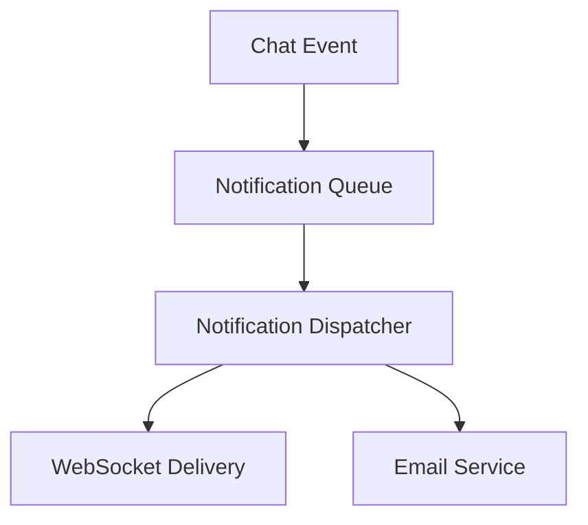

# How to Properly Use the Spec Generator Skill

## 📖 Overview

This guide walks you through the complete process of using the Feature Spec Generator skill to create professional-grade specifications. Whether you're creating a new feature or documenting a bug fix, this guide will help you use the skill effectively.

---

## 🎯 Before You Start

### Prerequisites

1. **Understand Your Project**
   - Know the target stack (Spring Boot, Next.js, PostgreSQL)
   - Understand the existing architecture
   - Identify stakeholders and users

2. **Clarify Your Scope**
   - What are you building or fixing?
   - What's in scope? What's out of scope?
   - What are the constraints?

3. **Gather Information**
   - User stories or bug description
   - Design principles or root cause hypothesis
   - Non-functional requirements
   - External dependencies

4. **Choose Your Mode**
   - **FEATURE**: Creating new functionality
   - **BUGFIX**: Fixing defects or vulnerabilities

---

## 🚀 Step-by-Step Usage Guide

### Step 1: Activate the Skill

**In Kiro Chat**, ask the agent to activate the feature-spec-generator skill:

```
I need to create a specification for [feature name / bugfix name].
Can you help me generate a professional spec package?
```

**The agent will respond with**:
- Confirmation that the skill is activated
- Initial questions to gather inputs
- Guidance on what information is needed

---

### Step 2: Choose Your Mode

**Tell the agent which mode you need**:

#### For FEATURE Mode:
```
I'm creating a new feature called "notification-system" that enables 
real-time alerts for chat events. This is a new feature, not a bugfix.
```

#### For BUGFIX Mode:
```
I need to document a bug fix for the message ordering race condition 
where messages sent rapidly appear out of order. This is a bugfix.
```

**The agent will**:
- Confirm the mode
- Ask mode-specific questions
- Provide guidance on what to prepare

---

### Step 3: Provide Required Inputs

#### Common Inputs (Both Modes)

**Spec Name** (kebab-case):
```
notification-system
real-time-notifications
fix-message-ordering-race-condition
```

**Short Summary** (1-2 sentences):
```
"The notification system enables real-time alerts for chat events 
(new messages, friend requests, room invitations) across web and 
mobile clients with customizable preferences."
```

**Target Stack**:
```
Backend: Spring Boot 3.x, Java 21, PostgreSQL
Frontend: Next.js 14+, React 18+, TypeScript, Tailwind CSS, Zustand
```

**Non-Functional Constraints**:
```
- Performance: Real-time delivery within 100ms
- Scale: Support 10-20 concurrent users
- Security: WCAG 2.1 AA accessibility compliance
- Reliability: No message loss, queue-based delivery
```

**External Dependencies**:
```
- Email service (Brevo or similar)
- WebSocket/STOMP for real-time delivery
- PostgreSQL for persistence
```

#### FEATURE Mode Only

**User Stories** (3-5 personas):
```
1. As a user, I want to receive real-time notifications when I receive 
   messages, so that I stay informed without leaving the app.

2. As a user, I want to customize which notifications I receive and how, 
   so that I'm not overwhelmed by alerts.

3. As a user, I want to see my notification history, so that I can 
   review past alerts.
```

**In-Scope vs Out-of-Scope**:
```
In-Scope:
- Real-time in-app notifications via WebSocket
- Email digest notifications
- Notification preferences UI
- Notification history/center

Out-of-Scope:
- Push notifications (mobile app)
- SMS notifications
- Notification templates customization
- Notification analytics
```

**Design Principles** (3-5):
```
1. Real-Time First: In-app notifications delivered within 100ms via WebSocket
2. User Control: Comprehensive preference system for notification types
3. Reliable Delivery: Queue-based system ensures no notifications are lost
4. Scalable: Async processing prevents blocking chat operations
5. Accessible: WCAG 2.1 AA compliance for all UI components
```

#### BUGFIX Mode Only

**Bug Description**:
```
Messages sent to a room are sometimes displayed out of order due to a 
race condition in the STOMP message handler. When multiple messages 
arrive in quick succession (< 100ms apart), they may be processed out 
of order, causing the message list to display messages in incorrect 
chronological order.
```

**Reproduction Steps**:
```
1. Open a chat room
2. Send 5 messages rapidly (within 50ms of each other)
3. Observe: Messages may appear as 1, 3, 2, 5, 4 instead of 1, 2, 3, 4, 5
4. Expected: Messages should always appear in chronological order
```

**Impact**:
```
Severity: High
Affected Users: All users sending rapid messages
Data Loss Risk: No data loss, but user confusion and poor UX
Frequency: Occurs in ~10% of rapid message sequences
```

**Root Cause Hypothesis**:
```
STOMP message handlers execute concurrently without ordering guarantees. 
Multiple messages for the same room are processed concurrently, and 
there's no sequence number or ordering mechanism to ensure they're 
handled in the order they arrive.
```

---

### Step 4: Review Agent's Questions

**The agent will ask clarifying questions** like:

```
I have a few clarifying questions:

1. For the notification preferences, should users be able to set 
   different preferences for different notification types?

2. Should the system queue notifications if the user is offline, 
   or only deliver to connected users?

3. For email notifications, should they be sent immediately or 
   as a daily/weekly digest?

4. Should notification history be stored indefinitely or have 
   a retention period?
```

**Provide clear, specific answers**:
```
1. Yes, users should be able to set preferences per notification type 
   (messages, friend requests, room invites) and per channel 
   (in-app, email, push).

2. Queue notifications for offline users and deliver when they reconnect.

3. Email notifications should be sent as daily digests at a user-specified time.

4. Store notification history for 30 days, then archive.
```

---

### Step 5: Confirm All Inputs

**The agent will summarize**:

```
Great! Let me confirm what I have:

MODE: FEATURE
NAME: notification-system
SUMMARY: Real-time alerts for chat events with customizable preferences

TARGET STACK:
- Backend: Spring Boot 3.x, Java 21, PostgreSQL
- Frontend: Next.js 14+, React 18+, TypeScript

USER STORIES: 3 personas (user receiving notifications, user customizing 
preferences, user reviewing history)

IN-SCOPE: Real-time in-app, email digests, preferences UI, history
OUT-OF-SCOPE: Push notifications, SMS, templates, analytics

DESIGN PRINCIPLES: Real-time first, user control, reliable delivery, 
scalable, accessible

CONSTRAINTS: 100ms delivery, 10-20 concurrent users, WCAG 2.1 AA

Is this correct? Any changes needed?
```

**Confirm or provide corrections**:
```
Yes, that's correct. One clarification: the email digests should be 
sent at 9 AM in the user's local timezone, not a user-specified time.
```

---

### Step 6: Review Generated Specs

**The agent will generate three documents in sequence**:

#### Phase 1: Requirements Document

```markdown
# Requirements Document

## Introduction
The notification system enables real-time alerts for chat events...

## Glossary
- **Notification_Event**: A system event that triggers a notification
- **Notification_Channel**: The delivery method (in-app, email, push)
...

## Requirements

### Requirement 1: Real-Time In-App Notifications

**User Story:** As a user, I want to receive real-time notifications 
when I receive messages or friend requests, so that I stay informed 
without leaving the app.

#### Acceptance Criteria

1. WHEN a message is sent to a room the user is a member of, 
   THE system SHALL broadcast a notification event to the user's 
   WebSocket connection within 100ms
...
```

**Review for**:
- ✅ Glossary is comprehensive
- ✅ Requirements are numbered hierarchically (1, 1.1, 1.2, 2, 2.1)
- ✅ Acceptance criteria use "WHEN...THEN...SHALL" format
- ✅ Scope section is clear
- ✅ Preservation requirements are explicit

**Provide feedback**:
```
The requirements look good. One clarification: for Requirement 2 
(Notification Preferences), should users be able to disable all 
notifications, or must at least one channel remain enabled?
```

#### Phase 2: Design Document

```markdown
# Design Document: Notification System

## Overview
The notification system uses a pub/sub architecture with a backend 
queue and WebSocket delivery for real-time in-app notifications...

## Architecture



## Correctness Properties

### Property 1: Real-Time Delivery

*For any* message sent to a room, the system SHALL deliver a 
notification to all connected members within 100ms.

**Validates: Requirements 1.1, 1.2**
...
```

**Review for**:
- ✅ Architecture diagram is clear
- ✅ 3-10 correctness properties are formal and verifiable
- ✅ Components are well-specified
- ✅ Data models are complete
- ✅ Error handling is comprehensive
- ✅ Testing strategy is explicit
- ✅ PBT applicability is assessed

**Provide feedback**:
```
The design looks comprehensive. I notice the error handling section 
mentions email delivery failures. Should we also handle WebSocket 
delivery failures with automatic retry?
```

#### Phase 3: Tasks Document

```markdown
# Implementation Plan: Notification System

## Overview
Implementation follows a phased approach: backend queue and dispatcher 
→ WebSocket delivery → email service → preferences UI → testing.

## Tasks

### Phase 1: Backend Queue and Dispatcher

- [ ] 1. Create NotificationEvent entity and repository
  - Define event types (MESSAGE, FRIEND_REQUEST, ROOM_INVITE)
  - Add database table with indexes on user_id and created_at
  - _Requirements: 1.1, 1.2_

- [ ] 2. Implement NotificationDispatcher service
  - Route events to appropriate channels based on preferences
  - Handle queue persistence for offline users
  - _Requirements: 1.3, 2.3_

- [ ] 3. Checkpoint - Backend queue complete
  - Verify events are persisted and routed correctly
  - Ask the user if questions arise
...
```

**Review for**:
- ✅ Tasks are organized into logical phases
- ✅ Each task has requirement traceability tags
- ✅ Checkpoints are explicit with clear success criteria
- ✅ Optional tasks are marked with `*`
- ✅ Subtasks are specific and actionable

**Provide feedback**:
```
The tasks look good. I'd like to add a Phase 0 for setting up the 
database schema and creating the NotificationEvent entity. Should 
that be a separate phase or part of Phase 1?
```

---

### Step 7: Request Modifications (If Needed)

**If something needs to change**, ask the agent:

```
I'd like to make a few changes to the design:

1. Add a new requirement for notification read/unread status
2. Modify the email delivery to use a scheduled job instead of 
   immediate sending
3. Add a new task for setting up the email template system

Can you regenerate the specs with these changes?
```

**The agent will**:
- Regenerate the affected documents
- Maintain consistency across all three documents
- Preserve requirement traceability

---

### Step 8: Approve and Finalize

**Once you're satisfied**, confirm:

```
The specs look great! Please write them to disk in the following location:

.kiro/specs/notification-system/
├── requirements.md
├── design.md
├── tasks.md
└── .config.kiro
```

**The agent will**:
- Create the spec folder
- Write all three documents
- Create the `.config.kiro` metadata file
- Confirm completion

---

## ✅ Quality Verification Checklist

Before approving the specs, verify:

### Requirements Document
- [ ] Glossary is comprehensive and used consistently
- [ ] Requirements are numbered hierarchically (1, 1.1, 1.2, 2, 2.1)
- [ ] Each requirement has a user story
- [ ] Acceptance criteria use "WHEN...THEN...SHALL" format
- [ ] Scope section lists in-scope and out-of-scope items
- [ ] Preservation requirements are explicit

### Design Document
- [ ] Architecture diagram is clear and labeled
- [ ] 3-10 correctness properties are formal and verifiable
- [ ] Each property validates specific requirements
- [ ] Components are well-specified with responsibilities
- [ ] Data models include entity diagrams and schema
- [ ] Error handling covers all scenarios
- [ ] Testing strategy is comprehensive
- [ ] PBT applicability is explicitly assessed with rationale

### Tasks Document
- [ ] Tasks are organized into logical phases
- [ ] Each task has requirement traceability tags
- [ ] Checkpoints are explicit with clear success criteria
- [ ] Optional tasks are marked with `*`
- [ ] Subtasks are specific and actionable
- [ ] Acceptance criteria are measurable

### Overall
- [ ] Consistent terminology throughout all three documents
- [ ] Professional, precise tone
- [ ] No undefined jargon
- [ ] Clear, labeled diagrams
- [ ] Requirement traceability is systematic

---

## 🎯 Common Scenarios

### Scenario 1: Creating a Feature Spec

**Your Request**:
```
I need to create a spec for a new "friend suggestion" feature that 
recommends users to connect with based on shared interests and mutual 
friends. This is a new feature for the social discovery system.
```

**Agent's Response**:
```
Great! I'll help you create a professional spec for the friend 
suggestion feature. Let me gather some information:

1. What are the main user stories for this feature?
2. How should the recommendation algorithm work?
3. Should suggestions be real-time or batch-processed?
4. What are the performance requirements?
5. Should users be able to dismiss or hide suggestions?
```

**Your Answers**:
```
1. Users want to discover new friends based on shared interests
2. Algorithm should use shared interests and mutual friends
3. Batch-processed daily at 2 AM
4. Load suggestions within 500ms
5. Yes, users should be able to dismiss suggestions
```

**Agent Generates**:
- Requirements with user stories and acceptance criteria
- Design with recommendation algorithm architecture
- Tasks with phased implementation (data model → algorithm → UI → testing)

---

### Scenario 2: Creating a Bugfix Spec

**Your Request**:
```
I need to document a bug fix for the WebSocket connection drop issue 
where users lose connection without notification. This is a bugfix.
```

**Agent's Response**:
```
I'll help you create a bugfix spec. Let me gather information:

1. How often does this bug occur?
2. What are the reproduction steps?
3. What's the impact on users?
4. What's your hypothesis for the root cause?
5. What should happen when connection is lost?
```

**Your Answers**:
```
1. Occurs in ~5% of sessions, especially on mobile
2. Open chat, wait 5-10 minutes, connection drops silently
3. Users don't know connection is lost, messages fail silently
4. No error handler for WebSocket disconnection events
5. Show connection status indicator, attempt auto-reconnect
```

**Agent Generates**:
- Requirements with bug analysis (current defect vs expected correct)
- Design with root cause analysis and fix strategy
- Tasks with three-phase testing (exploratory → fix → validation)

---

### Scenario 3: Requesting Modifications

**Your Request**:
```
The design looks good, but I'd like to make a few changes:

1. Add a new correctness property for message ordering
2. Change the testing strategy to include property-based tests
3. Add a new task for performance testing

Can you regenerate the design and tasks documents?
```

**Agent's Response**:
```
I'll regenerate the design and tasks documents with those changes. 
Let me confirm:

1. New property: "For any sequence of messages, the system SHALL 
   process them in the order they were received"
2. Add property-based tests using jqwik for message ordering
3. Add performance testing task to verify 100ms delivery latency

Is this correct?
```

**Your Confirmation**:
```
Yes, that's correct. Please regenerate the documents.
```

**Agent Regenerates**:
- Updated design document with new property
- Updated tasks document with new testing tasks
- Maintains consistency and requirement traceability

---

## 🔍 Tips for Success

### 1. Be Specific with Inputs
❌ **Vague**: "Create a notification system"
✅ **Specific**: "Create a real-time notification system that delivers alerts within 100ms via WebSocket and email digests"

### 2. Provide Clear User Stories
❌ **Vague**: "Users want notifications"
✅ **Specific**: "As a user, I want to receive real-time notifications when I receive messages, so that I stay informed without leaving the app"

### 3. Define Constraints Clearly
❌ **Vague**: "Should be fast"
✅ **Specific**: "Real-time delivery within 100ms, support 10-20 concurrent users, WCAG 2.1 AA accessibility"

### 4. Clarify Scope Boundaries
❌ **Vague**: "Notification system"
✅ **Specific**: "In-scope: in-app and email notifications. Out-of-scope: push notifications, SMS, analytics"

### 5. Review Each Document Carefully
- Don't just accept the first version
- Ask clarifying questions
- Request modifications if needed
- Verify quality against the checklist

### 6. Provide Feedback Constructively
❌ **Unhelpful**: "This doesn't look right"
✅ **Helpful**: "The design looks good, but I'd like to add a new requirement for notification read/unread status"

### 7. Verify Requirement Traceability
- Check that every requirement is addressed in the design
- Verify that every task is tagged with requirements
- Ensure no requirements are missed

### 8. Test the Specs
- Use the specs to guide implementation
- Verify that tasks match the design
- Ensure design matches requirements

---

## 🚨 Common Mistakes to Avoid

### ❌ Mistake 1: Incomplete Inputs
**Problem**: Not providing enough information
**Solution**: Use the input checklist and provide all required information

### ❌ Mistake 2: Vague Acceptance Criteria
**Problem**: Criteria that aren't measurable
**Solution**: Use "WHEN...THEN...SHALL" format with specific, measurable outcomes

### ❌ Mistake 3: Missing Requirement Traceability
**Problem**: Tasks that don't reference requirements
**Solution**: Verify every task has `_Requirements: X.X_` tags

### ❌ Mistake 4: Skipping Quality Verification
**Problem**: Accepting specs without checking quality
**Solution**: Use the quality checklist before approving

### ❌ Mistake 5: Not Requesting Modifications
**Problem**: Accepting specs that don't match your needs
**Solution**: Ask for changes and regenerate documents

### ❌ Mistake 6: Ignoring Preservation Requirements
**Problem**: Bugfix specs that don't address regression prevention
**Solution**: Verify preservation properties are explicit

### ❌ Mistake 7: Not Assessing PBT Applicability
**Problem**: Missing guidance on property-based testing
**Solution**: Verify PBT applicability is explicitly assessed

### ❌ Mistake 8: Inconsistent Terminology
**Problem**: Different terms used for the same concept
**Solution**: Verify glossary is used consistently throughout

---

## 📊 Expected Output

### What You'll Get

**Three Professional Documents**:

1. **requirements.md** (2-5 pages)
   - Glossary with 10-20 terms
   - 5-10 requirements with acceptance criteria
   - Scope section with in-scope and out-of-scope items
   - Preservation requirements

2. **design.md** (5-10 pages)
   - Architecture diagram (Mermaid)
   - 3-10 correctness properties
   - Component specifications
   - Data models with entity diagrams
   - Error handling strategy
   - Comprehensive testing strategy
   - PBT applicability assessment

3. **tasks.md** (3-8 pages)
   - 20-50 tasks organized into phases
   - Requirement traceability tags
   - Explicit checkpoints
   - Optional task marking
   - Specific acceptance criteria

**Total**: 10-23 pages of professional documentation

---

## 🎓 Learning Resources

### To Learn More
- Read `SPEC_GENERATOR_QUICK_REFERENCE.md` for quick answers
- Review `SPEC_GENERATOR_ENHANCEMENT_SUMMARY.md` for detailed examples
- Check `.kiro/specs/*/` for real repository examples
- Reference `SKILL.md` for authoritative guidance

### To Review Examples
- **Feature Mode**: Direct Messaging, Mobile-First Redesign
- **Bugfix Mode**: Chat Functionality Fixes, CI Test Failures
- **Both Modes**: OAuth Integration, Security Hardening

---

## 🎯 Next Steps

1. **Identify Your Need**: Feature or bugfix?
2. **Gather Information**: Use the input checklist
3. **Activate the Skill**: Ask the agent to help
4. **Provide Inputs**: Answer all questions clearly
5. **Review Documents**: Check quality against checklist
6. **Request Modifications**: Ask for changes if needed
7. **Approve and Finalize**: Write specs to disk
8. **Use the Specs**: Guide implementation with the specs

---

## 📞 Support

### Questions About Using the Skill?
- Review this guide (HOW_TO_USE_SPEC_GENERATOR.md)
- Check SPEC_GENERATOR_QUICK_REFERENCE.md for quick answers
- Reference SKILL.md for authoritative guidance

### Need Examples?
- Review SPEC_GENERATOR_ENHANCEMENT_SUMMARY.md
- Study real examples in `.kiro/specs/*/`

### Want to Understand the Skill Better?
- Read README_SPEC_GENERATOR.md for complete overview
- Review SPEC_GENERATOR_BEFORE_AFTER.md for improvements

---

## ✨ Summary

Using the Feature Spec Generator skill properly involves:

1. ✅ **Choosing your mode** (FEATURE or BUGFIX)
2. ✅ **Gathering complete inputs** (use the checklist)
3. ✅ **Answering clarifying questions** (be specific)
4. ✅ **Reviewing generated documents** (check quality)
5. ✅ **Requesting modifications** (if needed)
6. ✅ **Verifying quality** (use the checklist)
7. ✅ **Approving and finalizing** (write to disk)
8. ✅ **Using the specs** (guide implementation)

Follow this process to create professional-grade specifications that match your repository's standards.

---

**Last Updated**: May 20, 2026  
**Status**: ✅ Ready for Use  
**Quality**: ⭐⭐⭐⭐⭐ (5/5)
