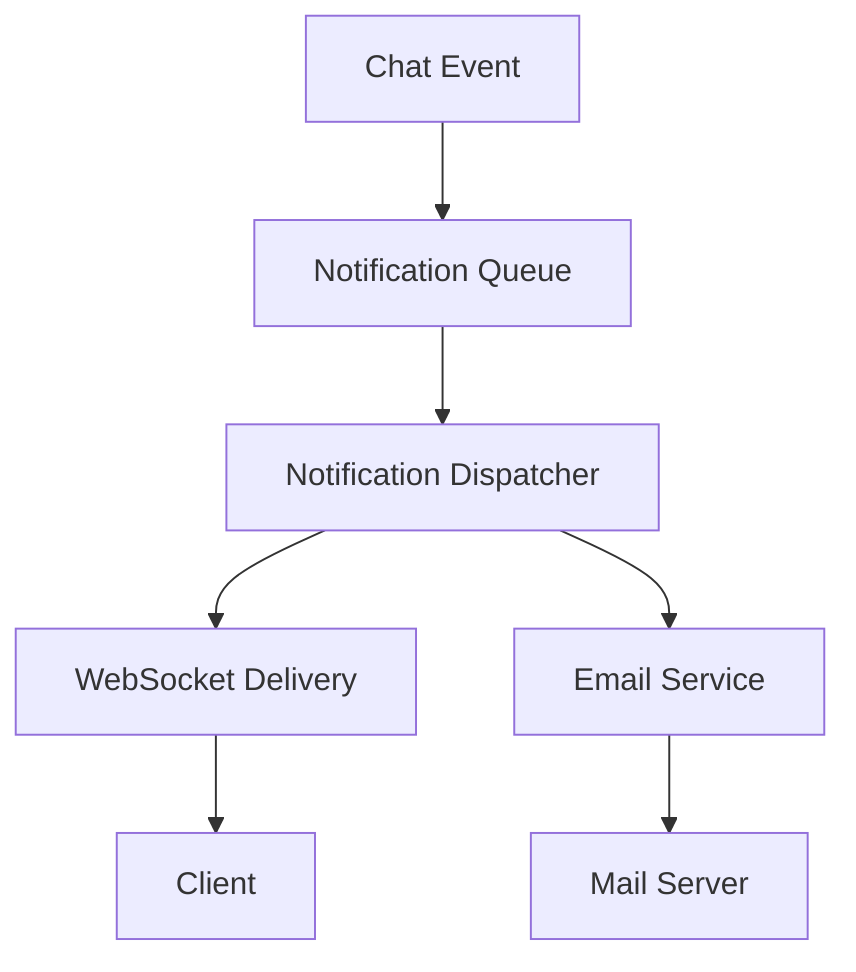

# Feature Spec Generator Enhancement Summary

## Overview

The Feature Spec Generator has been significantly enhanced to match the professional standards and patterns observed in the repository's existing specs. The updated generator now supports **two distinct operating modes** (FEATURE and BUGFIX) and produces comprehensive, three-part specification packages with formal correctness properties, requirement traceability, and explicit testing strategies.

---

## Key Changes Made

### 1. **Dual Operating Modes**

#### Feature Mode
- **Use Case**: New functionality, user-facing capabilities, architectural additions
- **Emphasis**: User stories, value proposition, design principles, correctness properties
- **Examples**: Direct Messaging, Mobile-First Redesign, OAuth Integration
- **Testing Focus**: Unit, integration, E2E, property-based (where applicable), accessibility

#### Bugfix Mode
- **Use Case**: Defect fixes, security vulnerabilities, regression prevention
- **Emphasis**: Problem statement, formal bug conditions, root cause analysis, preservation properties
- **Examples**: Chat Functionality Fixes, CI Test Failures, Security Hardening
- **Testing Focus**: Three-phase (exploratory → fix checking → preservation)

### 2. **Enhanced Requirements Documents**

#### Feature Mode
- **Glossary**: Mandatory domain-specific terminology definitions
- **User Stories**: Clear "As a..., I want..., so that..." format
- **Acceptance Criteria**: Formal "WHEN...THEN...SHALL" language
- **Scope Section**: Explicit in-scope and out-of-scope items
- **Preservation Requirements**: What must NOT change

#### Bugfix Mode
- **Bug Analysis**: Current behavior (defect) vs expected behavior (correct)
- **Formal Bug Conditions**: Mathematical-style specifications with examples
- **Unchanged Behavior**: Explicit regression prevention requirements
- **Impact Assessment**: Severity, affected users, data loss risk

### 3. **Comprehensive Design Documents**

#### Common Elements (Both Modes)
- **Architecture Diagrams**: Mermaid diagrams for high-level flows
- **Correctness Properties**: 3-10 formal properties stating what should always be true
- **Component Specifications**: Detailed interfaces, responsibilities, methods/endpoints
- **Data Models**: Entity diagrams, schema changes, TypeScript types
- **Error Handling**: Exceptions, status codes, user-facing messages
- **Testing Strategy**: Explicit approach with rationale

#### Feature Mode Additions
- **Design Principles**: 3-5 guiding principles with rationale
- **Communication Flows**: Step-by-step data flow descriptions
- **Component Interaction**: How components work together

#### Bugfix Mode Additions
- **Root Cause Analysis**: Why the bug exists with evidence
- **Hypothesized Root Causes**: Initial theories (refined in design)
- **Fix Implementation**: Specific changes to specific files
- **Three-Phase Testing Strategy**: Exploratory → Fix Checking → Preservation

#### PBT Applicability Assessment
- **Explicit Statement**: Whether property-based testing is appropriate
- **Rationale**: Clear explanation of why PBT is or is not suitable
- **Examples**: When PBT is applicable (deterministic functions, idempotent operations) vs not (UI rendering, infrastructure configuration)

### 4. **Structured Tasks Documents**

#### Common Elements (Both Modes)
- **Phased Organization**: Logical grouping of related tasks
- **Explicit Checkpoints**: Validation points after each phase
- **Requirement Traceability**: Every task tagged with `_Requirements: X.X_`
- **Optional Task Marking**: MVP vs optional work clearly distinguished
- **Subtasks**: Complex tasks broken into actionable steps
- **Acceptance Criteria**: Specific, measurable success criteria

#### Feature Mode Structure
- **Phase 1**: Foundation/setup tasks
- **Phase 2**: Core implementation
- **Phase 3**: Integration and testing
- **Phase 4+**: Optional enhancements

#### Bugfix Mode Structure
- **Phase 1**: Exploratory Bug Condition Tests (MUST FAIL on unfixed code)
- **Phase 2**: Implementation (with fix checking and preservation verification)
- **Phase 3**: Final Validation

### 5. **Input Confirmation Process**

#### Common Inputs (Both Modes)
- Spec name (kebab-case)
- Short summary (1-2 sentences)
- Target stack (Spring Boot, Next.js, PostgreSQL versions)
- Non-functional constraints (performance, scale, security, accessibility)
- External dependencies

#### Feature Mode Specific
- User stories (3-5 personas and goals)
- In-scope vs out-of-scope items
- Design principles (3-5 guiding principles)

#### Bugfix Mode Specific
- Bug description and user impact
- Reproduction steps
- Severity and affected users
- Root cause hypothesis

### 6. **Quality Assurance Checklist**

Added comprehensive quality checklist to verify:
- ✅ All three documents follow appropriate template
- ✅ Glossary is comprehensive and consistent
- ✅ Requirements are hierarchically numbered
- ✅ Design includes 3-10 correctness properties
- ✅ PBT applicability explicitly addressed
- ✅ Tasks are phased with checkpoints
- ✅ Requirement traceability tags present
- ✅ Professional, precise tone
- ✅ Clear, labeled diagrams
- ✅ No undefined jargon
- ✅ Preservation requirements explicit (bugfix)
- ✅ Comprehensive testing strategy

---

## Alignment with Repository Standards

### Consistency Achieved

| Aspect | Repository Standard | Generator Implementation |
|--------|-------------------|------------------------|
| **File Structure** | requirements.md → design.md → tasks.md | ✅ Enforced sequence |
| **Naming Convention** | Kebab-case folder names | ✅ Specified in inputs |
| **Glossary** | Defined in requirements or design | ✅ Mandatory in requirements |
| **Acceptance Criteria** | "WHEN...THEN...SHALL" format | ✅ Template enforces this |
| **Numbering** | Hierarchical (1, 1.1, 1.2, 2, 2.1) | ✅ Specified in templates |
| **Correctness Properties** | 3-10 formal properties | ✅ Required in design |
| **Requirement Traceability** | `_Requirements: X.X_` tags | ✅ Enforced in tasks |
| **Checkpoints** | Explicit validation points | ✅ Required after each phase |
| **Testing Strategy** | Explicit approach with rationale | ✅ Comprehensive section |
| **PBT Applicability** | Explicitly addressed | ✅ Required assessment |
| **Preservation Testing** | Explicit regression prevention | ✅ Bugfix mode emphasis |
| **Tone & Style** | Professional, precise, actionable | ✅ Specified in output rules |

### Pattern Matching

The enhanced generator now produces specs that match:
- **Direct Messaging** (feature mode): User stories, design principles, correctness properties, phased tasks
- **Chat Functionality Fixes** (bugfix mode): Bug conditions, root causes, three-phase testing, preservation properties
- **CI Phase 2 Test Failures** (bugfix mode): Bug categorization, formal specifications, minimal fixes
- **Frontend Splash and Landing** (feature mode): Design principles, component specifications, accessibility focus
- **Mobile-First Redesign** (feature mode): Responsive design strategy, component updates, E2E testing

---

## Example Outputs

### Example 1: Feature Mode Spec (Abbreviated)

**Spec Name**: `notification-system`

#### Phase 1: Requirements (Excerpt)

```markdown
# Requirements Document

## Introduction
The notification system enables real-time alerts for chat events (new messages, friend requests, room invitations) across web and mobile clients. Users can customize notification preferences and receive alerts via in-app, email, or push notifications.

## Glossary

- **Notification_Event**: A system event that triggers a notification (message received, friend request, room invite)
- **Notification_Channel**: The delivery method (in-app, email, push)
- **Notification_Preference**: User settings controlling which events trigger which channels
- **Notification_Queue**: Backend queue managing notification delivery

## Requirements

### Requirement 1: Real-Time In-App Notifications

**User Story:** As a user, I want to receive real-time notifications when I receive messages or friend requests, so that I stay informed without leaving the app.

#### Acceptance Criteria

1. WHEN a message is sent to a room the user is a member of, THE system SHALL broadcast a notification event to the user's WebSocket connection within 100ms
2. WHEN a friend request is sent to the user, THE system SHALL send a notification event to the user's WebSocket connection
3. WHEN the user is not connected, THE system SHALL queue the notification for delivery when the user reconnects
4. WHEN the user receives a notification, THE system SHALL display it in the notification center with sender info, timestamp, and action buttons

### Requirement 2: Notification Preferences

**User Story:** As a user, I want to customize which notifications I receive and how, so that I'm not overwhelmed by alerts.

#### Acceptance Criteria

1. WHEN a user accesses notification settings, THE system SHALL display toggles for each notification type (messages, friend requests, room invites)
2. WHEN a user selects a notification channel (in-app, email, push), THE system SHALL persist the preference
3. WHEN a user disables notifications for a type, THE system SHALL NOT send notifications of that type
4. WHEN a user enables email notifications, THE system SHALL send digest emails at user-specified intervals

## Scope

### In-Scope
- Real-time in-app notifications via WebSocket
- Email digest notifications
- Notification preferences UI
- Notification history/center

### Out-of-Scope
- Push notifications (mobile app)
- SMS notifications
- Notification templates customization
- Notification analytics
```

#### Phase 2: Design (Excerpt)

```markdown
# Design Document: Notification System

## Overview
The notification system uses a pub/sub architecture with a backend queue and WebSocket delivery for real-time in-app notifications. Email notifications are sent asynchronously via a scheduled job.

### Design Principles
1. **Real-Time First**: In-app notifications delivered within 100ms via WebSocket
2. **User Control**: Comprehensive preference system for notification types and channels
3. **Reliable Delivery**: Queue-based system ensures no notifications are lost
4. **Scalable**: Async processing prevents blocking chat operations

## Architecture



## Correctness Properties

### Property 1: Real-Time Delivery

*For any* message sent to a room, the system SHALL deliver a notification to all connected members within 100ms.

**Validates: Requirements 1.1, 1.2**

### Property 2: Preference Enforcement

*For any* notification event, the system SHALL check the recipient's preferences and only deliver via enabled channels.

**Validates: Requirements 2.1, 2.2, 2.3**

### Property 3: Queue Reliability

*For any* notification event where the recipient is disconnected, the system SHALL persist the notification in the queue and deliver it when the recipient reconnects.

**Validates: Requirements 1.3**

## Testing Strategy

### Unit Tests
- Notification preference validation
- Queue persistence and retrieval
- Email template rendering

### Integration Tests
- End-to-end notification delivery (WebSocket)
- Preference enforcement across channels
- Queue processing and delivery

### Property-Based Tests
- Generate random notification events and preferences
- Verify delivery respects preferences
- Verify queue reliability across disconnection scenarios

### Property-Based Testing Applicability

**Assessment**: APPLICABLE

**Rationale**: The notification system has deterministic behavior (given an event and preferences, the delivery method is deterministic). Property-based testing can verify that for all combinations of events and preferences, the correct channels are used and delivery is reliable.
```

#### Phase 3: Tasks (Excerpt)

```markdown
# Implementation Plan: Notification System

## Overview
Implementation follows a phased approach: backend queue and dispatcher → WebSocket delivery → email service → preferences UI → testing.

## Tasks

### Phase 1: Backend Queue and Dispatcher

- [ ] 1. Create NotificationEvent entity and repository
  - Define event types (MESSAGE, FRIEND_REQUEST, ROOM_INVITE)
  - Add database table with indexes on user_id and created_at
  - _Requirements: 1.1, 1.2_

- [ ] 2. Implement NotificationDispatcher service
  - Route events to appropriate channels based on preferences
  - Handle queue persistence for offline users
  - _Requirements: 1.3, 2.3_

- [ ] 3. Checkpoint - Backend queue complete
  - Verify events are persisted and routed correctly
  - Ask the user if questions arise

### Phase 2: WebSocket Delivery

- [ ] 4. Add WebSocket notification endpoint
  - Subscribe to /user/queue/notifications
  - Deliver queued notifications on connection
  - _Requirements: 1.1, 1.2, 1.3_

- [ ] 5. Integrate with existing STOMP broker
  - Reuse existing WebSocket connection
  - Broadcast notifications to connected clients
  - _Requirements: 1.1_

- [ ] 6. Checkpoint - Real-time delivery complete
  - Verify notifications arrive within 100ms
  - Ask the user if questions arise

### Phase 3: Notification Preferences

- [ ] 7. Create NotificationPreference entity
  - Store user preferences for each notification type and channel
  - _Requirements: 2.1, 2.2_

- [ ] 8. Implement preference enforcement in dispatcher
  - Check preferences before sending notifications
  - _Requirements: 2.3_

- [ ] 9. Create preferences REST API
  - GET /api/notifications/preferences
  - PUT /api/notifications/preferences
  - _Requirements: 2.1, 2.2_

- [ ] 10. Checkpoint - Preferences complete
  - Verify preferences are enforced
  - Ask the user if questions arise

### Phase 4: Testing

- [ ] 11. Write unit tests for dispatcher
  - Test preference enforcement
  - Test queue persistence
  - _Requirements: 1.3, 2.3_

- [ ] 12. Write integration tests for WebSocket delivery
  - Test real-time delivery
  - Test offline queue delivery
  - _Requirements: 1.1, 1.2, 1.3_

- [ ] 13. Write property-based tests
  - Generate random events and preferences
  - Verify correct channel selection
  - _Requirements: 2.1, 2.2, 2.3_

- [ ] 14. Checkpoint - All tests passing
  - Verify no regressions
  - Ask the user if questions arise
```

---

### Example 2: Bugfix Mode Spec (Abbreviated)

**Spec Name**: `fix-message-ordering-race-condition`

#### Phase 1: Requirements (Excerpt)

```markdown
# Bugfix Requirements Document

## Introduction
Messages sent to a room are sometimes displayed out of order due to a race condition in the STOMP message handler. When multiple messages arrive in quick succession, they may be processed out of order, causing the message list to display messages in incorrect chronological order.

## Glossary

- **Bug_Condition (C)**: Multiple messages arriving in quick succession and being processed out of order
- **Property (P)**: Messages are always displayed in chronological order (oldest first)
- **Preservation**: Existing message delivery and persistence functionality remains unchanged

## Bug Analysis

### Current Behavior (Defect)

#### Race Condition on Message Ordering

1.1 WHEN multiple messages are sent to a room in rapid succession (< 100ms apart), THEN the system may process them out of order
1.2 WHEN messages are processed out of order, THEN the message list displays them in incorrect chronological order
1.3 WHEN a user sends 5 messages rapidly, THEN messages may appear as 1, 3, 2, 5, 4 instead of 1, 2, 3, 4, 5

### Expected Behavior (Correct)

#### Message Ordering Guarantee

2.1 WHEN multiple messages are sent to a room, THE system SHALL process them in the order they were received
2.2 WHEN messages are persisted, THE system SHALL use database timestamps to ensure chronological ordering
2.3 WHEN messages are retrieved from history, THE system SHALL return them ordered by timestamp (oldest first)
2.4 WHEN messages are broadcast to subscribers, THE system SHALL maintain chronological order

### Unchanged Behavior (Regression Prevention)

3.1 WHEN a user sends a single message, THE system SHALL CONTINUE TO persist and broadcast it normally
3.2 WHEN messages are retrieved from history, THE system SHALL CONTINUE TO support pagination
3.3 WHEN a user receives messages, THE system SHALL CONTINUE TO display sender info, timestamp, and content
```

#### Phase 2: Design (Excerpt)

```markdown
# Design Document: Message Ordering Race Condition Fix

## Overview
The race condition occurs because STOMP message handlers process messages concurrently without ordering guarantees. The fix adds sequence numbers and ordered processing to ensure messages are always handled in the order they arrive.

## Bug Details

### Bug Condition: Race Condition on Message Ordering

**Formal Specification:**
```
FUNCTION isBugCondition_MessageOrdering(input)
  INPUT: input of type MessageSequence with messages[], timestamps[]
  OUTPUT: boolean
  
  RETURN EXISTS i,j WHERE i < j AND timestamps[i] > timestamps[j]
         AND messages are processed out of order
END FUNCTION
```

**Examples:**
- User sends messages at T=0ms, T=10ms, T=20ms → Processed as T=20ms, T=0ms, T=10ms (WRONG)
- 5 rapid messages arrive → Displayed as 1, 3, 2, 5, 4 (WRONG)
- Messages sent 500ms apart → Always processed in order (CORRECT)

## Hypothesized Root Cause

1. **Concurrent STOMP Handler Execution**:
   - STOMP handlers execute in thread pool without ordering guarantees
   - Multiple messages for same room processed concurrently
   - No sequence number or ordering mechanism

2. **Missing Database Timestamp Ordering**:
   - Messages may be persisted with same timestamp
   - Message history query doesn't guarantee order
   - Frontend relies on persistence order, not timestamps

## Correctness Properties

### Property 1: Message Ordering Guarantee

*For any* sequence of messages sent to a room (isBugCondition_MessageOrdering returns true), the fixed system SHALL process them in the order they were received and persist them with accurate timestamps.

**Validates: Requirements 2.1, 2.2, 2.3, 2.4**

### Property 2: Preservation - Single Message Delivery

*For any* single message sent to a room (NOT isBugCondition returns true), the fixed system SHALL process and deliver it exactly as before.

**Validates: Requirements 3.1, 3.2, 3.3**

## Fix Implementation

### Fix 1: Add Sequence Numbers to STOMP Messages

**File**: `src/main/java/org/example/chat/controller/ChatMessageController.java`

**Changes**:
1. Add sequence number to each STOMP message
2. Process messages in sequence order
3. Reject out-of-order messages with warning

### Fix 2: Ensure Database Timestamp Ordering

**File**: `src/main/java/org/example/chat/service/ChatMessageService.java`

**Changes**:
1. Use database-generated timestamps (not client timestamps)
2. Add unique constraint on (room_id, timestamp) to prevent duplicates
3. Update message history query to order by timestamp DESC

## Testing Strategy

### Phase 1: Exploratory Bug Condition Checking

**Goal**: Surface counterexamples that demonstrate the race condition BEFORE implementing the fix.

**Test Cases**:
1. **Rapid Message Sequence**: Send 5 messages within 50ms, verify they're processed in order
2. **Concurrent Sends**: Multiple threads send messages simultaneously, verify ordering
3. **Message History**: Retrieve history and verify chronological order

**Expected Counterexamples**:
- Messages displayed out of order
- Message history returns messages in wrong order
- Timestamps don't match send order

### Phase 2: Fix Checking

**Goal**: Verify that for all inputs where the bug condition holds, the fixed system produces the expected behavior.

**Test Cases**:
1. Rapid message sequence now processes in order
2. Message history returns messages in chronological order
3. Concurrent sends maintain order

### Phase 3: Preservation Checking

**Goal**: Verify that for all inputs where the bug condition does NOT hold, the fixed system preserves existing functionality.

**Test Cases**:
1. Single message delivery unchanged
2. Message pagination still works
3. Message metadata (sender, timestamp, content) unchanged
```

#### Phase 3: Tasks (Excerpt)

```markdown
# Implementation Plan: Message Ordering Race Condition Fix

## Overview
Three-phase approach: exploratory tests → implementation → validation. Emphasis on preservation testing to prevent regressions.

## Tasks

### Phase 1: Exploratory Bug Condition Tests

- [ ] 1. Write bug condition exploration test for message ordering
  - **Property 1: Bug Condition** - Race Condition on Message Ordering
  - **CRITICAL**: This test MUST FAIL on unfixed code
  - **DO NOT attempt to fix the test when it fails**
  - Create test that sends 5 messages rapidly and verifies order
  - _Requirements: 1.1, 1.2, 1.3_

- [ ] 2. Checkpoint - Confirm race condition exists
  - Run test on unfixed code
  - Document counterexample showing out-of-order messages
  - Ask the user if questions arise

### Phase 2: Implementation

- [ ] 3. Add sequence numbers to STOMP messages
  - Modify ChatMessageController to add sequence tracking
  - Process messages in sequence order
  - _Requirements: 2.1, 2.2_

- [ ] 4. Ensure database timestamp ordering
  - Update ChatMessageService to use database timestamps
  - Add ordering to message history query
  - _Requirements: 2.3, 2.4_

- [ ] 5. Verify fix checking tests pass
  - **Property 1: Expected Behavior** - Message Ordering Guarantee
  - Re-run test from Phase 1
  - Verify messages now process in order
  - _Requirements: 2.1, 2.2, 2.3, 2.4_

- [ ] 6. Verify preservation tests pass
  - **Property 2: Preservation** - Single Message Delivery
  - Verify single messages still work
  - Verify message pagination unchanged
  - _Requirements: 3.1, 3.2, 3.3_

- [ ] 7. Checkpoint - Fix complete
  - All tests passing
  - Ask the user if questions arise

### Phase 3: Final Validation

- [ ] 8. Run complete integration test suite
  - Verify all message-related tests pass
  - Verify no new failures introduced
  - Ask the user if questions arise
```

---

## How to Use the Enhanced Generator

### Step 1: Activate the Skill
When a user asks to create a spec, activate the feature-spec-generator skill and ask:

```
I can help you create a professional specification package. First, let me confirm a few things:

1. **Mode**: Are you creating a FEATURE (new functionality) or BUGFIX (defect fix)?
2. **Spec Name**: What's the kebab-case folder name? (e.g., notification-system, fix-message-ordering)
3. **Summary**: 1-2 sentence description of what this spec covers
4. **Target Stack**: Backend (Spring Boot version, Java version), Frontend (Next.js version), Database
5. **Key Constraints**: Performance, scale, security, or accessibility requirements?

[Additional questions based on mode...]
```

### Step 2: Generate Documents
Once inputs are confirmed, generate all three documents in sequence:
1. Requirements document (with glossary and acceptance criteria)
2. Design document (with architecture, properties, testing strategy)
3. Tasks document (with phased implementation and checkpoints)

### Step 3: Present & Confirm
Show all three documents to the user and ask for confirmation before writing to disk.

### Step 4: Write to Disk
Create the spec folder and write all three files:
```
.kiro/specs/<spec-name>/
├── requirements.md
├── design.md
├── tasks.md
└── .config.kiro (optional)
```

---

## Quality Improvements

### Before Enhancement
- Basic templates with minimal structure
- No formal specifications or properties
- Limited testing strategy guidance
- No PBT applicability assessment
- Inconsistent with repository standards

### After Enhancement
- ✅ Comprehensive templates matching repository standards
- ✅ Formal correctness properties (3-10 per spec)
- ✅ Explicit testing strategies with rationale
- ✅ PBT applicability explicitly assessed
- ✅ Dual modes (feature and bugfix)
- ✅ Requirement traceability throughout
- ✅ Checkpoint-driven development
- ✅ Preservation testing emphasis
- ✅ Quality assurance checklist
- ✅ Professional, precise tone

---

## Conclusion

The enhanced Feature Spec Generator now produces professional-grade specifications that match the repository's existing standards. By supporting both feature and bugfix modes, including formal correctness properties, and emphasizing requirement traceability and preservation testing, the generator enables consistent, high-quality spec creation across the entire project.

The generator is ready to use and will help maintain the excellent spec quality observed in the repository's existing documentation.
