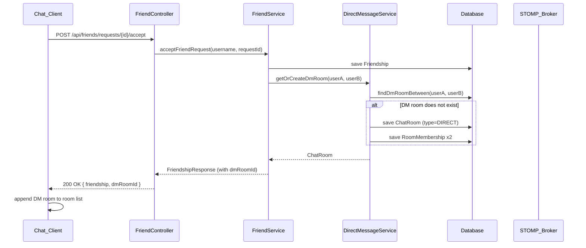
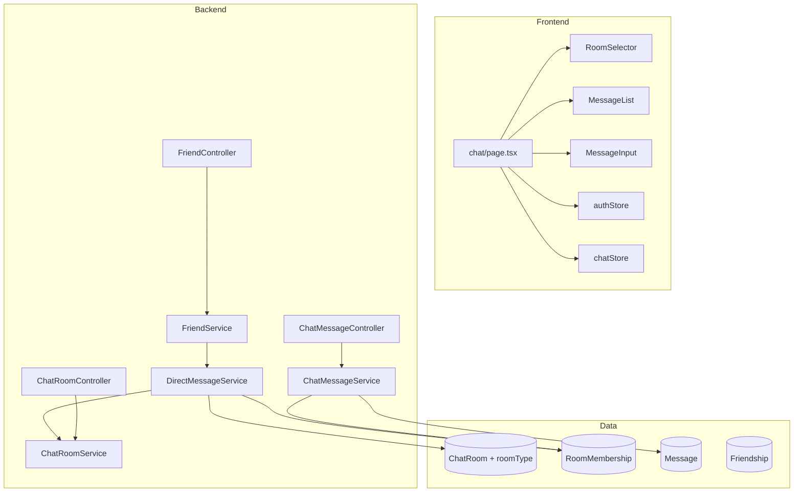
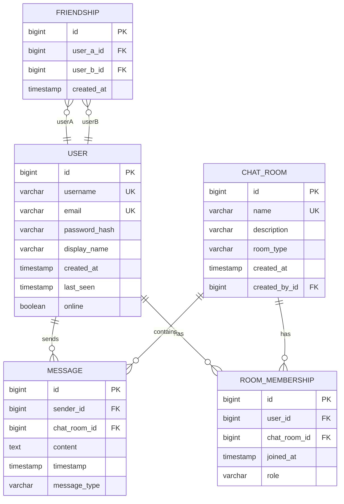

# Design Document: Direct Messaging

## Overview

This document describes the design for adding private one-on-one Direct Messaging (DM) to the existing real-time chat system. When two users become friends via the existing friend request/acceptance flow, a private DM room is automatically created and appears in both users' room lists. Only the two friends can send, receive, and view messages in that room.

The feature builds on the existing infrastructure:
- **Backend**: Spring Boot with STOMP/WebSocket, JPA entities (`ChatRoom`, `RoomMembership`, `Message`), and the `Friendship` model from the social-discovery-and-room-management spec.
- **Frontend**: Next.js with Zustand state management, existing `RoomSelector`, `MessageList`, and `MessageInput` components.

### Design Goals

1. **Minimal new infrastructure** — reuse existing `ChatRoom`, `RoomMembership`, and `Message` entities by adding a `roomType` discriminator field.
2. **Automatic creation** — DM rooms are created as a side effect of friend acceptance; no user action required.
3. **Immutable membership** — DM room membership is fixed at creation and cannot be changed.
4. **Access control** — non-participants are rejected at the service layer for all DM room operations.
5. **UI consistency** — DM rooms render in the same `RoomSelector` and chat view as group rooms, with type-specific display logic.

---

## Architecture

### High-Level Flow



### Component Interaction



### STOMP Topic Structure (unchanged)

DM rooms reuse the existing STOMP topic pattern. No new topics are needed.

| Destination | Purpose |
|---|---|
| `/app/chat.send/{roomId}` | Send message to DM room |
| `/topic/room/{roomId}` | Receive DM room messages |
| `/app/room.join/{roomId}` | Announce presence in DM room |
| `/app/room.leave/{roomId}` | Leave DM room |

---

## Components and Interfaces

### Backend Components

#### 1. `RoomType` Enum (new)

```java
public enum RoomType {
    GROUP,
    DIRECT
}
```

Added to the `ChatRoom` entity as a non-nullable column with default `GROUP`.

#### 2. `ChatRoom` Entity (modified)

Add a `roomType` field:

```java
@Enumerated(EnumType.STRING)
@Column(name = "room_type", nullable = false, length = 10)
private RoomType roomType = RoomType.GROUP;
```

The `name` column unique constraint is retained. DM room names follow the pattern `dm__{minId}__{maxId}` (e.g., `dm__3__7`) to guarantee uniqueness and idempotent lookup.

#### 3. `DirectMessageService` (new)

Responsible for creating and retrieving DM rooms. Extracted from `FriendService` to keep concerns separate.

```java
@Service
public class DirectMessageService {

    /**
     * Returns the existing DM room between two users, or creates one if it
     * does not exist. Idempotent — safe to call multiple times.
     */
    @Transactional
    public ChatRoom getOrCreateDmRoom(User userA, User userB);

    /**
     * Returns the DM room between two users, or empty if none exists.
     */
    public Optional<ChatRoom> findDmRoomBetween(User userA, User userB);
}
```

**Name generation**: `"dm__" + min(userA.id, userB.id) + "__" + max(userA.id, userB.id)` — deterministic regardless of argument order.

**Idempotency**: The method first queries by the generated name. If found, it returns the existing room. If not, it creates the room and both memberships in a single transaction.

#### 4. `FriendService` (modified)

`acceptFriendRequest` is extended to call `DirectMessageService.getOrCreateDmRoom` after persisting the `Friendship`. The `FriendshipResponse` DTO is extended to include the `dmRoomId`.

```java
// After saving Friendship:
ChatRoom dmRoom = directMessageService.getOrCreateDmRoom(currentUser, requester);
return new FriendshipResponse(PublicUserResponse.from(friend), friendship.getCreatedAt(), dmRoom.getId());
```

#### 5. `ChatRoomService` (modified)

- `createRoom` — no change; group rooms continue to use `RoomType.GROUP`.
- `deleteRoom` — add guard: throw `UnauthorizedException` if `chatRoom.getRoomType() == RoomType.DIRECT`.
- `addMember` — add guard: throw `UnauthorizedException` if `chatRoom.getRoomType() == RoomType.DIRECT` and the user is not already a participant (i.e., block post-creation additions).
- `listRoomsForUser` — no change; the query already returns all rooms the user is a member of, including DM rooms.

#### 6. `ChatRoomController` (modified)

- `inviteToRoom` — add guard: return `403 Forbidden` if the target room is `DIRECT`.
- `deleteRoom` — the guard in `ChatRoomService.deleteRoom` propagates as `UnauthorizedException` → `403`.
- `getRoomById` — no change; membership check already enforces access.
- `listRooms` — no change; returns all member rooms including DM rooms.

#### 7. `ChatRoomResponse` DTO (modified)

Add `roomType` field:

```java
private RoomType roomType;

public static ChatRoomResponse from(ChatRoom chatRoom) {
    return new ChatRoomResponse(
        chatRoom.getId(),
        chatRoom.getName(),
        chatRoom.getDescription(),
        chatRoom.getCreatedAt(),
        createdByResponse,
        chatRoom.getRoomType()   // new field
    );
}
```

#### 8. `FriendshipResponse` DTO (modified)

Add `dmRoomId` field so the frontend can immediately add the new DM room to the room list:

```java
private Long dmRoomId;
```

#### 9. `ChatRoomRepository` (modified)

Add a query to find a DM room by its generated name (used by `DirectMessageService`):

```java
Optional<ChatRoom> findByNameAndRoomType(String name, RoomType roomType);
```

### Frontend Components

#### 1. `ChatRoom` TypeScript type (modified)

Add `roomType` field to the domain type:

```typescript
// types/domain.ts
export type RoomType = 'GROUP' | 'DIRECT';

export interface ChatRoom {
  id: number;
  name: string;
  description: string | null;
  createdAt: string;
  createdBy: User | null;
  memberCount?: number;
  roomType: RoomType;          // new field
  otherParticipant?: PublicUser; // populated by frontend for DIRECT rooms
}
```

`otherParticipant` is derived on the frontend from the members list when a DM room is selected, not stored on the server.

#### 2. `RoomSelector` component (modified)

- For `DIRECT` rooms: display `room.otherParticipant?.displayName ?? room.name` as the label.
- For `DIRECT` rooms: render a person icon instead of the first-letter avatar.
- For `DIRECT` rooms: suppress the delete button (the `canDeleteRoom` prop already handles this, but the component should also check `room.roomType !== 'DIRECT'`).
- ARIA label for DM entries: `"Direct message with {otherParticipant.displayName}"`.

#### 3. `chat/page.tsx` (modified)

- After `handleRoomSelect`, if the selected room is `DIRECT`, derive `otherParticipant` from the members list (the member who is not the current user) and attach it to the room state.
- In the chat header: for `DIRECT` rooms, display `otherParticipant.displayName` and their online status instead of the room name.
- Suppress the invite button for `DIRECT` rooms.
- Pass `canDeleteRoom={(room) => room.roomType !== 'DIRECT' && room.createdBy?.id === user?.id}` to `RoomSelector`.

#### 4. `friends.ts` API client (modified)

`acceptFriendRequest` return type is updated to include `dmRoomId`:

```typescript
export interface Friendship {
  friend: PublicUser;
  createdAt: string;
  dmRoomId: number;
}
```

#### 5. `FriendsPanel` component (modified)

After `handleAcceptRequest` succeeds, the returned `Friendship.dmRoomId` is used to trigger a room list refresh so the new DM room appears immediately without a page reload.

---

## Data Models

### Database Schema Changes

#### `chat_rooms` table

```sql
ALTER TABLE chat_rooms
  ADD COLUMN room_type VARCHAR(10) NOT NULL DEFAULT 'GROUP';
```

Hibernate `ddl-auto: update` will apply this migration automatically in development. For production, a Flyway/Liquibase migration script should be used.

#### Entity Relationship Diagram (updated)



### DM Room Naming Convention

| Users | Generated name |
|---|---|
| id=3, id=7 | `dm__3__7` |
| id=7, id=3 | `dm__3__7` (same — min/max ordering) |
| id=1, id=100 | `dm__1__100` |

The name is stored in the existing `name` column (max 100 chars). The pattern `dm__{id}__{id}` is at most ~25 characters for realistic IDs, well within the limit.

### Frontend Type Definitions

```typescript
// types/domain.ts additions

export type RoomType = 'GROUP' | 'DIRECT';

// Updated ChatRoom interface
export interface ChatRoom {
  id: number;
  name: string;
  description: string | null;
  createdAt: string;
  createdBy: User | null;
  roomType: RoomType;
  otherParticipant?: PublicUser; // client-side only, derived from members
}

// Updated Friendship interface
export interface Friendship {
  friend: PublicUser;
  createdAt: string;
  dmRoomId: number;
}
```

---

## Correctness Properties

*A property is a characteristic or behavior that should hold true across all valid executions of a system — essentially, a formal statement about what the system should do. Properties serve as the bridge between human-readable specifications and machine-verifiable correctness guarantees.*

### Property Reflection

Before writing properties, redundancies are eliminated:

- **1.1 + 1.2 + 1.3** all concern DM room creation: that a room is created, both users are members, and it is persisted. These can be combined into one comprehensive "DM room creation round-trip" property.
- **4.1 + 4.2 + 4.3** all concern non-participant access rejection. These can be combined into one "non-participant access is rejected" property.
- **6.1 + 6.2 + 2.2** all concern the `roomType` field being present in the data model and API responses. These can be combined into one "room type field is always present" property.
- **2.3 + 7.2** both concern displaying the other participant's name — one for the room list label, one for the chat header. These can be combined into one "DM room displays other participant's name" property.
- **7.1 + 2.3** overlap on ARIA labels and display names. The ARIA label property is kept separate as it tests accessibility specifically.

After reflection, the final set of properties is:

---

### Property 1: DM Room Creation Round-Trip

*For any* two users A and B who become friends (B accepts A's friend request), a DM room SHALL exist between them in the database with both A and B as members, and the room SHALL be retrievable by either user via the room list API.

**Validates: Requirements 1.1, 1.2, 1.3**

---

### Property 2: DM Room Creation Idempotency

*For any* two users A and B, calling `getOrCreateDmRoom(A, B)` any number of times SHALL always return the same room (same ID), and there SHALL be exactly one DM room between them in the database.

**Validates: Requirements 1.4**

---

### Property 3: DM Room Name Determinism

*For any* two users A and B, the system-generated DM room name SHALL be identical regardless of argument order — `getOrCreateDmRoom(A, B)` and `getOrCreateDmRoom(B, A)` SHALL produce a room with the same name.

**Validates: Requirements 1.5**

---

### Property 4: Room List Completeness

*For any* user U with N DM rooms, the room list API response SHALL contain all N DM rooms, and each room SHALL include a `roomType` field with value `DIRECT` or `GROUP`.

**Validates: Requirements 2.1, 2.2, 6.1, 6.2**

---

### Property 5: Non-Participant Access Rejection

*For any* DM room and *for any* user who is not one of the two DM participants, all of the following operations SHALL be rejected with HTTP 403: sending a message, retrieving message history, retrieving room details, adding a member, and deleting the room.

**Validates: Requirements 4.1, 4.2, 4.3, 4.4, 4.5**

---

### Property 6: DM Message History Ordering

*For any* sequence of messages sent to a DM room, the message history API SHALL return them in ascending timestamp order (oldest first), paginated with a default page size of 50.

**Validates: Requirements 3.3, 5.3**

---

### Property 7: DM Room Displays Other Participant's Name

*For any* DM room rendered in the room list or chat header, the displayed label SHALL equal the other DM participant's `displayName` (not the system-generated room name).

**Validates: Requirements 2.3, 7.2**

---

### Property 8: DM Room Suppresses Invite and Delete Controls

*For any* DM room rendered in the UI, the invite member button and delete room button SHALL NOT be present in the rendered output.

**Validates: Requirements 6.4**

---

### Property 9: DM Room ARIA Labels

*For any* DM room entry rendered in the room list, the ARIA label SHALL contain the other DM participant's display name in the form `"Direct message with {displayName}"`.

**Validates: Requirements 7.1**

---

## Error Handling

### Backend

| Scenario | Response |
|---|---|
| Non-participant sends message to DM room | `403 Forbidden` — "You are not a member of this room" |
| Non-participant reads DM room history | `403 Forbidden` — "You are not a member of this room" |
| Non-participant reads DM room details | `403 Forbidden` — "You are not a member of this room" |
| Any user attempts to invite to DM room | `403 Forbidden` — "Cannot invite users to a direct message room" |
| Any user attempts to delete DM room | `403 Forbidden` — "Cannot delete a direct message room" |
| DM room already exists (idempotent call) | `200 OK` — returns existing room, no duplicate created |
| Friend acceptance fails mid-transaction | Transaction rolled back; no partial DM room created |

**Transaction boundary**: `FriendService.acceptFriendRequest` is `@Transactional`. The call to `DirectMessageService.getOrCreateDmRoom` is also `@Transactional` (with `REQUIRED` propagation, so it joins the outer transaction). If either fails, the entire operation rolls back — no orphaned DM rooms.

### Frontend

| Scenario | Behavior |
|---|---|
| Friend acceptance API call fails | Existing error handling in `FriendsPanel` shows error message; room list unchanged |
| Room list fails to refresh after DM creation | User can manually refresh; DM room will appear on next load |
| DM room selected but members API fails | Chat header falls back to system-generated room name; no crash |
| Non-participant tries to access DM room URL directly | Backend returns `403`; frontend shows existing error state |

---

## Testing Strategy

### Backend Unit Tests

- **`DirectMessageServiceTest`**: Test `getOrCreateDmRoom` with mocked repositories.
  - Creates room when none exists.
  - Returns existing room when one exists (idempotency).
  - Name is deterministic regardless of argument order.
  - Both users are added as members.
- **`ChatRoomServiceTest`**: Test new guards.
  - `deleteRoom` throws `UnauthorizedException` for `DIRECT` rooms.
  - `addMember` throws `UnauthorizedException` for `DIRECT` rooms.
- **`FriendServiceTest`**: Test that `acceptFriendRequest` calls `DirectMessageService` and returns `dmRoomId`.
- **`ChatRoomControllerTest`**: Test `inviteToRoom` returns `403` for `DIRECT` rooms.

### Backend Property-Based Tests (jqwik)

The project already uses jqwik (`.jqwik-database` is present). Property tests are placed in `src/test/java/org/example/chat/service/`.

```java
// Property 2: Idempotency
@Property
void dmRoomCreationIsIdempotent(@ForAll("userPairs") Pair<User, User> pair) {
    ChatRoom first = dmService.getOrCreateDmRoom(pair.first(), pair.second());
    ChatRoom second = dmService.getOrCreateDmRoom(pair.first(), pair.second());
    assertThat(first.getId()).isEqualTo(second.getId());
    assertThat(dmRoomRepository.countByName(first.getName())).isEqualTo(1);
}

// Property 3: Name determinism
@Property
void dmRoomNameIsDeterministic(@ForAll("userPairs") Pair<User, User> pair) {
    ChatRoom ab = dmService.getOrCreateDmRoom(pair.first(), pair.second());
    ChatRoom ba = dmService.getOrCreateDmRoom(pair.second(), pair.first());
    assertThat(ab.getName()).isEqualTo(ba.getName());
}

// Property 5: Non-participant access rejection
@Property
void nonParticipantCannotSendMessage(
        @ForAll("dmRooms") ChatRoom dmRoom,
        @ForAll("nonParticipantUsers") User outsider) {
    assertThatThrownBy(() -> chatMessageService.sendMessage(outsider.getId(), dmRoom.getId(), "hi"))
        .isInstanceOf(UnauthorizedException.class);
}
```

Each property test runs a minimum of 100 iterations.

Tag format: `// Feature: direct-messaging, Property {N}: {property_text}`

### Frontend Unit Tests (Jest + React Testing Library)

- **`RoomSelector` tests**: Verify DM rooms display `otherParticipant.displayName`, show person icon, suppress delete button, and have correct ARIA labels.
- **`chat/page.tsx` tests**: Verify invite button is hidden for DM rooms; chat header shows other participant's name.
- **`friends.ts` API tests**: Verify `acceptFriendRequest` returns `dmRoomId`.

### Frontend Property-Based Tests (fast-check)

```typescript
// Property 7: DM room displays other participant's name
test('DM room label is always the other participant display name', () => {
  fc.assert(fc.property(
    fc.record({ id: fc.integer(), displayName: fc.string({ minLength: 1 }) }),
    fc.record({ id: fc.integer(), displayName: fc.string({ minLength: 1 }) }),
    (currentUser, otherUser) => {
      const dmRoom: ChatRoom = {
        id: 1, name: 'dm__1__2', description: null,
        createdAt: '', createdBy: null, roomType: 'DIRECT',
        otherParticipant: otherUser
      };
      const { getByRole } = render(
        <RoomSelector rooms={[dmRoom]} currentUserId={currentUser.id} onRoomSelect={() => {}} />
      );
      expect(getByRole('button').textContent).toContain(otherUser.displayName);
    }
  ), { numRuns: 100 });
});
```

### Integration Tests

- **DM room creation on friend acceptance**: End-to-end test using `@SpringBootTest` — accept a friend request and verify the DM room appears in both users' room lists.
- **Message isolation**: Connect two DM participants and one outsider via STOMP; verify only participants receive messages sent to the DM room topic.
- **Persistence across restart**: Create DM rooms, reload application context, verify rooms and memberships are intact.

### Accessibility Testing

- Automated: jest-axe checks on `RoomSelector` with DM room entries.
- Manual: Verify keyboard navigation reaches DM room entries with correct focus order.
