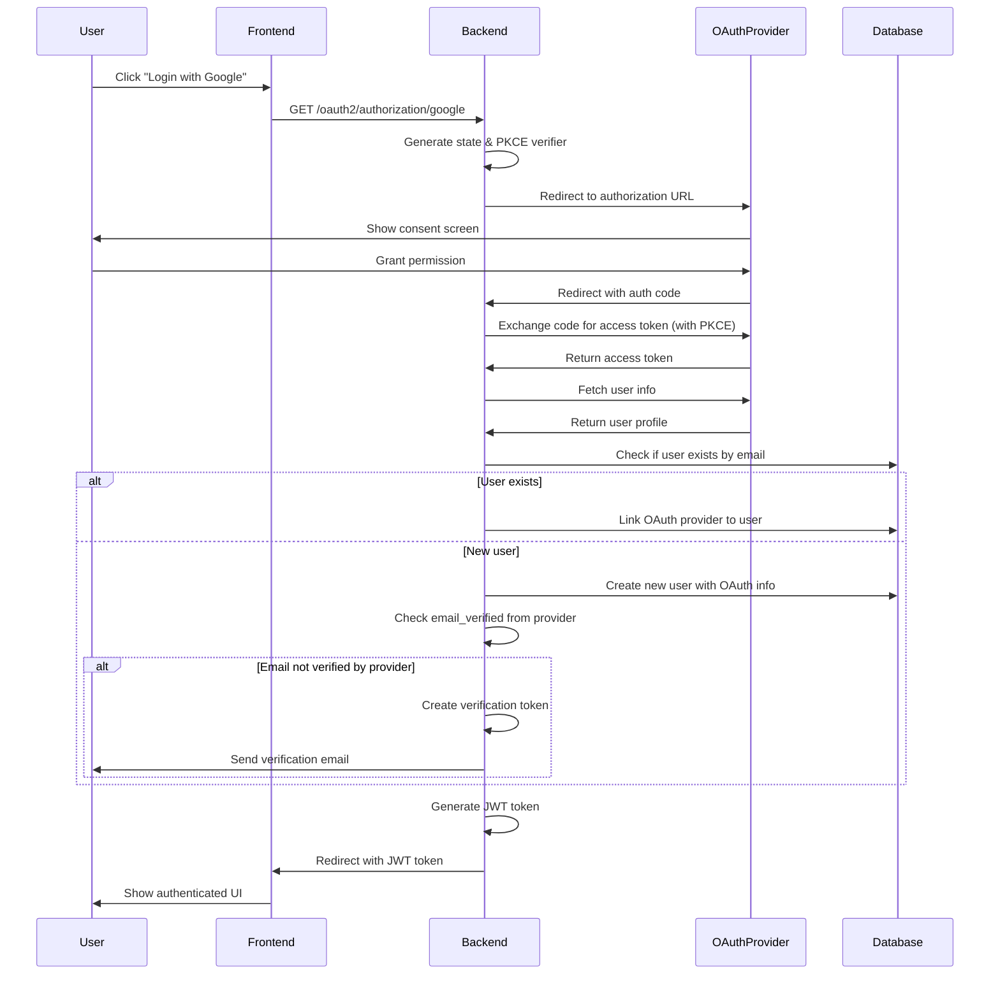

# Design Document: OAuth Email Verification Integration

## Overview

This design document specifies the technical implementation for integrating OAuth authentication providers (Google and GitHub) with the existing email verification system in the real-time chat application. The system currently uses traditional username/password authentication with JWT tokens and email verification. This feature extends the authentication system to support OAuth 2.0 providers while maintaining consistent email verification requirements across all authentication methods.

### Key Design Goals

1. **Seamless Integration**: OAuth authentication should integrate with existing JWT-based authentication without disrupting current flows
2. **Unified Email Verification**: All users must have verified emails regardless of authentication method
3. **Account Linking**: Support linking multiple OAuth providers to a single user account based on email matching
4. **Security First**: Implement OAuth 2.0 best practices including PKCE, state validation, and secure token storage
5. **Backward Compatibility**: Existing password-based users should continue to work without changes

### Research Summary

Based on research into Spring Security OAuth2 integration patterns ([Spring Security OAuth2 documentation](https://spring.io/guides/tutorials/spring-boot-oauth2/), [OAuth2 with Spring Boot tutorials](https://djamware.com/post/oauth2-login-in-java-google-and-github-with-spring-boot)), the implementation will leverage Spring Security's built-in OAuth2 client support. Key findings include:

- Spring Security 6 provides native OAuth2 client configuration through `spring.security.oauth2.client` properties
- OAuth2 user information can be accessed via `OAuth2User` principal after successful authentication
- Custom `OAuth2UserService` implementations allow for user account creation and linking logic
- PKCE support is available through Spring Security OAuth2 client configuration
- Email verification status from OAuth providers varies: Google provides `email_verified` claim, GitHub does not guarantee verification

## Architecture

### High-Level Architecture

The OAuth integration follows a layered architecture pattern:

```
┌─────────────────────────────────────────────────────────────┐
│                     Frontend (Next.js)                       │
│  ┌──────────────┐  ┌──────────────┐  ┌──────────────┐     │
│  │ Login Page   │  │ OAuth Buttons│  │ Profile Page │     │
│  └──────────────┘  └──────────────┘  └──────────────┘     │
└─────────────────────────────────────────────────────────────┘
                            │
                            ▼
┌─────────────────────────────────────────────────────────────┐
│              Spring Security Filter Chain                    │
│  ┌──────────────────────────────────────────────────────┐  │
│  │  OAuth2AuthorizationRequestRedirectFilter            │  │
│  │  OAuth2LoginAuthenticationFilter                     │  │
│  │  JwtAuthenticationFilter (existing)                  │  │
│  └──────────────────────────────────────────────────────┘  │
└─────────────────────────────────────────────────────────────┘
                            │
                            ▼
┌─────────────────────────────────────────────────────────────┐
│                   Service Layer                              │
│  ┌──────────────┐  ┌──────────────┐  ┌──────────────┐     │
│  │ OAuth2User   │  │ Authentication│  │ EmailVerif   │     │
│  │ Service      │  │ Service       │  │ Service      │     │
│  └──────────────┘  └──────────────┘  └──────────────┘     │
└─────────────────────────────────────────────────────────────┘
                            │
                            ▼
┌─────────────────────────────────────────────────────────────┐
│                   Data Layer                                 │
│  ┌──────────────┐  ┌──────────────┐  ┌──────────────┐     │
│  │ User         │  │ OAuthProvider│  │ Verification │     │
│  │ Repository   │  │ Repository   │  │ Token Repo   │     │
│  └──────────────┘  └──────────────┘  └──────────────┘     │
└─────────────────────────────────────────────────────────────┘
                            │
                            ▼
┌─────────────────────────────────────────────────────────────┐
│              PostgreSQL Database                             │
│  ┌──────────────┐  ┌──────────────┐  ┌──────────────┐     │
│  │ users        │  │ oauth_       │  │ verification │     │
│  │              │  │ providers    │  │ _tokens      │     │
│  └──────────────┘  └──────────────┘  └──────────────┘     │
└─────────────────────────────────────────────────────────────┘
```

### OAuth Authentication Flow



## Components and Interfaces

### 1. OAuth Provider Entity

New entity to store OAuth provider linkages for users.

```java
@Entity
@Table(name = "oauth_providers", 
       uniqueConstraints = @UniqueConstraint(columnNames = {"provider_name", "provider_user_id"}))
public class OAuthProvider {
    @Id
    @GeneratedValue(strategy = GenerationType.IDENTITY)
    private Long id;
    
    @ManyToOne(fetch = FetchType.LAZY)
    @JoinColumn(name = "user_id", nullable = false)
    private User user;
    
    @Column(name = "provider_name", nullable = false, length = 50)
    private String providerName; // "google", "github"
    
    @Column(name = "provider_user_id", nullable = false, length = 255)
    private String providerUserId;
    
    @Column(name = "email", length = 100)
    private String email;
    
    @Column(name = "display_name", length = 100)
    private String displayName;
    
    @Column(name = "profile_picture_url", length = 500)
    private String profilePictureUrl;
    
    @Column(name = "access_token", length = 1000)
    private String accessToken; // Encrypted
    
    @Column(name = "refresh_token", length = 1000)
    private String refreshToken; // Encrypted
    
    @Column(name = "token_expiry")
    private LocalDateTime tokenExpiry;
    
    @Column(name = "linked_at", nullable = false)
    private LocalDateTime linkedAt;
    
    @Column(name = "last_used")
    private LocalDateTime lastUsed;
    
    @Column(name = "display_name_manually_set", nullable = false)
    private Boolean displayNameManuallySet = false;
}
```

### 2. User Entity Updates

Extend the existing `User` entity to support OAuth authentication:

```java
@Entity
@Table(name = "users")
public class User {
    // ... existing fields ...
    
    @Column(nullable = true) // Make nullable for OAuth-only users
    private String passwordHash;
    
    @OneToMany(mappedBy = "user", cascade = CascadeType.ALL, orphanRemoval = true)
    private List<OAuthProvider> oauthProviders = new ArrayList<>();
    
    // Helper methods
    public boolean hasPassword() {
        return passwordHash != null && !passwordHash.isEmpty();
    }
    
    public boolean hasOAuthProvider(String providerName) {
        return oauthProviders.stream()
            .anyMatch(p -> p.getProviderName().equals(providerName));
    }
    
    public boolean canUnlinkProvider(String providerName) {
        return hasPassword() || oauthProviders.size() > 1;
    }
}
```

### 3. OAuth2UserService Implementation

Custom service to handle OAuth2 user loading and account creation/linking:

```java
@Service
public class CustomOAuth2UserService extends DefaultOAuth2UserService {
    
    private final UserRepository userRepository;
    private final OAuthProviderRepository oauthProviderRepository;
    private final EmailVerificationService emailVerificationService;
    private final PasswordEncoder passwordEncoder;
    
    @Override
    public OAuth2User loadUser(OAuth2UserRequest userRequest) throws OAuth2AuthenticationException {
        OAuth2User oauth2User = super.loadUser(userRequest);
        
        String providerName = userRequest.getClientRegistration().getRegistrationId();
        String providerUserId = extractProviderUserId(oauth2User, providerName);
        String email = oauth2User.getAttribute("email");
        Boolean emailVerified = extractEmailVerified(oauth2User, providerName);
        
        User user = processOAuthUser(providerName, providerUserId, email, emailVerified, oauth2User);
        
        return new CustomOAuth2User(oauth2User, user);
    }
    
    private User processOAuthUser(String providerName, String providerUserId, 
                                  String email, Boolean emailVerified, OAuth2User oauth2User) {
        // Check if OAuth provider linkage already exists
        Optional<OAuthProvider> existingProvider = 
            oauthProviderRepository.findByProviderNameAndProviderUserId(providerName, providerUserId);
        
        if (existingProvider.isPresent()) {
            return updateExistingOAuthUser(existingProvider.get(), email, emailVerified, oauth2User);
        }
        
        // Check if user exists by email
        Optional<User> existingUser = userRepository.findByEmail(email);
        
        if (existingUser.isPresent()) {
            return linkOAuthToExistingUser(existingUser.get(), providerName, providerUserId, 
                                          email, emailVerified, oauth2User);
        }
        
        // Create new user
        return createNewOAuthUser(providerName, providerUserId, email, emailVerified, oauth2User);
    }
}
```

### 4. OAuth2 Success Handler

Custom success handler to generate JWT tokens after OAuth authentication:

```java
@Component
public class OAuth2AuthenticationSuccessHandler extends SimpleUrlAuthenticationSuccessHandler {
    
    private final JwtUtil jwtUtil;
    private final UserRepository userRepository;
    
    @Value("${app.frontend-url}")
    private String frontendUrl;
    
    @Override
    public void onAuthenticationSuccess(HttpServletRequest request, HttpServletResponse response,
                                       Authentication authentication) throws IOException {
        CustomOAuth2User oauth2User = (CustomOAuth2User) authentication.getPrincipal();
        User user = oauth2User.getUser();
        
        String jwtToken = jwtUtil.generateToken(user.getUsername());
        
        String redirectUrl = UriComponentsBuilder.fromUriString(frontendUrl + "/auth/oauth-callback")
            .queryParam("token", jwtToken)
            .queryParam("emailVerified", user.getEmailVerified())
            .build().toUriString();
        
        getRedirectStrategy().sendRedirect(request, response, redirectUrl);
    }
}
```

### 5. OAuth2 Failure Handler

Custom failure handler for OAuth authentication errors:

```java
@Component
public class OAuth2AuthenticationFailureHandler extends SimpleUrlAuthenticationFailureHandler {
    
    @Value("${app.frontend-url}")
    private String frontendUrl;
    
    @Override
    public void onAuthenticationFailure(HttpServletRequest request, HttpServletResponse response,
                                       AuthenticationException exception) throws IOException {
        String errorMessage = URLEncoder.encode(exception.getMessage(), StandardCharsets.UTF_8);
        
        String redirectUrl = UriComponentsBuilder.fromUriString(frontendUrl + "/auth/login")
            .queryParam("error", errorMessage)
            .build().toUriString();
        
        getRedirectStrategy().sendRedirect(request, response, redirectUrl);
    }
}
```

### 6. OAuth Provider Management Controller

REST API endpoints for managing OAuth provider linkages:

```java
@RestController
@RequestMapping("/api/oauth")
public class OAuthProviderController {
    
    private final OAuthProviderService oauthProviderService;
    
    @GetMapping("/providers")
    public ResponseEntity<List<OAuthProviderResponse>> getLinkedProviders(
            @AuthenticationPrincipal UserDetails userDetails) {
        List<OAuthProviderResponse> providers = 
            oauthProviderService.getLinkedProviders(userDetails.getUsername());
        return ResponseEntity.ok(providers);
    }
    
    @DeleteMapping("/providers/{providerName}")
    public ResponseEntity<Void> unlinkProvider(
            @PathVariable String providerName,
            @AuthenticationPrincipal UserDetails userDetails) {
        oauthProviderService.unlinkProvider(userDetails.getUsername(), providerName);
        return ResponseEntity.noContent().build();
    }
    
    @PostMapping("/link/{providerName}")
    public ResponseEntity<String> initiateProviderLinking(
            @PathVariable String providerName,
            @AuthenticationPrincipal UserDetails userDetails) {
        String authorizationUrl = oauthProviderService.generateLinkingUrl(
            userDetails.getUsername(), providerName);
        return ResponseEntity.ok(authorizationUrl);
    }
}
```

### 7. Security Configuration Updates

Update Spring Security configuration to enable OAuth2 login:

```java
@Configuration
@EnableWebSecurity
public class SecurityConfig {
    
    private final CustomOAuth2UserService customOAuth2UserService;
    private final OAuth2AuthenticationSuccessHandler successHandler;
    private final OAuth2AuthenticationFailureHandler failureHandler;
    
    @Bean
    public SecurityFilterChain filterChain(HttpSecurity http) throws Exception {
        http
            // ... existing configuration ...
            .oauth2Login(oauth2 -> oauth2
                .userInfoEndpoint(userInfo -> userInfo
                    .userService(customOAuth2UserService)
                )
                .successHandler(successHandler)
                .failureHandler(failureHandler)
                .authorizationEndpoint(authorization -> authorization
                    .authorizationRequestRepository(cookieAuthorizationRequestRepository())
                )
            );
        
        return http.build();
    }
    
    @Bean
    public HttpCookieOAuth2AuthorizationRequestRepository cookieAuthorizationRequestRepository() {
        return new HttpCookieOAuth2AuthorizationRequestRepository();
    }
}
```

## Correctness Properties

*A property is a characteristic or behavior that should hold true across all valid executions of a system—essentially, a formal statement about what the system should do. Properties serve as the bridge between human-readable specifications and machine-verifiable correctness guarantees.*

### Property Reflection

After analyzing all 60 acceptance criteria, I identified the following redundancies and consolidations:

**Redundancy Analysis:**
- Properties 4.1 and 5.5 both test email verification flag handling from OAuth providers → Consolidated into Property 1
- Properties 6.2 and 6.3 both test email verification validation during authentication → Consolidated into Property 8
- Properties 5.1, 5.2, and 5.3 all relate to email change detection and handling → Consolidated into Property 2
- Properties 7.1 and 7.2 both test authentication method validation during unlinking → Consolidated into Property 10
- Properties 9.5 and 12.1 both test secure token storage → Consolidated into Property 14
- Properties 8.5 and 5.4 both test audit logging → Consolidated into Property 15

**Final Property Set:** 20 comprehensive properties covering all testable acceptance criteria

### Property 1: OAuth Email Verification Status Handling

*For any* OAuth authentication where the provider supplies an `email_verified` flag as true, the system SHALL mark the user's email as verified without creating a verification token; otherwise, the system SHALL create and send a verification token.

**Validates: Requirements 4.1, 4.2, 5.5**

### Property 2: OAuth Email Change Detection and Re-verification

*For any* OAuth authentication where the OAuth provider's email differs from the stored user email, the system SHALL update the user's email, reset the `email_verified` flag to false (unless the provider's `email_verified` is true), and create a new verification token.

**Validates: Requirements 5.1, 5.2, 5.3**

### Property 3: OAuth User Creation with Required Fields

*For any* first-time OAuth authentication with valid user info containing required fields (email, provider user ID), the system SHALL create a new user account with OAuth provider information stored.

**Validates: Requirements 3.1, 3.2**

### Property 4: OAuth Account Linking by Email

*For any* OAuth authentication where a user with matching email already exists, the system SHALL link the OAuth provider to the existing user account without creating a duplicate user.

**Validates: Requirements 3.3**

### Property 5: OAuth Provider Linkage Uniqueness

*For any* user and OAuth provider combination, attempting to link the same provider twice SHALL be rejected, preventing duplicate linkages.

**Validates: Requirements 3.4**

### Property 6: OAuth Username Generation and Uniqueness

*For any* OAuth authentication where the user info does not include a username, the system SHALL generate a unique username from the display name by converting to lowercase, replacing spaces with underscores, and appending numeric suffixes when conflicts occur.

**Validates: Requirements 3.5, 3.6**

### Property 7: OAuth User Email Verification Flow Equivalence

*For any* OAuth-created user requiring email verification, the verification flow (token creation, email sending, token validation) SHALL function identically to traditional password-based user verification.

**Validates: Requirements 4.4, 4.5**

### Property 8: Hybrid User Authentication with Email Verification

*For any* hybrid user (with both password and OAuth provider), authentication via either method SHALL validate email verification status before issuing a JWT token.

**Validates: Requirements 6.1, 6.2, 6.3**

### Property 9: OAuth Provider Addition to Existing Accounts

*For any* existing password-based user, OAuth providers SHALL be linkable to the account, and for any OAuth-only user, a password SHALL be settable, creating a hybrid user account.

**Validates: Requirements 6.4, 6.5**

### Property 10: OAuth Provider Unlinking Validation

*For any* OAuth provider unlink request, the system SHALL verify at least one authentication method remains; if the user has only one OAuth provider and no password, the unlink request SHALL be rejected.

**Validates: Requirements 7.1, 7.2, 7.3**

### Property 11: OAuth Provider Unlinking Data Preservation

*For any* successful OAuth provider unlink operation, the user account and email verification status SHALL remain intact and unchanged.

**Validates: Requirements 7.5**

### Property 12: OAuth User Info Validation

*For any* OAuth user info received from a provider, the system SHALL validate that required fields (email, provider user ID) are present; if missing, the system SHALL return an error indicating incomplete provider data.

**Validates: Requirements 2.4, 8.4**

### Property 13: OAuth State Parameter Validation

*For any* OAuth callback request, the system SHALL validate the state parameter matches the expected value to prevent CSRF attacks; invalid state SHALL result in authentication failure.

**Validates: Requirements 9.2**

### Property 14: OAuth Token Secure Storage

*For any* OAuth access token or refresh token that needs to be stored, the system SHALL encrypt the token before persisting it to the database.

**Validates: Requirements 9.5, 12.1**

### Property 15: OAuth Operation Audit Logging

*For any* OAuth operation (email change, provider linking, provider unlinking, token refresh, authentication error), the system SHALL create an audit log entry without exposing sensitive information (tokens, passwords) in the log.

**Validates: Requirements 5.4, 7.4, 8.5, 9.6, 12.4**

### Property 16: OAuth Redirect URI Validation

*For any* OAuth redirect URI in a callback request, the system SHALL validate the URI against the configured whitelist of allowed redirect URIs; non-whitelisted URIs SHALL be rejected.

**Validates: Requirements 9.3**

### Property 17: OAuth Profile Synchronization with Manual Override

*For any* OAuth authentication, the system SHALL update the user's display name and profile picture from OAuth data only if the user has not manually customized these fields (indicated by the `display_name_manually_set` flag).

**Validates: Requirements 11.1, 11.2, 11.3, 11.4, 11.5**

### Property 18: OAuth Token Refresh with Fallback

*For any* expired OAuth access token where a refresh token exists, the system SHALL attempt to obtain a new access token using the refresh token; if refresh fails, the system SHALL require user re-authentication.

**Validates: Requirements 12.2, 12.3**

### Property 19: OAuth Response Format Consistency

*For any* OAuth-related REST API operation (login, callback, linking, unlinking, listing providers), the response format SHALL match the existing authentication endpoint patterns (same error structure, same success structure).

**Validates: Requirements 10.5**

### Property 20: OAuth Unverified Email Access Restriction

*For any* OAuth user with an unverified email address, the system SHALL allow login and JWT token issuance but SHALL restrict access to features requiring verified email.

**Validates: Requirements 4.3**

## Data Models

### Database Schema Changes

#### New Table: oauth_providers

```sql
CREATE TABLE oauth_providers (
    id BIGSERIAL PRIMARY KEY,
    user_id BIGINT NOT NULL REFERENCES users(id) ON DELETE CASCADE,
    provider_name VARCHAR(50) NOT NULL,
    provider_user_id VARCHAR(255) NOT NULL,
    email VARCHAR(100),
    display_name VARCHAR(100),
    profile_picture_url VARCHAR(500),
    access_token VARCHAR(1000),
    refresh_token VARCHAR(1000),
    token_expiry TIMESTAMP,
    linked_at TIMESTAMP NOT NULL DEFAULT CURRENT_TIMESTAMP,
    last_used TIMESTAMP,
    display_name_manually_set BOOLEAN NOT NULL DEFAULT FALSE,
    CONSTRAINT uk_provider_user UNIQUE (provider_name, provider_user_id)
);

CREATE INDEX idx_oauth_providers_user_id ON oauth_providers(user_id);
CREATE INDEX idx_oauth_providers_provider_name ON oauth_providers(provider_name);
```

#### Modified Table: users

```sql
ALTER TABLE users ALTER COLUMN password_hash DROP NOT NULL;
```

### DTO Classes

#### OAuthProviderResponse

```java
public record OAuthProviderResponse(
    String providerName,
    String email,
    String displayName,
    LocalDateTime linkedAt,
    LocalDateTime lastUsed
) {}
```

#### OAuth2UserInfo

```java
public interface OAuth2UserInfo {
    String getProviderId();
    String getEmail();
    String getName();
    String getProfilePictureUrl();
    Boolean getEmailVerified();
}

public class GoogleOAuth2UserInfo implements OAuth2UserInfo {
    private final Map<String, Object> attributes;
    
    @Override
    public String getProviderId() {
        return (String) attributes.get("sub");
    }
    
    @Override
    public Boolean getEmailVerified() {
        return (Boolean) attributes.get("email_verified");
    }
    // ... other methods
}

public class GithubOAuth2UserInfo implements OAuth2UserInfo {
    private final Map<String, Object> attributes;
    
    @Override
    public String getProviderId() {
        return String.valueOf(attributes.get("id"));
    }
    
    @Override
    public Boolean getEmailVerified() {
        return null; // GitHub doesn't provide this
    }
    // ... other methods
}
```

## Error Handling

### OAuth-Specific Exceptions

```java
public class OAuthAuthenticationException extends ChatApplicationException {
    public OAuthAuthenticationException(String message) {
        super(message);
    }
}

public class OAuthProviderLinkingException extends ChatApplicationException {
    public OAuthProviderLinkingException(String message) {
        super(message);
    }
}

public class OAuthProviderUnlinkException extends ChatApplicationException {
    public OAuthProviderUnlinkException(String message) {
        super(message);
    }
}
```

### Error Handling Strategy

1. **OAuth Provider Errors**: Log detailed error information server-side, return generic user-friendly messages to frontend
2. **Account Linking Conflicts**: Return specific error messages when email conflicts occur
3. **Unlinking Validation**: Prevent unlinking last authentication method with clear error message
4. **Token Refresh Failures**: Require re-authentication via OAuth when refresh fails
5. **Email Verification Failures**: Allow login but restrict features until email is verified

### Global Exception Handler Updates

```java
@RestControllerAdvice
public class GlobalExceptionHandler {
    
    @ExceptionHandler(OAuthAuthenticationException.class)
    public ResponseEntity<ErrorResponse> handleOAuthAuthenticationException(
            OAuthAuthenticationException ex) {
        logger.error("OAuth authentication error", ex);
        return ResponseEntity.status(HttpStatus.UNAUTHORIZED)
            .body(new ErrorResponse("OAuth authentication failed. Please try again."));
    }
    
    @ExceptionHandler(OAuthProviderUnlinkException.class)
    public ResponseEntity<ErrorResponse> handleOAuthProviderUnlinkException(
            OAuthProviderUnlinkException ex) {
        return ResponseEntity.status(HttpStatus.BAD_REQUEST)
            .body(new ErrorResponse(ex.getMessage()));
    }
}
```

## Testing Strategy

### Dual Testing Approach

This feature requires both unit tests and property-based tests for comprehensive coverage:

- **Unit tests**: Verify specific examples, edge cases, error conditions, and integration points
- **Property tests**: Verify universal properties across all inputs using randomized test data
- Together: Unit tests catch concrete bugs in specific scenarios, property tests verify general correctness across the input space

### Property-Based Testing Configuration

**Library Selection**: [jqwik](https://jqwik.net/) - A property-based testing library for Java that integrates with JUnit 5

**Test Configuration**:
- Minimum 100 iterations per property test (due to randomization)
- Each property test MUST reference its design document property using a comment tag
- Tag format: `// Feature: oauth-email-verification-integration, Property {number}: {property_text}`

**Example Property Test Structure**:

```java
@Property
@Label("Feature: oauth-email-verification-integration, Property 1: OAuth Email Verification Status Handling")
void oauthEmailVerificationStatusHandling(
    @ForAll("oauthUserInfoWithVerifiedEmail") OAuth2UserInfo verifiedUserInfo,
    @ForAll("oauthUserInfoWithUnverifiedEmail") OAuth2UserInfo unverifiedUserInfo) {
    
    // Test verified email case
    User userVerified = customOAuth2UserService.processOAuthUser(verifiedUserInfo);
    assertThat(userVerified.getEmailVerified()).isTrue();
    verify(emailVerificationService, never()).createAndSendToken(any());
    
    // Test unverified email case
    User userUnverified = customOAuth2UserService.processOAuthUser(unverifiedUserInfo);
    assertThat(userUnverified.getEmailVerified()).isFalse();
    verify(emailVerificationService, times(1)).createAndSendToken(any());
}

@Provide
Arbitrary<OAuth2UserInfo> oauthUserInfoWithVerifiedEmail() {
    return Combinators.combine(
        Arbitraries.strings().alpha().ofMinLength(5),
        Arbitraries.emails(),
        Arbitraries.strings().alpha().ofMinLength(3)
    ).as((id, email, name) -> new GoogleOAuth2UserInfo(
        Map.of("sub", id, "email", email, "name", name, "email_verified", true)
    ));
}
```

### Unit Testing

Unit tests will focus on individual components and business logic:

1. **OAuth2UserService Tests**
   - Test user creation from OAuth profile (specific examples)
   - Test account linking by email (specific examples)
   - Test email verification status handling (covered by property tests)
   - Test username generation and uniqueness (covered by property tests)
   - Test profile synchronization logic (covered by property tests)

2. **OAuthProviderService Tests**
   - Test provider linking validation (covered by property tests)
   - Test provider unlinking validation (covered by property tests)
   - Test last authentication method protection (covered by property tests)
   - Test token refresh logic (covered by property tests)

3. **AuthenticationService Tests**
   - Test hybrid user authentication (covered by property tests)
   - Test OAuth-only user authentication (specific examples)
   - Test email verification requirement enforcement (covered by property tests)

4. **Security Configuration Tests**
   - Test OAuth2 filter chain configuration (smoke tests)
   - Test success/failure handler invocation (specific examples)
   - Test PKCE parameter generation (integration tests)

### Property-Based Testing

Property tests will verify universal properties across randomized inputs:

1. **Property 1-7: OAuth User Creation and Linking**
   - Generate random OAuth profiles with varying email verification status
   - Generate random existing users for account linking scenarios
   - Generate random username conflicts for uniqueness testing
   - Verify user creation, linking, and verification flows

2. **Property 8-11: Hybrid User and Provider Management**
   - Generate random hybrid users with various authentication method combinations
   - Generate random provider linking/unlinking scenarios
   - Verify authentication validation and data preservation

3. **Property 12-16: Security and Validation**
   - Generate random OAuth user info with missing/invalid fields
   - Generate random OAuth callbacks with valid/invalid state parameters
   - Generate random redirect URIs for whitelist validation
   - Verify validation logic and secure token storage

4. **Property 17-20: Profile Sync and Access Control**
   - Generate random OAuth profiles with varying display names and pictures
   - Generate random users with manual/automatic profile settings
   - Generate random token refresh scenarios
   - Verify profile synchronization and access restrictions

### Integration Testing

Integration tests will verify end-to-end OAuth flows:

1. **OAuth Login Flow Tests**
   - Test complete Google OAuth login flow with mock provider
   - Test complete GitHub OAuth login flow with mock provider
   - Test JWT token generation after OAuth success
   - Test redirect to frontend with token

2. **Account Linking Tests**
   - Test linking OAuth provider to existing password account
   - Test linking multiple OAuth providers to same account
   - Test email conflict handling during linking

3. **Email Verification Integration Tests**
   - Test email verification for OAuth users with unverified emails
   - Test automatic verification for OAuth users with verified emails
   - Test email change detection and re-verification

4. **Provider Management Tests**
   - Test listing linked providers
   - Test unlinking provider with multiple auth methods
   - Test preventing unlinking last auth method

### Test Configuration

```java
@TestConfiguration
public class OAuth2TestConfig {
    
    @Bean
    public OAuth2AuthorizedClientService authorizedClientService() {
        return new InMemoryOAuth2AuthorizedClientService(clientRegistrationRepository());
    }
    
    @Bean
    public ClientRegistrationRepository clientRegistrationRepository() {
        return new InMemoryClientRegistrationRepository(
            googleClientRegistration(),
            githubClientRegistration()
        );
    }
    
    private ClientRegistration googleClientRegistration() {
        return ClientRegistration.withRegistrationId("google")
            .clientId("test-client-id")
            .clientSecret("test-client-secret")
            .authorizationGrantType(AuthorizationGrantType.AUTHORIZATION_CODE)
            .redirectUri("{baseUrl}/login/oauth2/code/{registrationId}")
            .scope("openid", "profile", "email")
            .authorizationUri("https://accounts.google.com/o/oauth2/v2/auth")
            .tokenUri("https://www.googleapis.com/oauth2/v4/token")
            .userInfoUri("https://www.googleapis.com/oauth2/v3/userinfo")
            .userNameAttributeName("sub")
            .clientName("Google")
            .build();
    }
}
```

### Testing Libraries

- **JUnit 5**: Core testing framework
- **Mockito**: Mocking OAuth2 providers and external dependencies
- **Spring Security Test**: Testing security configurations and OAuth2 flows
- **WireMock**: Mocking OAuth provider HTTP endpoints
- **TestContainers**: PostgreSQL container for integration tests

## Configuration

### Application Properties

```yaml
spring:
  security:
    oauth2:
      client:
        registration:
          google:
            client-id: ${GOOGLE_CLIENT_ID}
            client-secret: ${GOOGLE_CLIENT_SECRET}
            scope:
              - openid
              - profile
              - email
            redirect-uri: "{baseUrl}/login/oauth2/code/{registrationId}"
            client-name: Google
            
          github:
            client-id: ${GITHUB_CLIENT_ID}
            client-secret: ${GITHUB_CLIENT_SECRET}
            scope:
              - read:user
              - user:email
            redirect-uri: "{baseUrl}/login/oauth2/code/{registrationId}"
            client-name: GitHub
            
        provider:
          google:
            authorization-uri: https://accounts.google.com/o/oauth2/v2/auth
            token-uri: https://www.googleapis.com/oauth2/v4/token
            user-info-uri: https://www.googleapis.com/oauth2/v3/userinfo
            user-name-attribute: sub
            
          github:
            authorization-uri: https://github.com/login/oauth/authorize
            token-uri: https://github.com/login/oauth/access_token
            user-info-uri: https://api.github.com/user
            user-name-attribute: id

app:
  oauth:
    # Enable PKCE for public clients
    use-pkce: true
    # Cookie expiry for OAuth state (5 minutes)
    authorization-request-cookie-expiry: 300
    # Allowed redirect URIs for security
    authorized-redirect-uris:
      - ${app.frontend-url}/auth/oauth-callback
```

### Environment Variables

Required environment variables for OAuth configuration:

- `GOOGLE_CLIENT_ID`: Google OAuth client ID
- `GOOGLE_CLIENT_SECRET`: Google OAuth client secret
- `GITHUB_CLIENT_ID`: GitHub OAuth client ID
- `GITHUB_CLIENT_SECRET`: GitHub OAuth client secret
- `APP_BASE_URL`: Backend base URL (e.g., https://api.example.com)
- `FRONTEND_BASE_URL`: Frontend base URL (e.g., https://example.com)

### Security Considerations

1. **PKCE Implementation**: Enable PKCE for authorization code flow to prevent authorization code interception
2. **State Parameter Validation**: Validate state parameter to prevent CSRF attacks
3. **Redirect URI Validation**: Whitelist allowed redirect URIs
4. **Token Storage**: Encrypt OAuth access/refresh tokens before storing in database
5. **HTTPS Enforcement**: Require HTTPS for all OAuth redirect URIs in production
6. **Token Expiry**: Implement token refresh logic before expiry
7. **Scope Minimization**: Request only necessary OAuth scopes

## Implementation Notes

### Username Generation Strategy

For OAuth users without explicit usernames:

1. Extract name from OAuth profile (e.g., "John Doe")
2. Convert to lowercase and replace spaces with underscores (e.g., "john_doe")
3. Check uniqueness in database
4. If not unique, append numeric suffix (e.g., "john_doe_2")
5. Limit to 50 characters per User entity constraint

### Email Verification Logic

```
IF OAuth provider email_verified == true THEN
    Set user.emailVerified = true
    Skip verification email
ELSE IF OAuth provider email_verified == false OR null THEN
    Set user.emailVerified = false
    Create verification token
    Send verification email
END IF
```

### Profile Synchronization Logic

```
IF user.displayNameManuallySet == false THEN
    Update user.displayName from OAuth profile
ELSE
    Keep existing user.displayName
END IF

IF OAuth profile picture URL exists THEN
    Update user.profilePictureUrl
END IF
```

### Token Refresh Strategy

1. Check token expiry before making OAuth API calls
2. If expired and refresh token exists, attempt refresh
3. If refresh succeeds, update stored tokens
4. If refresh fails, mark provider as requiring re-authentication
5. Log refresh failures for monitoring

## Frontend Integration

### OAuth Login Buttons

```typescript
// Frontend component for OAuth login
export function OAuthLoginButtons() {
  const handleOAuthLogin = (provider: 'google' | 'github') => {
    window.location.href = `${API_BASE_URL}/oauth2/authorization/${provider}`;
  };
  
  return (
    <div className="oauth-buttons">
      <button onClick={() => handleOAuthLogin('google')}>
        <GoogleIcon /> Continue with Google
      </button>
      <button onClick={() => handleOAuthLogin('github')}>
        <GithubIcon /> Continue with GitHub
      </button>
    </div>
  );
}
```

### OAuth Callback Handler

```typescript
// Frontend page to handle OAuth callback
export default function OAuthCallbackPage() {
  const router = useRouter();
  const { token, emailVerified } = router.query;
  
  useEffect(() => {
    if (token) {
      // Store JWT token
      localStorage.setItem('authToken', token as string);
      
      // Redirect based on email verification status
      if (emailVerified === 'false') {
        router.push('/auth/verify-email-required');
      } else {
        router.push('/chat');
      }
    }
  }, [token, emailVerified]);
  
  return <LoadingSpinner />;
}
```

### Provider Management UI

```typescript
// Frontend component for managing linked OAuth providers
export function LinkedProvidersPanel() {
  const { data: providers } = useQuery('/api/oauth/providers');
  
  const handleUnlink = async (providerName: string) => {
    await fetch(`/api/oauth/providers/${providerName}`, {
      method: 'DELETE',
      headers: { Authorization: `Bearer ${getAuthToken()}` }
    });
  };
  
  return (
    <div className="linked-providers">
      {providers?.map(provider => (
        <div key={provider.providerName} className="provider-card">
          <span>{provider.providerName}</span>
          <span>{provider.email}</span>
          <button onClick={() => handleUnlink(provider.providerName)}>
            Unlink
          </button>
        </div>
      ))}
    </div>
  );
}
```

---

**Design Status**: Ready for implementation

**Next Steps**: 
1. Review and approve design document
2. Proceed to task breakdown phase
3. Implement OAuth provider entity and repository
4. Implement CustomOAuth2UserService
5. Configure Spring Security OAuth2 client
6. Implement frontend OAuth buttons and callback handling
7. Write comprehensive tests
