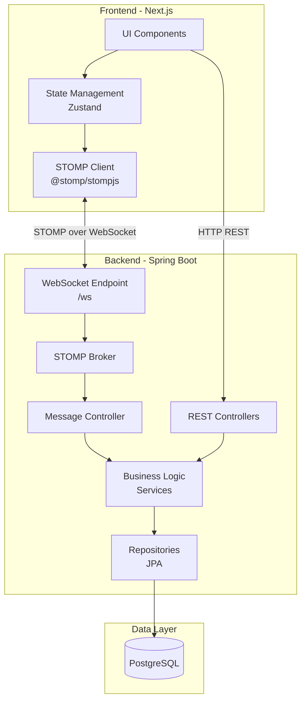
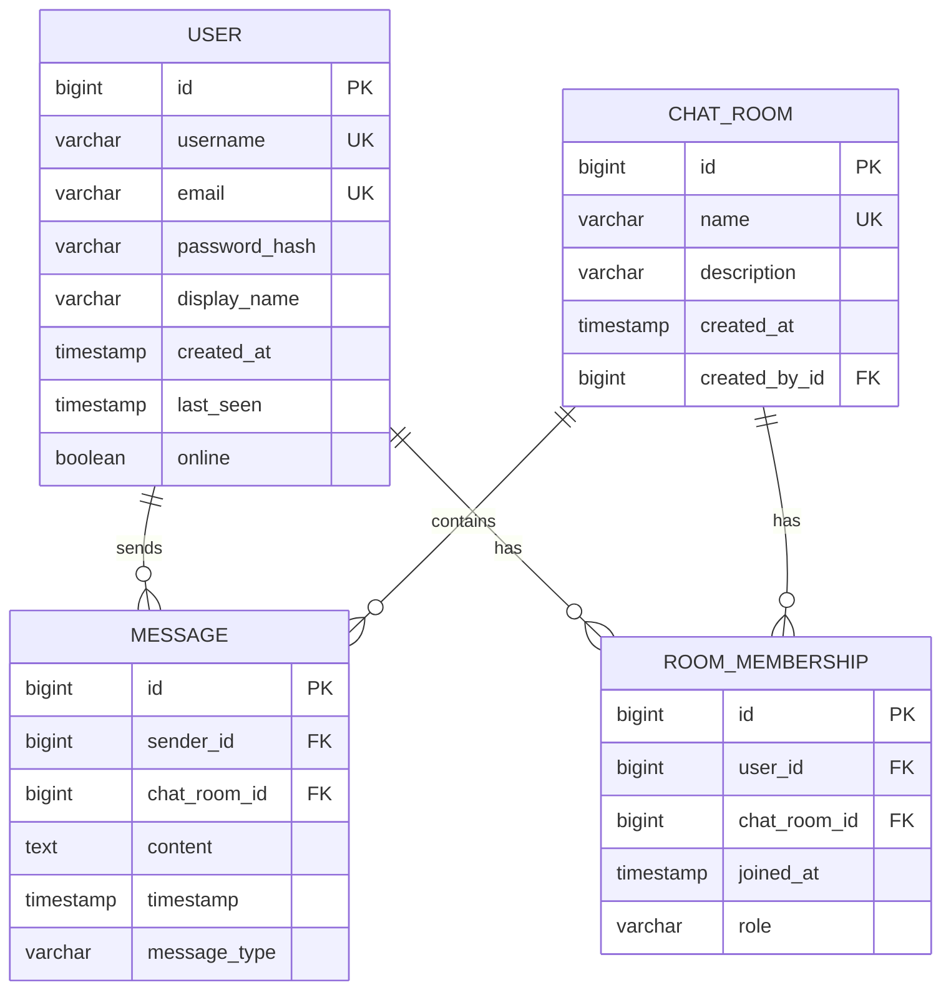

# Design Document: Real-Time Chat System

## Overview

This design document specifies the architecture and implementation details for a real-time chat system built with Spring Boot (backend) and Next.js with TypeScript (frontend). The system uses STOMP (Simple Text Oriented Messaging Protocol) over WebSocket for bidirectional real-time communication, supporting 10-20 concurrent users as a learning project.

### Key Technologies

**Backend:**
- Java 21
- Spring Boot 3.x
- Spring WebSocket with STOMP
- Spring Data JPA
- PostgreSQL database
- Maven build system

**Frontend:**
- Next.js 14+ with App Router
- TypeScript (strict mode)
- React 18+
- @stomp/stompjs for WebSocket client
- Tailwind CSS for mobile-first styling
- Zustand for state management

### Design Principles

1. **Mobile-First**: UI designed for mobile devices first, then scaled up
2. **Real-Time Communication**: STOMP over WebSocket for structured pub/sub messaging
3. **Type Safety**: TypeScript throughout frontend with strict compiler options
4. **Separation of Concerns**: Clear boundaries between transport, business logic, and presentation
5. **Learning-Focused**: Simple, understandable architecture suitable for educational purposes

## Architecture

### High-Level Architecture



### Communication Flow

**Message Sending Flow:**
1. User types message in UI Component
2. State Management updates local state
3. STOMP Client sends SEND frame to `/app/chat.send/{roomId}`
4. Spring WebSocket receives frame at Message Controller
5. Controller validates and persists message via Service layer
6. Service publishes message to STOMP topic `/topic/room/{roomId}`
7. STOMP Broker broadcasts to all subscribers
8. All connected clients receive message via their subscriptions
9. Frontend updates UI with new message

**Connection Flow:**
1. User authenticates via REST API
2. Frontend receives JWT token
3. STOMP Client connects to `/ws` endpoint with token
4. Spring validates token and establishes WebSocket connection
5. Client subscribes to relevant topics (rooms, presence)
6. Connection maintained with heartbeat frames

### STOMP Topic Structure

| Destination Pattern | Purpose | Message Type |
|-------------------|---------|--------------|
| `/app/chat.send/{roomId}` | Send message to room | Application destination (client → server) |
| `/topic/room/{roomId}` | Receive room messages | Subscription topic (server → clients) |
| `/topic/presence/{roomId}` | User presence updates | Subscription topic (server → clients) |
| `/app/room.join/{roomId}` | Join room | Application destination (client → server) |
| `/app/room.leave/{roomId}` | Leave room | Application destination (client → server) |
| `/user/queue/errors` | User-specific errors | User destination (server → specific client) |

## Components and Interfaces

### Backend Components

#### 1. WebSocket Configuration

**Class:** `WebSocketConfig`

**Responsibilities:**
- Configure STOMP endpoints
- Enable SockJS fallback
- Set message broker prefixes
- Configure message size limits

**Configuration:**
```java
@Configuration
@EnableWebSocketMessageBroker
public class WebSocketConfig implements WebSocketMessageBrokerConfigurer {
    
    @Override
    public void registerStompEndpoints(StompEndpointRegistry registry) {
        registry.addEndpoint("/ws")
                .setAllowedOrigins("http://localhost:3000")
                .withSockJS();
    }
    
    @Override
    public void configureMessageBroker(MessageBrokerRegistry registry) {
        registry.enableSimpleBroker("/topic", "/queue");
        registry.setApplicationDestinationPrefixes("/app");
        registry.setUserDestinationPrefix("/user");
    }
}
```

#### 2. Message Controller

**Class:** `ChatMessageController`

**Endpoints:**
- `@MessageMapping("/chat.send/{roomId}")` - Handle incoming messages
- `@MessageMapping("/room.join/{roomId}")` - Handle room join
- `@MessageMapping("/room.leave/{roomId}")` - Handle room leave

**Responsibilities:**
- Receive STOMP messages
- Validate message content
- Delegate to service layer
- Send responses to topics

#### 3. REST Controllers

**UserController:**
- `POST /api/auth/register` - User registration
- `POST /api/auth/login` - User authentication
- `GET /api/users/me` - Get current user profile
- `PUT /api/users/me` - Update user profile

**ChatRoomController:**
- `POST /api/rooms` - Create chat room
- `GET /api/rooms` - List available rooms
- `GET /api/rooms/{id}` - Get room details
- `GET /api/rooms/{id}/members` - Get room members

**MessageController:**
- `GET /api/rooms/{roomId}/messages` - Get message history (paginated)
- `GET /api/rooms/{roomId}/messages?page=0&size=50` - Pagination support

#### 4. Service Layer

**AuthenticationService:**
- User registration and credential validation
- JWT token generation and validation
- Session management

**ChatMessageService:**
- Message persistence
- Message validation
- Message broadcasting via SimpMessagingTemplate
- Message history retrieval

**ChatRoomService:**
- Room creation and management
- Membership management
- Room metadata operations

**UserPresenceService:**
- Track online/offline status
- Publish presence updates
- Handle connection/disconnection events

#### 5. Repository Layer

**UserRepository extends JpaRepository<User, Long>:**
- `Optional<User> findByUsername(String username)`
- `boolean existsByUsername(String username)`
- `boolean existsByEmail(String email)`

**ChatRoomRepository extends JpaRepository<ChatRoom, Long>:**
- `List<ChatRoom> findByMembersContaining(User user)`
- `Optional<ChatRoom> findByName(String name)`

**MessageRepository extends JpaRepository<Message, Long>:**
- `Page<Message> findByChatRoomOrderByTimestampDesc(ChatRoom room, Pageable pageable)`
- `List<Message> findByChatRoomAndTimestampAfter(ChatRoom room, LocalDateTime timestamp)`

**RoomMembershipRepository extends JpaRepository<RoomMembership, Long>:**
- `List<RoomMembership> findByChatRoom(ChatRoom room)`
- `Optional<RoomMembership> findByUserAndChatRoom(User user, ChatRoom room)`
- `void deleteByUserAndChatRoom(User user, ChatRoom room)`

### Frontend Components

#### 1. App Structure (Next.js App Router)

```
frontend/
├── src/
│   ├── app/
│   │   ├── layout.tsx              # Root layout
│   │   ├── page.tsx                # Home/landing page
│   │   ├── auth/
│   │   │   ├── login/
│   │   │   │   └── page.tsx        # Login page
│   │   │   └── register/
│   │   │       └── page.tsx        # Register page
│   │   └── chat/
│   │       ├── layout.tsx          # Chat layout
│   │       ├── page.tsx            # Room list
│   │       └── [roomId]/
│   │           └── page.tsx        # Chat room
│   ├── components/
│   │   ├── chat/
│   │   │   ├── MessageList.tsx     # Message display
│   │   │   ├── MessageInput.tsx    # Message input
│   │   │   ├── UserList.tsx        # Online users
│   │   │   └── RoomSelector.tsx    # Room navigation
│   │   ├── auth/
│   │   │   ├── LoginForm.tsx
│   │   │   └── RegisterForm.tsx
│   │   └── ui/
│   │       ├── Button.tsx
│   │       ├── Input.tsx
│   │       └── Card.tsx
│   ├── lib/
│   │   ├── stomp/
│   │   │   ├── client.ts           # STOMP client setup
│   │   │   ├── hooks.ts            # React hooks for STOMP
│   │   │   └── types.ts            # STOMP-related types
│   │   ├── api/
│   │   │   ├── client.ts           # HTTP client setup
│   │   │   ├── auth.ts             # Auth API calls
│   │   │   ├── rooms.ts            # Room API calls
│   │   │   └── messages.ts         # Message API calls
│   │   └── store/
│   │       ├── authStore.ts        # Auth state
│   │       ├── chatStore.ts        # Chat state
│   │       └── connectionStore.ts  # WebSocket state
│   ├── types/
│   │   ├── models.ts               # Domain models
│   │   ├── api.ts                  # API types
│   │   └── stomp.ts                # STOMP types
│   └── utils/
│       ├── validation.ts
│       └── formatting.ts
├── public/
├── package.json
└── tsconfig.json
```

#### 2. Key React Components

**MessageList Component:**
```typescript
'use client';

interface MessageListProps {
  roomId: string;
}

export function MessageList({ roomId }: MessageListProps) {
  // Displays messages with virtual scrolling
  // Auto-scrolls to bottom on new messages
  // Shows sender, timestamp, content
  // Handles loading states
}
```

**MessageInput Component:**
```typescript
'use client';

interface MessageInputProps {
  roomId: string;
  onSend: (content: string) => void;
}

export function MessageInput({ roomId, onSend }: MessageInputProps) {
  // Text input with send button
  // Enter key to send
  // Character limit validation
  // Disabled when disconnected
}
```

**UserList Component:**
```typescript
'use client';

interface UserListProps {
  roomId: string;
}

export function UserList({ roomId }: UserListProps) {
  // Displays online users
  // Shows presence indicators
  // Updates in real-time
}
```

#### 3. STOMP Client Integration

**STOMP Client Setup:**
```typescript
// lib/stomp/client.ts
import { Client, StompConfig } from '@stomp/stompjs';
import SockJS from 'sockjs-client';

export function createStompClient(token: string): Client {
  const config: StompConfig = {
    brokerURL: undefined, // Using SockJS
    webSocketFactory: () => new SockJS('http://localhost:8080/ws'),
    connectHeaders: {
      Authorization: `Bearer ${token}`,
    },
    debug: (str) => console.log('STOMP:', str),
    reconnectDelay: 5000,
    heartbeatIncoming: 4000,
    heartbeatOutgoing: 4000,
  };
  
  return new Client(config);
}
```

**React Hook for STOMP:**
```typescript
// lib/stomp/hooks.ts
export function useStompSubscription<T>(
  destination: string,
  callback: (message: T) => void
) {
  const client = useConnectionStore((state) => state.client);
  
  useEffect(() => {
    if (!client?.connected) return;
    
    const subscription = client.subscribe(destination, (message) => {
      const parsed = JSON.parse(message.body) as T;
      callback(parsed);
    });
    
    return () => subscription.unsubscribe();
  }, [client, destination, callback]);
}
```

#### 4. State Management (Zustand)

**Auth Store:**
```typescript
// lib/store/authStore.ts
interface AuthState {
  user: User | null;
  token: string | null;
  isAuthenticated: boolean;
  login: (username: string, password: string) => Promise<void>;
  logout: () => void;
  register: (data: RegisterData) => Promise<void>;
}

export const useAuthStore = create<AuthState>((set) => ({
  // Implementation
}));
```

**Chat Store:**
```typescript
// lib/store/chatStore.ts
interface ChatState {
  rooms: ChatRoom[];
  currentRoom: ChatRoom | null;
  messages: Map<string, Message[]>;
  addMessage: (roomId: string, message: Message) => void;
  setCurrentRoom: (room: ChatRoom) => void;
  loadMessages: (roomId: string) => Promise<void>;
}

export const useChatStore = create<ChatState>((set, get) => ({
  // Implementation
}));
```

**Connection Store:**
```typescript
// lib/store/connectionStore.ts
interface ConnectionState {
  client: Client | null;
  connected: boolean;
  connecting: boolean;
  error: string | null;
  connect: (token: string) => void;
  disconnect: () => void;
  sendMessage: (destination: string, body: any) => void;
}

export const useConnectionStore = create<ConnectionState>((set, get) => ({
  // Implementation
}));
```

## Data Models

### Database Schema

#### Entity Relationship Diagram



### Backend Entity Classes

#### User Entity

```java
@Entity
@Table(name = "users")
public class User {
    @Id
    @GeneratedValue(strategy = GenerationType.IDENTITY)
    private Long id;
    
    @Column(unique = true, nullable = false, length = 50)
    private String username;
    
    @Column(unique = true, nullable = false, length = 100)
    private String email;
    
    @Column(nullable = false)
    private String passwordHash;
    
    @Column(length = 100)
    private String displayName;
    
    @Column(nullable = false)
    private LocalDateTime createdAt;
    
    private LocalDateTime lastSeen;
    
    @Column(nullable = false)
    private Boolean online = false;
    
    @OneToMany(mappedBy = "sender", cascade = CascadeType.ALL)
    private List<Message> messages;
    
    @OneToMany(mappedBy = "user", cascade = CascadeType.ALL)
    private List<RoomMembership> memberships;
    
    // Getters, setters, constructors
}
```

#### ChatRoom Entity

```java
@Entity
@Table(name = "chat_rooms")
public class ChatRoom {
    @Id
    @GeneratedValue(strategy = GenerationType.IDENTITY)
    private Long id;
    
    @Column(unique = true, nullable = false, length = 100)
    private String name;
    
    @Column(length = 500)
    private String description;
    
    @Column(nullable = false)
    private LocalDateTime createdAt;
    
    @ManyToOne
    @JoinColumn(name = "created_by_id")
    private User createdBy;
    
    @OneToMany(mappedBy = "chatRoom", cascade = CascadeType.ALL)
    private List<Message> messages;
    
    @OneToMany(mappedBy = "chatRoom", cascade = CascadeType.ALL)
    private List<RoomMembership> memberships;
    
    // Getters, setters, constructors
}
```

#### Message Entity

```java
@Entity
@Table(name = "messages", indexes = {
    @Index(name = "idx_room_timestamp", columnList = "chat_room_id,timestamp")
})
public class Message {
    @Id
    @GeneratedValue(strategy = GenerationType.IDENTITY)
    private Long id;
    
    @ManyToOne(optional = false)
    @JoinColumn(name = "sender_id", nullable = false)
    private User sender;
    
    @ManyToOne(optional = false)
    @JoinColumn(name = "chat_room_id", nullable = false)
    private ChatRoom chatRoom;
    
    @Column(nullable = false, columnDefinition = "TEXT")
    private String content;
    
    @Column(nullable = false)
    private LocalDateTime timestamp;
    
    @Enumerated(EnumType.STRING)
    @Column(length = 20)
    private MessageType messageType = MessageType.TEXT;
    
    // Getters, setters, constructors
}

enum MessageType {
    TEXT,
    SYSTEM,
    JOIN,
    LEAVE
}
```

#### RoomMembership Entity

```java
@Entity
@Table(name = "room_memberships", uniqueConstraints = {
    @UniqueConstraint(columnNames = {"user_id", "chat_room_id"})
})
public class RoomMembership {
    @Id
    @GeneratedValue(strategy = GenerationType.IDENTITY)
    private Long id;
    
    @ManyToOne(optional = false)
    @JoinColumn(name = "user_id", nullable = false)
    private User user;
    
    @ManyToOne(optional = false)
    @JoinColumn(name = "chat_room_id", nullable = false)
    private ChatRoom chatRoom;
    
    @Column(nullable = false)
    private LocalDateTime joinedAt;
    
    @Enumerated(EnumType.STRING)
    @Column(length = 20)
    private MemberRole role = MemberRole.MEMBER;
    
    // Getters, setters, constructors
}

enum MemberRole {
    OWNER,
    MODERATOR,
    MEMBER
}
```

### Frontend Type Definitions

#### Domain Models

```typescript
// types/models.ts

export interface User {
  id: number;
  username: string;
  email: string;
  displayName: string;
  createdAt: string;
  lastSeen: string | null;
  online: boolean;
}

export interface ChatRoom {
  id: number;
  name: string;
  description: string | null;
  createdAt: string;
  createdBy: User;
  memberCount: number;
}

export interface Message {
  id: number;
  sender: User;
  chatRoom: ChatRoom;
  content: string;
  timestamp: string;
  messageType: MessageType;
}

export enum MessageType {
  TEXT = 'TEXT',
  SYSTEM = 'SYSTEM',
  JOIN = 'JOIN',
  LEAVE = 'LEAVE',
}

export interface RoomMembership {
  id: number;
  user: User;
  chatRoom: ChatRoom;
  joinedAt: string;
  role: MemberRole;
}

export enum MemberRole {
  OWNER = 'OWNER',
  MODERATOR = 'MODERATOR',
  MEMBER = 'MEMBER',
}
```

#### API Types

```typescript
// types/api.ts

export interface LoginRequest {
  username: string;
  password: string;
}

export interface LoginResponse {
  token: string;
  user: User;
}

export interface RegisterRequest {
  username: string;
  email: string;
  password: string;
  displayName: string;
}

export interface CreateRoomRequest {
  name: string;
  description?: string;
}

export interface MessageHistoryResponse {
  content: Message[];
  page: number;
  size: number;
  totalElements: number;
  totalPages: number;
}
```

#### STOMP Types

```typescript
// types/stomp.ts

export interface StompMessage {
  type: 'MESSAGE' | 'JOIN' | 'LEAVE' | 'PRESENCE';
  payload: any;
}

export interface ChatMessagePayload {
  id: number;
  senderId: number;
  senderUsername: string;
  senderDisplayName: string;
  content: string;
  timestamp: string;
  roomId: number;
}

export interface PresencePayload {
  userId: number;
  username: string;
  online: boolean;
  roomId: number;
}

export interface JoinLeavePayload {
  userId: number;
  username: string;
  displayName: string;
  roomId: number;
  timestamp: string;
}
```

### Database Configuration

**PostgreSQL Setup:**
- Database name: `chatdb`
- Connection pool: HikariCP (default in Spring Boot)
- Min pool size: 5
- Max pool size: 20 (sufficient for 10-20 concurrent users)

**application.yml:**
```yaml
spring:
  datasource:
    url: jdbc:postgresql://localhost:5432/chatdb
    username: ${DB_USERNAME:chatuser}
    password: ${DB_PASSWORD:chatpass}
    driver-class-name: org.postgresql.Driver
  jpa:
    hibernate:
      ddl-auto: update
    show-sql: false
    properties:
      hibernate:
        dialect: org.hibernate.dialect.PostgreSQLDialect
        format_sql: true
```

## Error Handling

### Backend Error Handling

#### Exception Hierarchy

```java
// Base exception
public class ChatApplicationException extends RuntimeException {
    private final ErrorCode errorCode;
    private final HttpStatus httpStatus;
}

// Specific exceptions
public class UserNotFoundException extends ChatApplicationException {}
public class RoomNotFoundException extends ChatApplicationException {}
public class UnauthorizedException extends ChatApplicationException {}
public class ValidationException extends ChatApplicationException {}
public class WebSocketException extends ChatApplicationException {}
```

#### Global Exception Handler

```java
@ControllerAdvice
public class GlobalExceptionHandler {
    
    @ExceptionHandler(ChatApplicationException.class)
    public ResponseEntity<ErrorResponse> handleChatException(
        ChatApplicationException ex
    ) {
        ErrorResponse error = new ErrorResponse(
            ex.getErrorCode(),
            ex.getMessage(),
            LocalDateTime.now()
        );
        return ResponseEntity
            .status(ex.getHttpStatus())
            .body(error);
    }
    
    @ExceptionHandler(MethodArgumentNotValidException.class)
    public ResponseEntity<ErrorResponse> handleValidationException(
        MethodArgumentNotValidException ex
    ) {
        // Handle validation errors
    }
}
```

#### STOMP Error Handling

```java
@MessageExceptionHandler
public void handleStompException(
    StompHeaderAccessor accessor,
    Exception ex
) {
    logger.error("STOMP error", ex);
    
    // Send error to user's error queue
    messagingTemplate.convertAndSendToUser(
        accessor.getUser().getName(),
        "/queue/errors",
        new ErrorMessage(ex.getMessage())
    );
}
```

### Frontend Error Handling

#### Error Boundary Component

```typescript
'use client';

export class ErrorBoundary extends React.Component<
  { children: React.ReactNode },
  { hasError: boolean; error: Error | null }
> {
  // Catches React rendering errors
}
```

#### API Error Handling

```typescript
// lib/api/client.ts
export async function apiCall<T>(
  url: string,
  options?: RequestInit
): Promise<T> {
  try {
    const response = await fetch(url, {
      ...options,
      headers: {
        'Content-Type': 'application/json',
        ...options?.headers,
      },
    });
    
    if (!response.ok) {
      const error = await response.json();
      throw new ApiError(error.message, response.status, error.code);
    }
    
    return response.json();
  } catch (error) {
    if (error instanceof ApiError) throw error;
    throw new NetworkError('Network request failed');
  }
}
```

#### STOMP Error Handling

```typescript
// lib/stomp/client.ts
client.onStompError = (frame) => {
  console.error('STOMP error:', frame.headers['message']);
  useConnectionStore.getState().setError(frame.headers['message']);
};

client.onWebSocketError = (event) => {
  console.error('WebSocket error:', event);
  useConnectionStore.getState().setError('Connection error');
};
```

#### User-Facing Error Messages

```typescript
// components/ErrorDisplay.tsx
export function ErrorDisplay({ error }: { error: Error }) {
  const userMessage = getUserFriendlyMessage(error);
  
  return (
    <div role="alert" className="error-banner">
      <p>{userMessage}</p>
      {error instanceof ApiError && error.code && (
        <p className="error-code">Error code: {error.code}</p>
      )}
    </div>
  );
}

function getUserFriendlyMessage(error: Error): string {
  if (error instanceof NetworkError) {
    return 'Unable to connect. Please check your internet connection.';
  }
  if (error instanceof UnauthorizedError) {
    return 'Your session has expired. Please log in again.';
  }
  if (error instanceof ValidationError) {
    return error.message; // Validation messages are user-friendly
  }
  return 'Something went wrong. Please try again.';
}
```

## Testing Strategy

### Backend Testing

#### Unit Tests
- **Service Layer Tests**: Test business logic with mocked repositories
- **Repository Tests**: Use `@DataJpaTest` with H2 in-memory database
- **Controller Tests**: Use `@WebMvcTest` for REST endpoints
- **Validation Tests**: Test input validation and constraint violations

**Example:**
```java
@SpringBootTest
class ChatMessageServiceTest {
    @MockBean
    private MessageRepository messageRepository;
    
    @MockBean
    private SimpMessagingTemplate messagingTemplate;
    
    @Autowired
    private ChatMessageService service;
    
    @Test
    void sendMessage_ValidMessage_PersistsAndBroadcasts() {
        // Test implementation
    }
}
```

#### Integration Tests
- **WebSocket Integration**: Test STOMP message flow end-to-end
- **Database Integration**: Test with Testcontainers PostgreSQL
- **Authentication Flow**: Test JWT generation and validation

**Example:**
```java
@SpringBootTest(webEnvironment = WebEnvironment.RANDOM_PORT)
@Testcontainers
class WebSocketIntegrationTest {
    @Container
    static PostgreSQLContainer<?> postgres = new PostgreSQLContainer<>("postgres:15");
    
    @Test
    void testMessageBroadcast() {
        // Connect multiple STOMP clients
        // Send message from one
        // Verify all receive it
    }
}
```

### Frontend Testing

#### Unit Tests (Jest + React Testing Library)
- **Component Tests**: Test UI components in isolation
- **Hook Tests**: Test custom hooks with `@testing-library/react-hooks`
- **Utility Tests**: Test validation, formatting functions
- **Store Tests**: Test Zustand store actions and state updates

**Example:**
```typescript
describe('MessageInput', () => {
  it('sends message on enter key', () => {
    const onSend = jest.fn();
    render(<MessageInput roomId="1" onSend={onSend} />);
    
    const input = screen.getByRole('textbox');
    fireEvent.change(input, { target: { value: 'Hello' } });
    fireEvent.keyDown(input, { key: 'Enter' });
    
    expect(onSend).toHaveBeenCalledWith('Hello');
  });
});
```

#### Integration Tests
- **API Integration**: Test API client with MSW (Mock Service Worker)
- **STOMP Integration**: Mock STOMP client for testing subscriptions
- **E2E User Flows**: Test complete user journeys with Playwright

**Example:**
```typescript
describe('Chat Flow', () => {
  it('user can send and receive messages', async () => {
    await page.goto('/chat/1');
    await page.fill('[data-testid="message-input"]', 'Test message');
    await page.click('[data-testid="send-button"]');
    
    await expect(page.locator('text=Test message')).toBeVisible();
  });
});
```

#### Accessibility Testing
- **Automated**: Use jest-axe for automated a11y checks
- **Manual**: Test with keyboard navigation and screen readers
- **Color Contrast**: Verify WCAG AA compliance

### Testing Coverage Goals
- Backend: 80% code coverage minimum
- Frontend: 70% code coverage minimum
- Critical paths (auth, message sending): 100% coverage


## Property-Based Testing Applicability Assessment

After analyzing the requirements for this real-time chat system, **property-based testing (PBT) is NOT appropriate** for this feature. Here's why:

### Why PBT Does Not Apply

1. **Infrastructure Configuration**: The system heavily relies on WebSocket/STOMP configuration, database setup, and service wiring. These are declarative configurations similar to Infrastructure as Code, not functions with testable properties.

2. **External Service Integration**: Core functionality depends on external services:
   - WebSocket protocol behavior (provided by Spring WebSocket)
   - STOMP broker behavior (provided by Spring messaging)
   - Database operations (provided by PostgreSQL and JPA)
   - These external behaviors don't vary meaningfully with our input

3. **Side-Effect Operations**: Primary operations are side-effect driven:
   - Broadcasting messages to subscribers
   - Tracking user presence
   - Managing WebSocket connections
   - These operations don't return values suitable for property verification

4. **UI Rendering**: Frontend components focus on presentation and user interaction, which are better tested with snapshot tests and interaction tests.

5. **Protocol Compliance**: The system implements STOMP protocol compliance, which is deterministic and doesn't benefit from randomized testing.

### Appropriate Testing Strategies

Instead of property-based testing, this system should use:

1. **Integration Tests**: Test WebSocket message flow end-to-end with multiple connected clients
2. **Unit Tests with Mocks**: Test business logic in isolation (message validation, room management)
3. **E2E Tests**: Test complete user workflows (login, join room, send message, receive message)
4. **Snapshot Tests**: Test UI component rendering
5. **Contract Tests**: Verify STOMP message formats and API contracts
6. **Load Tests**: Verify system handles 10-20 concurrent users

### Testing Focus Areas

**Backend:**
- WebSocket connection establishment and teardown
- STOMP message routing to correct subscribers
- Message persistence and retrieval
- Authentication and authorization
- Error handling and recovery

**Frontend:**
- STOMP client connection management
- Message display and real-time updates
- User presence indicators
- Mobile-responsive layout
- Accessibility compliance

**Integration:**
- End-to-end message delivery
- Reconnection handling
- Multi-user scenarios
- Concurrent message handling

This testing approach provides comprehensive coverage appropriate for a real-time communication system without attempting to apply property-based testing where it doesn't fit.

