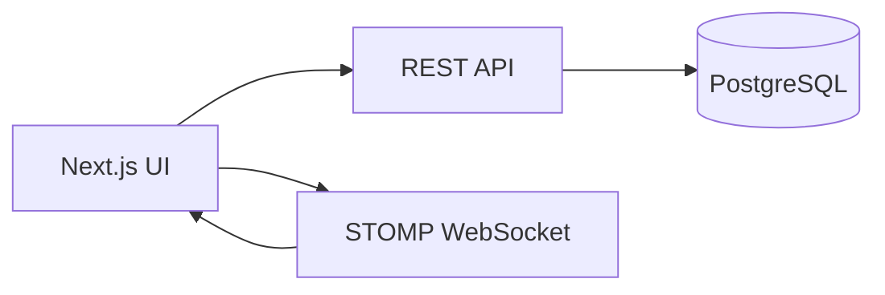

# Design Document: Social Discovery and Room Management

## Overview

This feature extends the existing Next.js frontend and Spring Boot backend with user search, friend requests, a friends list, room creation/search UX, and room deletion. It reuses the current auth model, REST API client, STOMP presence, and accessibility standards.

### Key Technologies

- Backend: Spring Boot (Java), PostgreSQL
- Frontend: Next.js App Router, React, TypeScript, Tailwind CSS, Zustand

### Design Principles

1. Reuse existing auth and API patterns (JWT, apiCall).
2. Keep UI accessible (WCAG 2.1 AA, ARIA, keyboard support).
3. Prefer simple and consistent REST endpoints.

## Architecture

### High-Level Architecture

### Communication/Data Flow

1. User types in user search input.
2. Frontend calls GET /api/users/search?q=.
3. Backend queries users and returns public profile list + relationship status.
4. User sends friend request via POST /api/friends/requests.
5. Backend creates pending request.
6. Friends list and pending requests retrieved via GET /api/friends and GET /api/friends/requests.
7. User creates a room via POST /api/rooms and the UI navigates to the new room.
8. Room deletion uses DELETE /api/rooms/{roomId} after confirmation and UI redirects as needed.

## Components and Interfaces

### Backend Components

#### UserSearchController (new)

- Responsibilities: User search for authenticated users.
- Endpoints:
  - GET /api/users/search?q=
  - Returns user list with relationship status (none, pending_incoming, pending_outgoing, friends).

#### FriendController (new)

- Responsibilities: Friend request lifecycle and friend list.
- Endpoints:
  - POST /api/friends/requests (send request)
  - GET /api/friends/requests (list incoming/outgoing)
  - POST /api/friends/requests/{id}/accept
  - POST /api/friends/requests/{id}/decline
  - GET /api/friends (list friends)

#### ChatRoomController (existing + new)

- Existing endpoints: POST /api/rooms, GET /api/rooms, GET /api/rooms/{id}, GET /api/rooms/{id}/members
- New endpoint:
  - DELETE /api/rooms/{id} (authorized roles only)

### Frontend Components

#### FriendsPanel (new)

- Shows friends list and pending requests.
- Uses online indicators from presence data.

#### UserSearch (new)

- Search input with debounced requests.
- Shows relationship status and action buttons.

#### RoomCreateModal (new)

- Collects name/description and calls createRoom.
- On success, refresh room list and navigate to room.

#### RoomSearchInput (new)

- Filters current room list by name/description.

#### RoomDeleteAction (new)

- Delete button on room header or room list item (owner/moderator only).
- Confirmation dialog with explicit warning.

## Data Models

### FriendRequest

- id: number
- requesterId: number
- recipientId: number
- status: PENDING | ACCEPTED | DECLINED
- createdAt: ISO date string

### Friendship

- id: number
- userId: number
- friendId: number
- createdAt: ISO date string

### UserSearchResult

- user: User (public fields)
- relationshipStatus: NONE | PENDING_INCOMING | PENDING_OUTGOING | FRIENDS

## Error Handling

- 400: Invalid request (self-request, duplicate, invalid query).
- 401: Unauthenticated access.
- 403: Unauthorized room deletion.
- 404: Missing room or request.
- 409: Conflict on duplicate request.
- Frontend shows inline errors and retry actions.

## Testing Strategy

- Unit tests: controller/service validation, request state transitions.
- Integration tests: end-to-end friend request flow, room deletion.
- Frontend tests: component rendering, accessibility checks, and API error handling.
- E2E: user search, send request, accept, create room, delete room flow.
