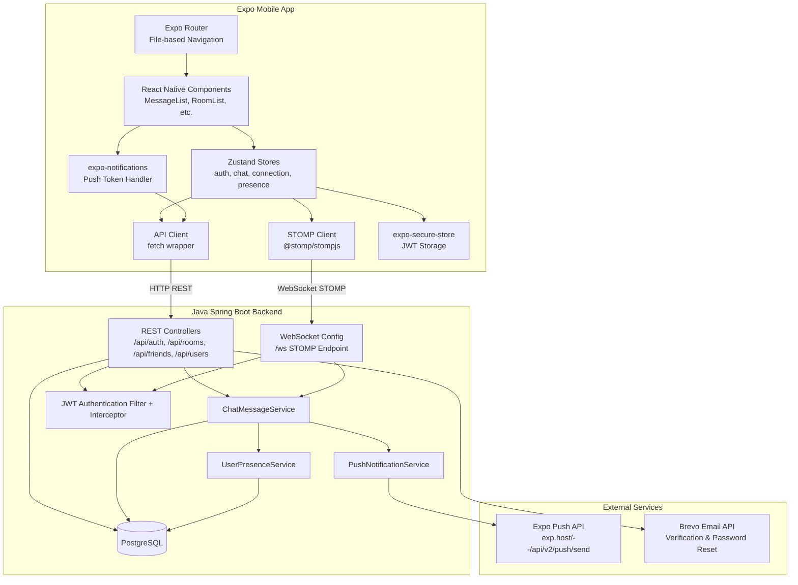

# Design Document: Expo Mobile App

## Overview

The mobile app follows a layered architecture where a new Expo (React Native) client communicates with the existing Java Spring Boot backend over REST API and STOMP/WebSocket. The backend is extended with a push notification module. The frontend reuses existing TypeScript types, Zustand stores, and API client patterns from the Next.js web app — only the UI layer is rebuilt for native mobile.

### Key Technologies

- **Mobile Client**: Expo SDK 52+, React Native, Expo Router (file-based navigation), Zustand
- **Real-Time**: `@stomp/stompjs` over raw WebSocket (no SockJS), auto-reconnect
- **Storage**: `expo-secure-store` (JWT), `AsyncStorage` (cache), in-memory (CSRF token)
- **Push Notifications**: `expo-notifications`, `expo-device`, Expo Push API
- **List Performance**: `@shopify/flash-list` for virtualized message rendering
- **Network State**: `@react-native-community/netinfo`
- **Backend**: Java 17 + Spring Boot 3.5 (existing), new `PushNotificationService`
- **Build**: EAS Build (internal distribution)

### Design Principles

1. **Maximize reuse over rewrite** — Copy types, stores, and API logic from `frontend/`. Only UI components are built from scratch for native.
2. **Offline-first resilience** — STOMP auto-reconnect, optimistic UI, message queue, graceful degradation on network loss.
3. **Push notifications as core infrastructure** — WebSocket dies when backgrounded; push is the only reliable delivery channel for mobile.
4. **Security parity with web** — JWT in encrypted storage (`expo-secure-store`), HTTPS/WSS enforced in production, no token exposure in logs.
5. **Performance for chat at scale** — `FlashList` virtualization, minimal re-renders via Zustand selectors, image caching strategy.

## Architecture

### High-Level Architecture



### Communication / Data Flow

**A. Session Restore Flow:**
1. App launches → splash screen
2. `authStore.validateSession()` reads JWT from `expo-secure-store`
3. If token exists: `GET /api/users/me` with `Authorization: Bearer <token>`
4. Valid → navigate to tabs; Invalid → clear token → navigate to login

**B. Message Send Flow (Online):**
1. User types message → taps send
2. Optimistic: message appears in list with "sending" status
3. `connectionStore.sendMessage()` publishes to `/app/chat.send/{roomId}`
4. Backend `ChatMessageService` validates → persists → broadcasts to `/topic/room/{roomId}`
5. All subscribers (including sender) receive broadcast → reconcile optimistic message with server-confirmed message

**C. Message Send Flow (Offline):**
1. User taps send while offline
2. Message queued in local state with "pending" status
3. `NetInfo` detects connectivity restored
4. STOMP reconnects → queued messages flushed via `/app/chat.send/{roomId}`
5. Retry logic with exponential backoff for failures

**D. Push Notification Flow:**
1. App foreground: `useNotifications` hook requests permission
2. On grant: `Notifications.getExpoPushTokenAsync()` → `POST /api/push/register`
3. User sends app to background → STOMP disconnects
4. Another user sends a message → `ChatMessageService` persists + broadcasts
5. After broadcast: `PushNotificationService.sendPushIfOffline()` checks `UserPresenceService`
6. If recipient offline: fetch push tokens → `POST https://exp.host/--/api/v2/push/send`
7. Push delivered to device → OS shows notification
8. User taps notification → app opens → deep link navigates to `chats/{roomId}`

## Components and Interfaces

### Backend Components

#### PushNotificationController (NEW)

- **Responsibilities**: Register/unregister push notification tokens for authenticated users
- **Endpoints**:
  - `POST /api/push/register` — body: `{pushToken, platform}`
  - `POST /api/push/unregister` — body: `{pushToken}`

#### PushNotificationService (NEW)

- **Responsibilities**: Send push notifications via Expo Push API for offline users
- **Key Methods**:
  - `sendPushIfOffline(Message message, Long roomId)` — checks presence, sends pushes
  - `sendPushToUser(Long userId, String title, String body, Map<String, Object> data)` — sends to all user's devices

#### PushToken Entity (NEW)

- `id: Long`, `userId: Long`, `pushToken: String`, `platform: String`, `createdAt: LocalDateTime`, `updatedAt: LocalDateTime`

#### PushTokenRepository (NEW)

- `findByUserId(Long userId): List<PushToken>`
- `findByPushToken(String pushToken): Optional<PushToken>`
- `deleteByPushToken(String pushToken): void`

#### Modified: ChatMessageService

- After `broadcastMessage()`, call `pushNotificationService.sendPushIfOffline(savedMessage, roomId)`

#### Modified: SecurityConfig

- Add `POST /api/push/**` to authenticated endpoints permit list

### Frontend Components

#### Auth Screens

| Component | Responsibilities | Key Props/State |
|-----------|----------------|-----------------|
| `LoginForm` | Email/password inputs, validation, submit | `onSuccess: () => void` |
| `RegisterForm` | Registration fields, validation | `onSuccess: () => void` |
| `ForgotPasswordForm` | Email input, submit | `onSuccess: () => void` |
| `ResetPasswordForm` | New password + confirm, token from route params | — |

#### Chat Screens

| Component | Responsibilities | Key Props/State |
|-----------|----------------|-----------------|
| `RoomSelector` | List of DM/group rooms with latest message preview | `rooms: ChatRoom[]`, `onSelect: (room) => void` |
| `RoomListItem` | Single room row with name, preview, timestamp, presence dot | `room: ChatRoom`, `latestMessage?: Message` |
| `MessageList` | Virtualized message list via FlashList, date separators, auto-scroll | `messages: Message[]`, `currentUserId: number` |
| `MessageBubble` | Single message: different style for inbound/outbound, timestamp | `message: Message`, `isOwn: boolean` |
| `MessageInput` | Multi-line text input + send button, keyboard avoidance | `onSend: (text: string) => void` |
| `UserList` | Member list with presence indicators | `users: User[]`, `currentUserId: number` |
| `PresenceDot` | Green/gray online indicator dot | `online: boolean` |

#### Contacts Screens

| Component | Responsibilities | Key Props/State |
|-----------|----------------|-----------------|
| `ContactCard` | Friend row with presence + "Chat" action button | `friendship: Friendship` |
| `FriendRequestCard` | Incoming request with accept/decline buttons | `request: FriendRequest`, `onAccept, onDecline` |
| `UserSearchResult` | Search result row with relationship status + action button | `result: UserSearchResult` |

#### UI Components

| Component | Responsibilities |
|-----------|----------------|
| `ConnectionBanner` | Full-width banner showing "No Connection" or "Reconnecting..." |
| `ErrorBoundary` | Catches render errors, shows crash screen with "Restart App" |
| `EmptyState` | Icon + message + optional action button for empty lists |
| `Avatar` | User avatar with fallback initials |
| `Modal` | Reusable modal/bottom sheet |

### Stores (all Zustand)

| Store | State Shape | Key Actions | Platform Adaptation |
|-------|------------|-------------|-------------------|
| `authStore` | `{user, token, csrfToken, isAuthenticated, isInitialized}` | `login, register, validateSession, logout` | `expo-secure-store` replaces `localStorage` |
| `chatStore` | `{rooms, currentRoom, messages}` | `setRooms, setCurrentRoom, addMessage, loadMessages` | Identical to web |
| `connectionStore` | `{client, connected, connecting, error}` | `connect, disconnect, sendMessage` | Raw WebSocket replaces SockJS |
| `presenceStore` | `{presence: Map<userId, {online, lastSeen}>}` | `updatePresence` | Identical to web |
| `notificationStore` | `{pushToken, permissionGranted}` | `registerPushToken, unregisterPushToken` | New — mobile only |

## Data Models

### Database Schema (New Table)

```sql
CREATE TABLE push_tokens (
    id          BIGSERIAL PRIMARY KEY,
    user_id     BIGINT NOT NULL REFERENCES users(id) ON DELETE CASCADE,
    push_token  VARCHAR(255) NOT NULL UNIQUE,
    platform    VARCHAR(10) NOT NULL CHECK (platform IN ('ios', 'android')),
    created_at  TIMESTAMP NOT NULL DEFAULT NOW(),
    updated_at  TIMESTAMP NOT NULL DEFAULT NOW()
);

CREATE INDEX idx_push_tokens_user_id ON push_tokens(user_id);
```

### TypeScript Types (Reused from web)

```typescript
// Copied verbatim from frontend/types/domain.ts
export interface User {
  id: number;
  username: string;
  email: string;
  displayName: string;
  createdAt: string;
  lastSeen: string;
  online: boolean;
  emailVerified?: boolean;
}

export interface ChatRoom {
  id: number;
  name: string;
  description?: string;
  createdAt: string;
  createdBy: User;
  roomType: 'GROUP' | 'DIRECT';
  otherParticipant?: PublicUser;
}

export interface Message {
  id: number;
  senderId: number;
  senderUsername: string;
  senderDisplayName: string;
  chatRoomId: number;
  content: string;
  timestamp: string;
  messageType: MessageType;
}

// ... all other types from domain.ts, api.ts, stomp.ts
```

### New API Types

```typescript
// src/types/api.ts (additions)
export interface RegisterPushTokenRequest {
  pushToken: string;
  platform: 'ios' | 'android';
}

export interface UnregisterPushTokenRequest {
  pushToken: string;
}
```

### Java Entity (New)

```java
@Entity
@Table(name = "push_tokens")
@Data
public class PushToken {
    @Id
    @GeneratedValue(strategy = GenerationType.IDENTITY)
    private Long id;

    @ManyToOne(fetch = FetchType.LAZY)
    @JoinColumn(name = "user_id", nullable = false)
    private User user;

    @Column(name = "push_token", nullable = false, unique = true)
    private String pushToken;

    @Column(name = "platform", nullable = false, length = 10)
    private String platform;

    @Column(name = "created_at", nullable = false, updatable = false)
    private LocalDateTime createdAt;

    @Column(name = "updated_at", nullable = false)
    private LocalDateTime updatedAt;

    @PrePersist
    protected void onCreate() {
        createdAt = updatedAt = LocalDateTime.now();
    }

    @PreUpdate
    protected void onUpdate() {
        updatedAt = LocalDateTime.now();
    }
}
```

## Correctness Properties

### Property 1: Optimistic Message Delivery

*For any* user action that triggers a message send via STOMP `/app/chat.send/{roomId}`, the message SHALL appear in the UI immediately (before server confirmation), and the UI SHALL reconcile to match the server-confirmed state within 5 seconds of a successful broadcast.

**Validates: Requirements 3.3, 3.4, 11.3**

### Property 2: Push Notification Delivery

*For any* message sent to a chat room where the recipient is offline (no active STOMP session), the backend SHALL send an Expo push notification to all registered devices of that recipient within 30 seconds of message persistence.

**Validates: Requirements 9.4, 9.6, 10.1, 10.2**

### Property 3: Authentication Persistence

*For any* app cold start where a valid JWT exists in `expo-secure-store`, the system SHALL navigate to the main chat screen without showing the login screen to the user.

**Validates: Requirements 1.1, 1.2, 1.3**

### Property 4: Session Expiration

*For any* app cold start where the stored JWT is expired or invalid, the system SHALL clear all stored credentials and SHALL present the login screen.

**Validates: Requirements 1.4, 11.6**

### Property 5: STOMP Connection Lifecycle

*For any* authenticated user with the app in the foreground, the system SHALL maintain an active STOMP WebSocket connection. *For any* disconnection, the system SHALL display a connection banner and SHALL automatically reconnect within 10 seconds.

**Validates: Requirements 4.1, 4.4, 4.5, 4.6, 4.7**

### Property 6: Push Token Binding

*For any* registered push token, the token SHALL be associated with exactly one authenticated user. *For any* logout by that user, the token SHALL be removed from the database. *For any* new login, the client SHALL re-register the token.

**Validates: Requirements 9.3, 10.3, 10.4, 10.5**

### Property 7: Message Queue Integrity

*For any* message sent while the device is offline, the message SHALL NOT be lost. The system SHALL attempt delivery upon reconnection, SHALL preserve message ordering within a single room, and SHALL retry with exponential backoff on failure.

**Validates: Requirements 11.3, 11.4**

### Property 8: Navigation Protection

*For any* unauthenticated user, all routes under `(tabs)/` SHALL redirect to the login screen. *For any* authenticated user, the login and register routes SHALL redirect to the main app.

**Validates: Requirements 12.5, 12.6**

## Error Handling

| Scenario | HTTP/WS | User Feedback | Recovery |
|----------|---------|---------------|----------|
| Network offline | — | "No Connection" banner + queue messages | Auto-retry on reconnect |
| STOMP disconnected | — | "Reconnecting..." banner | Auto-reconnect every 5s |
| Login failed | 401 | "Invalid username or password" | Re-enable form |
| Registration failed | 409 | "Username or email already taken" | Re-enable form |
| Token expired | 401 | Redirect to login | Clear token |
| Server error | 5xx | "Something went wrong. Try again." | Retry button |
| Push notification permission denied | — | No notification + no error shown | Graceful degradation |
| API rate limited | 429 | "Too many requests. Please wait." | Retry-After header |
| Send message failure (STOMP) | — | "Failed to send" on message bubble | Tap to retry |
| Load history error | 5xx | Inline error + retry button | Load first page on retry |
| Delete account | 200 | Confirmation → redirect to login | — |
| Room creation fails | 4xx/5xx | Inline error on modal | Close modal, try again |

## Testing Strategy

### Unit Tests

- **Stores**: Test each Zustand store action in isolation — auth transitions (login, logout, validateSession), chat state management (addMessage deduplication, room switching), connection state machine
- **API client**: Test request formatting, header injection (Authorization, CSRF), error class resolution for 4xx/5xx/network errors
- **Utils**: Date formatting (relative time), message grouping (date separators), input validation

### Integration Tests

- **Auth flow**: Wire up `apiCall` with mock server — full sequence: register → login → validate session → logout → verify secure store cleared
- **Chat flow**: Mock both REST and STOMP — load rooms → select room → load messages (pagination) → send message (optimistic + STOMP broadcast) → verify message list state
- **Push registration**: Mock `expo-notifications` + backend endpoint → verify token is sent on login and unregistered on logout

### End-to-End Tests (Manual)

- Install APK via EAS Build QR code on physical Android device
- Full regression checklist — auth, chat, channels, contacts, profile, push notifications, offline behavior

### Property-Based Testing Applicability

**Assessment**: PARTIALLY APPLICABLE

**Rationale**: Property-based testing (via `fast-check`) is applicable for:

- **Message sorting and ordering**: Property: *For any* sequence of messages arriving via STOMP (out of order, duplicates, delayed), the final message list SHALL be sorted by timestamp ascending with no duplicates. Generate arbitrary message sequences and verify the sort invariant.
- **Input sanitization**: Property: *For any* message content string containing HTML/script tags, the content SHALL be rendered as plain text without script execution. Generate arbitrary malicious strings and verify safe rendering.
- **Pagination continuity**: Property: *For any* set of paginated message pages, merging page N and page N+1 SHALL produce a continuous sequence without gaps or overlaps. Generate arbitrary page sizes and verify merge.

PBT is NOT applicable for: UI rendering (requires visual verification), push notification delivery (requires physical device), or navigation routing (requires integration harness).
