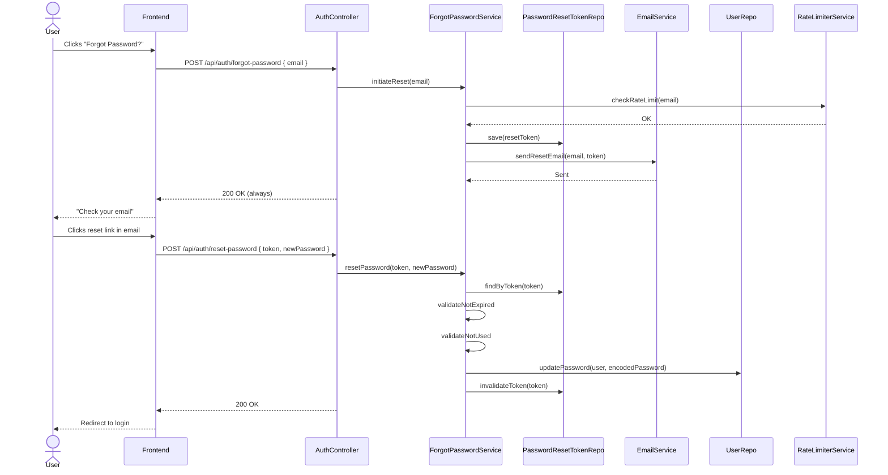

# Design Document: Forgot Password

## Overview

The Forgot Password feature extends the existing authentication flow with a secure, token-based password reset mechanism. It follows the same patterns as the existing email verification flow (`VerificationToken` entity, token-based links, Brevo/SMTP email delivery). The design reuses existing infrastructure: `RateLimiterService` for rate limiting, `BrevoEmailService` / `EmailService` for email, `SecurityAuditLogger` for audit events, and the existing exception hierarchy for error handling.

The flow has two phases: (1) request reset (email -> token -> email link) and (2) reset password (token + new password -> update credential).

### Key Technologies

- **Backend**: Java 17, Spring Boot 3.5.14, Spring Security, Spring Data JPA, PostgreSQL/H2
- **Email**: Brevo HTTP API (primary) + Spring Mail SMTP (fallback)
- **Frontend**: Next.js, React, TypeScript, Tailwind CSS
- **Testing**: JUnit 5, MockMvc, jqwik (PBT)

### Design Principles

1. **Follow existing patterns** -- Mirror the `VerificationToken` / `EmailVerificationService` pattern for token generation, persistence, and email delivery.
2. **Defense in depth** -- Rate limiting, token expiry, single-use tokens, constant-time comparison, and identical responses for registered/unregistered emails.
3. **Least privilege** -- The forgot-password endpoints are fully public (no auth required) but protected by rate limiting.
4. **Auditability** -- All reset attempts (success and failure) are logged via `SecurityAuditLogger`.

## Architecture

### High-Level Flow



### API Endpoints

| Method | Path | Request Body | Response | Auth |
|--------|------|-------------|----------|------|
| `POST` | `/api/auth/forgot-password` | `ForgotPasswordRequest` | `200 OK` | Public |
| `POST` | `/api/auth/reset-password` | `ResetPasswordRequest` | `200 OK` | Public |

Both endpoints are added to `SecurityConfig` as public (permit-all) routes, alongside the existing public auth endpoints.

## Components and Interfaces

### Backend: New Components

#### `PasswordResetToken` (Entity)
- **Table**: `password_reset_tokens`
- **Fields**: `id` (Long, PK), `token` (String, unique, indexed), `user` (ManyToOne -> User), `expiresAt` (Instant), `usedAt` (Instant, nullable), `createdAt` (Instant)
- **Similar to**: `VerificationToken` entity

#### `PasswordResetTokenRepository`
- Extends `JpaRepository<PasswordResetToken, Long>`
- Key methods:
  - `Optional<PasswordResetToken> findByToken(String token)` -- lookup by token
  - `void deleteByUser(User user)` -- cleanup on account deletion

#### `ForgotPasswordService`
- **Responsibility**: Token generation, validation, password update, email orchestration
- Key methods:
  - `initiateReset(String email)` -- generate token, persist, send email (idempotent for unregistered emails)
  - `resetPassword(String token, String newPassword)` -- validate token, update password, mark token used

#### `ForgotPasswordRequest` (DTO)
```java
@Data
@NoArgsConstructor
@AllArgsConstructor
public class ForgotPasswordRequest {
    @NotBlank @Email
    private String email;
}
```

#### `ResetPasswordRequest` (DTO)
```java
@Data
@NoArgsConstructor
@AllArgsConstructor
public class ResetPasswordRequest {
    @NotBlank
    private String token;

    @NotBlank @Size(min = 8, max = 100)
    private String newPassword;
}
```

### Backend: Modified Components

#### `AuthController`
- Add `POST /api/auth/forgot-password` and `POST /api/auth/reset-password` endpoints

#### `SecurityConfig`
- Add `/api/auth/forgot-password` and `/api/auth/reset-password` to the public permit-all path list

#### `UserRepository`
- Add `Optional<User> findByEmail(String email)` if not already present

### Frontend: New Components

#### ForgotPasswordPage
- **Route**: `/forgot-password`
- **Form**: Email input + "Send Reset Link" button
- **States**: idle -> loading -> success ("Check your email") / error

#### ResetPasswordPage
- **Route**: `/reset-password?token=<token>`
- **Form**: New password + confirm password inputs + "Reset Password" button
- **States**: idle -> loading -> success (redirect to login) / error (invalid/expired token)

#### Update LoginPage
- Add "Forgot Password?" link below the login form

## Data Models

### New Entity

```java
@Entity
@Table(name = "password_reset_tokens")
@Getter @Setter
@NoArgsConstructor @AllArgsConstructor
public class PasswordResetToken {

    @Id
    @GeneratedValue(strategy = GenerationType.IDENTITY)
    private Long id;

    @Column(nullable = false, unique = true)
    private String token;

    @ManyToOne(fetch = FetchType.LAZY)
    @JoinColumn(name = "user_id", nullable = false)
    private User user;

    @Column(nullable = false)
    private Instant expiresAt;

    private Instant usedAt;

    @Column(nullable = false, updatable = false)
    private Instant createdAt;

    @PrePersist
    protected void onCreate() {
        this.createdAt = Instant.now();
    }

    public boolean isExpired() {
        return Instant.now().isAfter(expiresAt);
    }

    public boolean isUsed() {
        return usedAt != null;
    }
}
```

### SQL Migration

```sql
CREATE TABLE password_reset_tokens (
    id BIGSERIAL PRIMARY KEY,
    token VARCHAR(255) NOT NULL UNIQUE,
    user_id BIGINT NOT NULL REFERENCES users(id) ON DELETE CASCADE,
    expires_at TIMESTAMP WITH TIME ZONE NOT NULL,
    used_at TIMESTAMP WITH TIME ZONE,
    created_at TIMESTAMP WITH TIME ZONE NOT NULL DEFAULT NOW()
);

CREATE INDEX idx_password_reset_tokens_token ON password_reset_tokens(token);
CREATE INDEX idx_password_reset_tokens_user_id ON password_reset_tokens(user_id);
```

### Token Generation

- Use `java.security.SecureRandom` to generate a 32-byte (256-bit) random token
- Encode as hex (64-character string)
- Use constant-time comparison (`MessageDigest.isEqual()`) on validation

## Correctness Properties

### Property 1: Non-Enumeration
*For any* email address (registered or not), `POST /api/auth/forgot-password` SHALL return the exact same HTTP response (`200 OK`).

**Validates: Requirements 1.2, 3.5**

### Property 2: Token Expiry
*For any* `PasswordResetToken` where `expiresAt` is in the past, `resetPassword()` SHALL reject the request with `400 BAD_REQUEST`.

**Validates: Requirements 2.2, 3.2**

### Property 3: Single-Use Token
*For any* `PasswordResetToken` where `usedAt IS NOT NULL`, `resetPassword()` SHALL reject the request with `400 BAD_REQUEST`.

**Validates: Requirements 2.3, 3.3**

### Property 4: Rate Limiting
*For any* email address that exceeds 3 forgot-password requests within 15 minutes, the system SHALL return `429 TOO_MANY_REQUESTS`.

**Validates: Requirements 1.4, 3.1**

### Property 5: Password Update
*For any* valid reset token and valid new password, `resetPassword()` SHALL update `User.password` to the BCrypt-encoded new password and SHALL mark the token as used.

**Validates: Requirements 2.1**

### Property 6: Constant-Time Token Comparison
*For any* token lookup, THE system SHALL use `MessageDigest.isEqual()` (or equivalent) for comparison to prevent timing side-channel attacks.

**Validates: Requirements 3.4**

## Error Handling

| Scenario | HTTP Status | Error Code | User Message |
|----------|-------------|-----------|--------------|
| Invalid email format | `400 BAD_REQUEST` | `VALIDATION_ERROR` | "Email must be a valid email address" |
| Expired token | `400 BAD_REQUEST` | `TOKEN_EXPIRED` | "This reset link has expired. Please request a new one." |
| Invalid/used token | `400 BAD_REQUEST` | `INVALID_TOKEN` | "This reset link is invalid or has already been used." |
| Weak password | `400 BAD_REQUEST` | `VALIDATION_ERROR` | "Password must be at least 8 characters" |
| Rate limit exceeded | `429 TOO_MANY_REQUESTS` | `RATE_LIMIT_EXCEEDED` | "Too many requests. Please try again later." |

## Testing Strategy

### Unit Tests
- `ForgotPasswordService.initiateReset()` -- generates token, persists, sends email (mock `EmailService`)
- `ForgotPasswordService.resetPassword()` -- validates token, updates password, marks used
- `ForgotPasswordService.resetPassword()` -- rejects expired token
- `ForgotPasswordService.resetPassword()` -- rejects used token
- `PasswordResetToken.isExpired()` / `isUsed()`

### Integration Tests
- `POST /api/auth/forgot-password` with registered email -> 200 + email sent
- `POST /api/auth/forgot-password` with unregistered email -> 200 (no email sent)
- `POST /api/auth/forgot-password` with invalid email -> 400
- `POST /api/auth/reset-password` with valid token -> 200 + password updated
- `POST /api/auth/reset-password` with expired token -> 400
- `POST /api/auth/reset-password` with used token -> 400
- Rate limiting -> 3 requests OK, 4th -> 429
- Login with new password after reset -> 200 + JWT
- Login with old password after reset -> 401

### Property-Based Tests (jqwik)
- Token generation: for any `User`, the generated token is non-null, unique, and 64 hex characters
- Rate limiter: for any sequence of requests, the rate limiter correctly enforces the limit

### E2E Tests (Frontend + Backend)
- Full flow: request reset -> receive email -> click link -> set new password -> login with new password
- Expired token flow: wait for expiry -> submit -> see error
- Invalid token flow: submit tampered token -> see error

### Property-Based Testing Applicability

**Assessment**: APPLICABLE

**Rationale**: Token generation (randomness, format, uniqueness) and rate limiting (bucket behavior over time) are well-suited to property-based testing with jqwik, which is already a dependency in the project.
