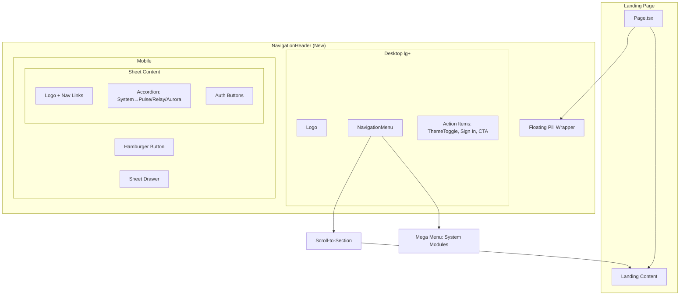

# Design Document: Landing Navigation Redesign

## Overview

The existing `NavigationHeader.tsx` will be rewritten to a floating pill design matching the shadcn navigation-5 aesthetic. The implementation introduces shadcn/ui components (`NavigationMenu`, `Sheet`, `Accordion`, `Badge`) customized with the project's Slack CSS tokens, plus `lucide-react` for icons. All existing functionality (scroll-to-section, scroll-spy, auth links, theme toggle, mobile menu) is preserved. The "System" nav item gains a mega menu dropdown showing the Pulse, Relay, and Aurora module cards from the landing page content.

### Key Technologies

- **Frontend**: Next.js 16 (App Router), React 19, TypeScript 5, Tailwind CSS v4
- **New Dependencies**: `lucide-react`, shadcn/ui components (`navigation-menu`, `button`, `badge`, `sheet`, `accordion`)
- **Design System**: Slack CSS custom properties (`--slack-*` tokens), `border-radius-pill` (9999px)

### Design Principles

1. **Token-First Styling**: Every color in the new nav bar uses Slack CSS tokens — no hardcoded Tailwind palette classes (`neutral-*`, `orange-*`, `gray-*`). Dark mode works automatically via `:root.dark` variable overrides.
2. **Content-Driven Navigation**: The nav labels and dropdown content reflect the project's existing section structure, not the navigation-5 defaults.
3. **Progressive Enhancement**: Desktop gets the full pill + mega menu experience; mobile gets a Sheet drawer with accordion. Both are fully accessible.
4. **Zero Regression**: All current scroll/spy/auth/toggle behavior is preserved exactly.

## Architecture

### High-Level Layout



### Component Tree

```
<header> (sticky top-0 z-40, outer anchor for positioning)
  └── <div> (mx-auto max-w-5xl px-4, centered container)
       └── <div> (flex h-16 items-center gap-2 rounded-full border shadow bg-slack-surface-primary)
            ├── <Logo /> (left)
            ├── <NavigationMenu> (desktop, center, hidden below lg)
            │    └── <NavigationMenuList>
            │         ├── Home       (NavigationMenuLink → scroll to #home)
            │         ├── Readiness  (NavigationMenuLink → scroll to #readiness)
            │         ├── System     (NavigationMenuTrigger + NavigationMenuContent)
            │         │    └── Mega Menu Grid (3 module cards: Pulse, Relay, Aurora)
            │         ├── Integration (NavigationMenuLink → scroll to #integration)
            │         ├── Community   (NavigationMenuLink → scroll to #community)
            │         └── Stories     (NavigationMenuLink → scroll to #stories)
            │
            ├── <div> (right, flex items-center gap-2)
            │    ├── <ThemeToggle />
            │    ├── <Button variant="ghost"> <CommandIcon /> (optional) </Button>
            │    ├── <Link href="/auth/login"> Sign In </Button variant="outline">
            │    ├── <Link href="/auth/register"> Start Journey </Button primary>
            │    └── <SheetTrigger> (lg:hidden, hamburger icon)
            │
            └── <Sheet> (mobile drawer, lg:hidden)
                 └── <SheetContent side="right">
                      ├── <Logo />
                      ├── Nav Links (stacked)
                      │    ├── Home, Readiness → simple links
                      │    └── System → <Accordion>
                      │         ├── Pulse
                      │         ├── Relay
                      │         └── Aurora
                      ├── Integration, Community, Stories → simple links
                      ├── <Button variant="outline"> Sign In
                      └── <Button primary> Start Journey
```

### Data Flow

1. **Scroll-to-section**: Clicking any `NavigationMenuLink` or mobile nav link calls `handleItemClick(id)` which invokes `document.getElementById(id)?.scrollIntoView({ behavior: 'smooth', block: 'start' })` and closes mobile Sheet if open.
2. **Scroll-spy**: The existing passive scroll event listener in a `useEffect` tracks section positions via `getBoundingClientRect().top <= 140` offset and updates `activeSection` state, which controls the active highlight class.
3. **Theme toggle**: Unchanged — the existing `ThemeToggle` component manages dark mode via Zustand store and class-based toggle.
4. **Mega menu open/close**: Managed internally by shadcn `NavigationMenu` (hover/click + outside click/Escape).

## Components and Interfaces

### New/Modified Components

#### NavigationHeader (rewrite of existing)

- **File**: `frontend/components/landing/NavigationHeader.tsx`
- **Responsibilities**: Renders floating pill navbar, manages desktop NavigationMenu with mega menu, mobile Sheet drawer, scroll-spy, mobile menu open/close
- **Props**: `className?: string` (unchanged from current)
- **Internal State**:
  - `isMenuOpen: boolean` — mobile Sheet open state
  - `activeSection: string` — currently visible section id
  - `menuButtonRef`, `mobileMenuRef`, `firstFocusableRef` — refs for focus management

#### SystemMegaMenu (new sub-component)

- **File**: `frontend/components/landing/SystemMegaMenu.tsx`
- **Responsibilities**: Renders the 3-column grid inside the `NavigationMenuContent` dropdown for the "System" item, showing Pulse, Relay, and Aurora module cards with icons and stats.
- **Data**: Uses `SYSTEM_MODULES` data (either extracted to a shared data file or co-located).

### shadcn/ui Component Customizations

All shadcn components will have their default `neutral-*` colors replaced with Slack tokens. Key mappings:

| shadcn Default | Slack Token Replacement |
|---|---|
| `bg-white` / `bg-background` | `bg-slack-surface-primary` |
| `bg-neutral-100` / `bg-muted` | `bg-slack-surface-tertiary` |
| `bg-neutral-950` / `bg-card` (dark) | `bg-slack-surface-primary` |
| `text-neutral-900` / `text-foreground` | `text-slack-text-primary` |
| `text-neutral-500` / `text-muted-foreground` | `text-slack-text-secondary` |
| `border-neutral-200` / `border` | `border-slack-border` |
| `hover:bg-neutral-100` / `hover:bg-accent` | `hover:bg-slack-surface-tertiary` |
| `hover:text-neutral-900` / `hover:text-accent-foreground` | `hover:text-slack-text-primary` |

The shadcn `Button` component (used for CTA/sign-in) will be kept only for the nav-bar-specific variants; the project's existing custom `Button` component will NOT be removed or replaced.

## Data Models

### Mega Menu Data

```typescript
interface MegaMenuItem {
  title: string;
  role: string;
  icon: string;
  stats: { value: string; label: string }[];
}

const SYSTEM_MODULES: MegaMenuItem[] = [
  {
    title: 'Pulse',
    role: 'AI business planner',
    icon: 'Activity',
    stats: [
      { value: '2500+', label: 'Launch labs' },
      { value: '7+ regions', label: 'Market scans' },
      { value: '92%', label: 'Signal clarity' },
    ],
  },
];
```

### Section Navigation Data

```typescript
interface NavItem {
  label: string;
  id: string;
  hasDropdown?: boolean;
}

const MENU_ITEMS: NavItem[] = [
  { label: 'Home', id: 'home' },
  { label: 'Readiness', id: 'readiness' },
  { label: 'System', id: 'system', hasDropdown: true },
  { label: 'Integration', id: 'integration' },
  { label: 'Community', id: 'community' },
  { label: 'Stories', id: 'stories' },
];
```

## Correctness Properties

### Property 1: Active Section Highlight

*For any* scroll position on the landing page, the nav link corresponding to the section whose top edge is closest to (and within 140px of) the viewport top SHALL have the active CSS class (`bg-slack-surface-tertiary` + `text-slack-text-primary`). All other nav links SHALL have the inactive style (`text-slack-text-secondary`).

**Validates: Requirements 2.2, 2.3**

### Property 2: Smooth Scroll on Click

*For any* nav link click (desktop or mobile), the page SHALL smoothly scroll to the element with `id` matching the link's target. After scrolling, the corresponding nav link SHALL become active.

**Validates: Requirements 2.1, 7.1**

### Property 3: Floating Pill Appearance

*For any* viewport width >= 1024px (`lg:`), the nav bar SHALL render as a `rounded-full` pill that is narrower than the viewport, centered, with a border and shadow, NOT spanning edge-to-edge.

**Validates: Requirements 1.1, 1.3, 1.4**

### Property 4: Slack Token Exclusivity

*For any* rendered element within the `NavigationHeader`, ALL color-related CSS classes SHALL be from the `slack-*` token set (`bg-slack-*`, `text-slack-*`, `border-slack-*`, `shadow-slack-*`). NO Tailwind default palette classes (`neutral-*`, `orange-*`, `gray-*`, `white`, `black`) SHALL be used.

**Validates: Requirements 1.5**

### Property 5: Mobile Sheet Behavior

*For any* viewport width < 1024px, the center nav links SHALL be hidden and a hamburger button SHALL be shown. Clicking the hamburger SHALL open a Sheet drawer. Pressing Escape or clicking the overlay SHALL close it.

**Validates: Requirements 5.1, 5.2, 5.6**

### Property 6: Auth Link Preservation

*For any* click on "Sign In", the browser SHALL navigate to `/auth/login`. *For any* click on "Start Journey", the browser SHALL navigate to `/auth/register`.

**Validates: Requirements 4.2, 4.3, 7.4**

### Property 7: System Mega Menu Content

*For any* activation of the "System" nav item on desktop, the dropdown SHALL display exactly three module cards (Pulse, Relay, Aurora) with matching title, role, and stats from `SYSTEM_MODULES`.

**Validates: Requirements 3.1, 3.2**

## Error Handling

| Scenario | Behavior |
|---|---|
| Section `id` not found in DOM | `document.getElementById()` returns null; `handleItemClick` bails silently (guard clause) |
| shadcn component fails to load | Next.js error boundary catches it; nav bar falls back to simple text-only bar |
| Theme toggle fails | Theme defaults to light mode; ThemeProvider handles gracefully |
| Sheet fails to render on mobile | Hamburger button does nothing (rare); user can still scroll page |

## Testing Strategy

### Unit Tests
- NavigationHeader renders all 6 nav items correctly
- Active section state updates on scroll (mock `getBoundingClientRect`)
- Click handler calls `scrollIntoView` with correct id
- ThemeToggle renders and is clickable
- Mega menu renders System module cards with correct data

### Integration Tests
- Desktop: full pill layout renders (logo, nav items, action buttons)
- Mobile: Sheet opens on hamburger click, shows correct items
- System mega menu opens and displays cards with correct content
- Sign In / Start Journey links navigate to correct routes
- shadcn components render with Slack token colors (visual regression test)

### Accessibility Tests
- Tab order: desktop nav items, action buttons
- Escape closes Sheet and mega menu
- ARIA labels present on hamburger, nav items, Sheet dialog
- Focus trapping inside mobile Sheet
- Focus returns to hamburger after Sheet closes

### Property-Based Testing Applicability

**Assessment**: NOT APPLICABLE

**Rationale**: This is a UI/layout feature with no algorithmic logic, state machines, or data transformations that benefit from property-based testing. The correctness properties can be verified with standard unit and integration tests.
