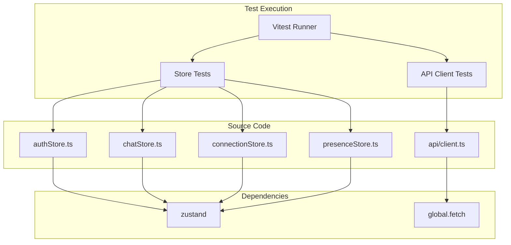

# Design Document: Mobile Testing Infrastructure

## Overview

The testing infrastructure uses **Vitest** as the test runner — chosen over Jest because it's lighter, faster, and natively handles TypeScript and ESM without additional configuration. Tests are organized in `*.test.ts` files colocated with their source modules, matching the backend's convention of test packages mirroring source packages.

### Key Technologies

- **Test Runner**: Vitest ^3.x (native ESM, TypeScript, works with Expo's Metro bundler)
- **Mocking**: vitest's built-in `vi.mock()` + `vi.fn()` (no separate mocking library needed)
- **Store Testing**: Pure function calls to Zustand stores (no React rendering required)
- **API Client Testing**: `vi.fn()` to mock `global.fetch`

### Design Principles

1. **Test behavior, not implementation** — Tests verify observable state changes and side effects, not internal store mechanics
2. **No React rendering for stores** — Zustand stores are plain functions; test them without mounting components
3. **Match backend patterns** — Use the descriptive test naming style (`method_Scenario_ExpectedResult`) already established in `ForgotPasswordServiceTest.java`
4. **CI-native** — Tests must run headlessly without emulators or native modules

## Architecture

### High-Level Architecture



### Communication / Data Flow

1. Vitest discovers `*.test.ts` files via the `include` glob in config
2. Each test file imports the source module directly (same import path as production code)
3. For store tests: call Zustand store actions directly via `useAuthStore.getState().login()`, assert on `useAuthStore.getState()`
4. For API client tests: mock `global.fetch` before each test, call `apiCall()`, assert on return value or thrown error
5. Tests run in Node.js environment — no native modules are loaded

## Components and Interfaces

### Test Configuration

**File**: `expo-chat-app/vitest.config.ts`

```typescript
import { defineConfig } from 'vitest/config';

export default defineConfig({
  test: {
    globals: true,
    environment: 'node',
    include: ['src/**/*.test.ts', 'src/**/*.test.tsx'],
  },
});
```

### Store Test Patterns

Each store test follows this structure:

```typescript
import { describe, it, expect, beforeEach } from 'vitest';
import { useAuthStore } from './authStore';
import { initialAuthState } from './authStore'; // hypothetical export

describe('authStore', () => {
  beforeEach(() => {
    useAuthStore.setState(initialAuthState);
  });

  describe('login', () => {
    it('validCredentials_SetsAuthenticatedState', async () => {
      const mockUser = { id: 1, username: 'test', displayName: 'Test' };
      mockLoginApi.mockResolvedValueOnce({ token: 'abc', user: mockUser });

      await useAuthStore.getState().login({ username: 'test', password: 'pass' });

      const state = useAuthStore.getState();
      expect(state.isAuthenticated).toBe(true);
      expect(state.token).toBe('abc');
      expect(state.user).toEqual(mockUser);
    });
  });
});
```

### API Client Test Pattern

```typescript
import { describe, it, expect, beforeEach, vi } from 'vitest';
import { apiCall, ApiError, NetworkError } from './client';

describe('apiCall', () => {
  beforeEach(() => {
    vi.restoreAllMocks();
  });

  it('successfulRequest_ReturnsParsedJson', async () => {
    vi.spyOn(global, 'fetch').mockResolvedValueOnce(
      new Response(JSON.stringify({ id: 1 }), { status: 200, headers: { 'content-type': 'application/json' } })
    );

    const result = await apiCall('/api/test');
    expect(result).toEqual({ id: 1 });
  });

  it('badRequest_ThrowsApiError', async () => {
    vi.spyOn(global, 'fetch').mockResolvedValueOnce(
      new Response(JSON.stringify({ message: 'Invalid input' }), { status: 400, headers: { 'content-type': 'application/json' } })
    );

    await expect(apiCall('/api/test')).rejects.toThrow(ApiError);
    await expect(apiCall('/api/test')).rejects.toMatchObject({ status: 400 });
  });
});
```

## Data Models

No new data models are introduced. Tests operate on existing types defined in `src/types/domain.ts` and `src/types/api.ts`.

## Correctness Properties

### Property 1: Store State Consistency

*For any* store action (login, logout, addMessage, etc.), after the action completes, the store state SHALL be internally consistent (e.g., `isAuthenticated=true` implies `token` and `user` are non-null).

**Validates: Requirements 2.1, 2.2**

### Property 2: Idempotent Logout

*For any* authentication state, calling `authStore.logout()` twice in succession SHALL produce the same final state as calling it once.

**Validates: Requirement 2.2**

### Property 3: Message Order Preservation

*For any* sequence of `chatStore.addMessage()` calls, the messages in the store SHALL be ordered by insertion order within each room.

**Validates: Requirement 2.3**

### Property 4: API Error Discrimination

*For any* HTTP response with status 4xx, the `apiCall` function SHALL throw `ApiError` (not `NetworkError`). *For any* network failure (no response), it SHALL throw `NetworkError`.

**Validates: Requirements 3.2, 3.3, 3.4**

### Property 5: Auth Header Presence

*For any* `apiCall` invocation with a non-null `token` option, the outgoing `fetch` request SHALL include an `Authorization: Bearer <token>` header.

**Validates: Requirement 3.5**

### Property 6: CSRF Header for Mutations

*For any* `apiCall` invocation with method POST, PUT, or DELETE, when a `csrfToken` exists in the store, the outgoing request SHALL include an `X-CSRF-TOKEN` header.

**Validates: Requirement 3.6**

## Error Handling

| Scenario | Test Behavior | Expected Assertion |
|----------|--------------|-------------------|
| API returns 400 | `apiCall` throws `ApiError` | `error.status === 400` |
| API returns 401 | `apiCall` throws `ApiError` | `error.status === 401` |
| API returns 500 | `apiCall` throws `ApiError` | `error.status === 500` |
| Network timeout | `apiCall` throws `NetworkError` | `error instanceof NetworkError` |
| No token for protected call | authStore blocks request | `isAuthenticated === false` |

## Testing Strategy

### Unit Tests (Store Tests)

| Suite | File | Test Count | Key Scenarios |
|-------|------|------------|---------------|
| authStore | `src/stores/authStore.test.ts` | 6 | login success, login failure, logout, session validate, register, forgotPassword |
| chatStore | `src/stores/chatStore.test.ts` | 8 | addMessage, prependMessages, loadMessages, updateMessageStatus, confirmMessage, clearRoomMessages, pagination, deduplication |
| connectionStore | `src/stores/connectionStore.test.ts` | 3 | connect, disconnect, reconnect |
| presenceStore | `src/stores/presenceStore.test.ts` | 3 | setOnline, setOffline, batchUpdate |

### Unit Tests (API Client)

| Suite | File | Test Count | Key Scenarios |
|-------|------|------------|---------------|
| apiCall | `src/api/client.test.ts` | 11 | 200 JSON, 204 no-content, 400 error, 401 error, 500 error, network error, non-JSON, auth header present, auth header absent, CSRF header present, CSRF header absent |

### Property-Based Testing Applicability

**Assessment**: APPLICABLE for specific properties

**Rationale**: Properties 4 (API Error Discrimination), 5 (Auth Header Presence), and 6 (CSRF Header for Mutations) are well-suited for property-based testing using `fast-check` or Vitest's built-in `assert` + random generation. Property 1 (Store State Consistency) could also benefit from PBT to verify that random sequences of store operations never leave the store in an inconsistent state. However, for the initial implementation, example-based tests are sufficient — PBT can be added in a follow-up phase.

### Test File Organization

```
expo-chat-app/src/
├── stores/
│   ├── authStore.ts
│   ├── authStore.test.ts        # Unit tests
│   ├── chatStore.ts
│   ├── chatStore.test.ts        # Unit tests
│   ├── connectionStore.ts
│   ├── connectionStore.test.ts  # Unit tests
│   ├── presenceStore.ts
│   └── presenceStore.test.ts    # Unit tests
├── api/
│   ├── client.ts
│   └── client.test.ts           # Unit tests
│   ├── auth.ts
│   └── auth.test.ts             # Integration tests (mock network)
```

### CI Integration

The existing `phase4-mobile-check` job will be extended to also run tests:

```yaml
- name: Run mobile tests
  working-directory: expo-chat-app
  run: npx vitest run
```

The job name will be updated to `phase4-mobile-check-and-test` to reflect the expanded scope.
