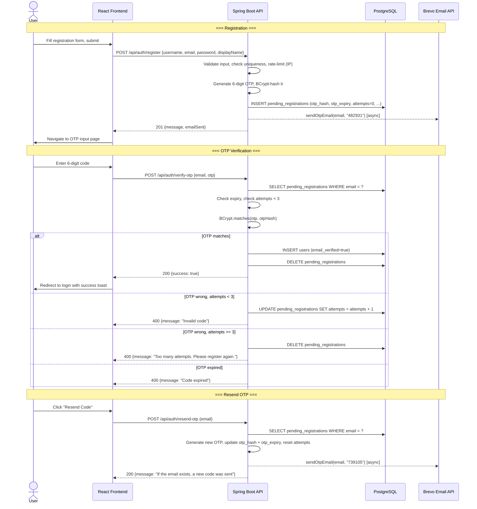
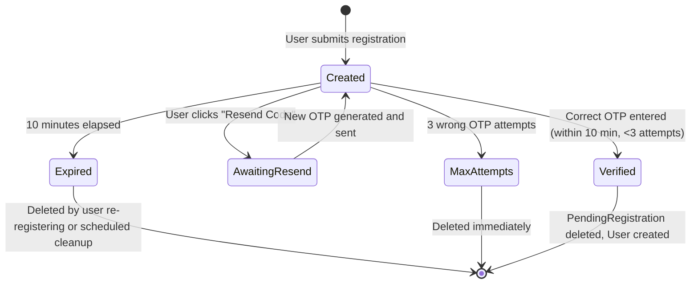

# Design Document: OTP-Based Email Verification

## Overview

The current verification flow uses a UUID token embedded in a clickable email link. The user clicks the link, which hits `GET /api/auth/verify-email?token=...`, the server validates the token, creates the user, and issues a 302 redirect to the frontend. This is fragile on mobile, depends on the email client rendering links correctly, and requires a redirect dance.

The new design replaces the token+link approach with a **6-digit numeric OTP** that the user reads from the email and types into a web form. The OTP is stored BCrypt-hashed in `PendingRegistration`, verified via `POST /api/auth/verify-otp`, and invalidated after 3 wrong attempts or 10 minutes.

### Key Technologies

- **Backend**: Spring Boot 3.5.14, Java 17, PostgreSQL, Spring Security + JWT, Brevo HTTP API (WebClient), BCrypt
- **Frontend**: React (based on the configured `app.frontend-url: http://localhost:3000`), TypeScript, Tailwind (assumed from existing patterns)
- **Email**: Brevo transactional email API (existing `BrevoEmailService`), inline HTML/plain-text templates

### Design Principles

1. **Minimize diff surface** -- modify existing entities/services rather than introducing new abstractions. The `PendingRegistration` entity is already the right place.
2. **Reuse existing infrastructure** -- BCrypt, `RateLimiterService`, `BrevoEmailService`, async email sending via `CompletableFuture.runAsync()` all stay.
3. **Hash, don't store plaintext** -- OTP gets the same BCrypt treatment as passwords. No plaintext codes in the database.
4. **Fail closed on security** -- any ambiguity (expired, max attempts, not found) returns a generic error. No email enumeration.
5. **Backward-incompatible is fine** -- the user explicitly chose full replacement. Old endpoints and entities are removed.

## Architecture

### High-Level Flow



### State Machine for PendingRegistration



## Components and Interfaces

### Backend Components

#### 1. Modified: `PendingRegistration` Entity

**File:** `src/main/java/org/example/chat/entity/PendingRegistration.java`

**Changes:**
- **Remove:** `token` (String)
- **Add:** `otpHash` (String, BCrypt-hashed 6-digit OTP)
- **Add:** `otpExpiry` (LocalDateTime, createdAt + 10 minutes)
- **Add:** `attemptCount` (int, default 0)
- **Update:** `isExpired()` -> checks `otpExpiry` instead of `expiryDate`
- **Remove:** `expiryDate` (replaced by `otpExpiry`)

```java
@Entity
@Table(name = "pending_registrations")
public class PendingRegistration {
    @Id
    private String email;  // natural key, prevents duplicate pending registrations

    @Column(nullable = false)
    private String otpHash;           // BCrypt hash of the 6-digit OTP

    @Column(nullable = false)
    private LocalDateTime otpExpiry;  // createdAt + 10 minutes

    @Column(nullable = false)
    private int attemptCount = 0;

    // unchanged fields
    private String username;
    private String passwordHash;
    private String displayName;
    private LocalDateTime createdAt;
    private Boolean emailSent = false;

    public boolean isExpired() {
        return LocalDateTime.now().isAfter(otpExpiry);
    }

    public boolean isMaxAttemptsExceeded() {
        return attemptCount >= 3;
    }
}
```

#### 2. Modified: `RegistrationService`

**File:** `src/main/java/org/example/chat/service/RegistrationService.java`

**Changes:**

| Method | Change |
|---|---|
| `initiateRegistration(...)` | Return type changes from `RegistrationResult` to remove `verificationUrl`. Generate 6-digit OTP via `generateOtp()`, hash via `passwordEncoder.encode(otp)`, store in `PendingRegistration`. Call `brevoEmailService.sendOtpEmail(email, otp)` instead of `sendVerificationEmail`. |
| `completeRegistration(token)` | **Renamed** to `verifyOtp(email, rawOtp)`. Find `PendingRegistration` by email. Check expiry + attempt count. BCrypt-verify. On success: create User, delete PendingRegistration. On failure: increment attempts (or delete if max reached). |
| `resendVerificationEmail(email)` | **Renamed** to `resendOtp(email)`. Find by email, generate new OTP, update entity, send email. |
| `buildVerificationUrl(token)` | **Removed.** No longer needed. |
| `cleanupExpiredPendingRegistrations()` | Update to use `otpExpiry` in the repository query. |

**New OTP generation:**
```java
private String generateOtp() {
    var secureRandom = new java.security.SecureRandom();
    return String.format("%06d", secureRandom.nextInt(1_000_000));
}
```

**OTP hashing (reuses existing encoder):**
```java
String otpHash = passwordEncoder.encode(rawOtp);
```

#### 3. New DTOs

**`VerifyOtpRequest.java`:**
```java
public record VerifyOtpRequest(
    @NotBlank @Email String email,
    @NotBlank @Pattern(regexp = "\\d{6}") String otp
) {}
```

**`ResendOtpRequest.java`:**
```java
public record ResendOtpRequest(
    @NotBlank @Email String email
) {}
```

**`VerifyOtpResponse.java`:**
```java
public record VerifyOtpResponse(
    boolean success,
    String message
) {}
```

#### 4. Modified: `RegistrationResponse` (in `AuthController`)

**Remove** the `verificationUrl` field:
```java
public record RegistrationResponse(
    String message,
    boolean emailSent,
    String errorMessage  // null on success
) {}
```
(Previously had `verificationUrl` and `errorMessage`. The `errorMessage` stays for partial-failure cases like email send failure.)

#### 5. New: OTP Endpoints in `AuthController`

**`POST /api/auth/verify-otp`:**
```java
@PostMapping("/verify-otp")
public ResponseEntity<VerifyOtpResponse> verifyOtp(
        @Valid @RequestBody VerifyOtpRequest request,
        HttpServletRequest httpRequest) {

    rateLimiterService.checkOtpVerification(httpRequest.getRemoteAddr());

    RegistrationService.OtpVerificationResult result =
            registrationService.verifyOtp(request.email(), request.otp());

    return ResponseEntity.ok(new VerifyOtpResponse(result.success(), result.message()));
}
```

**`POST /api/auth/resend-otp`:**
```java
@PostMapping("/resend-otp")
public ResponseEntity<Map<String, String>> resendOtp(
        @Valid @RequestBody ResendOtpRequest request) {

    registrationService.resendOtp(request.email());

    // Always 200 -- generic message to prevent email enumeration
    return ResponseEntity.ok(Map.of(
        "message", "If the email is pending verification, a new code has been sent."
    ));
}
```

#### 6. Modified: `BrevoEmailService`

**File:** `src/main/java/org/example/chat/service/BrevoEmailService.java`

**New method:** `sendOtpEmail(String to, String otpCode)`

**HTML template (replaces link-based template):**
```html
<!DOCTYPE html>
<html>
<body style="font-family: Arial, sans-serif; max-width: 600px; margin: 0 auto;">
    <div style="background-color: #f4f4f4; padding: 30px; border-radius: 10px;">
        <h1 style="color: #4a5568; margin-bottom: 10px;">Verify Your Email</h1>
        <p style="color: #666;">Use the code below to complete your registration:</p>

        <div style="text-align: center; margin: 30px 0;">
            <div style="font-family: 'Courier New', monospace; font-size: 36px;
                        letter-spacing: 12px; color: #2d3748; font-weight: bold;
                        background: #fff; padding: 16px 24px; border-radius: 8px;
                        display: inline-block; border: 2px dashed #cbd5e0;">
                %s
            </div>
        </div>

        <p style="color: #666; font-size: 14px; text-align: center;">
            This code expires in <strong>10 minutes</strong>.<br>
            Do not share this code with anyone.
        </p>
    </div>
</body>
</html>
```

**Plain-text template:**
```
Verify Your Email

Your verification code is: %s

This code expires in 10 minutes.
Do not share this code with anyone.
```

**Remove:** `sendVerificationEmail(String to, String verificationUrl)` -- no longer needed.

#### 7. Modified: `RateLimiterService`

**File:** `src/main/java/org/example/chat/service/RateLimiterService.java`

**New rate limit bucket:**
| Action | Key Pattern | Capacity | Refill Interval |
|---|---|---|---|
| OTP Verification | `otp_verify:<IP>` | 5 | 1 minute |

```java
public void checkOtpVerification(String clientIp) {
    if (!rateLimitEnabled) return;
    String key = "otp_verify:" + clientIp;
    // capacity: 5, refillDuration: 1 minute
}
```

#### 8. Removed Components

| Component | Action |
|---|---|
| `VerificationToken.java` | **Delete** entity |
| `VerificationTokenRepository.java` | **Delete** repository |
| `EmailVerificationService.java` | **Delete** (the `isEmailVerified()` static method moves to `AuthenticationService` or a utility) |
| `GET /api/auth/verify-email` | **Delete** endpoint in `EmailVerificationController` (or delete the controller entirely) |
| `POST /api/auth/resend-verification` | **Delete** endpoint |
| `EmailVerificationController.java` | **Delete** controller file |
| `ResendVerificationRequest.java` DTO | **Delete** DTO |

#### 9. Modified: `AuthenticationService`

**File:** `src/main/java/org/example/chat/service/AuthenticationService.java`

- **Remove:** `RegistrationResult.verificationUrl()` field from the record
- **Update:** `authenticateUser()` -> inline the `emailVerified` check (was calling `emailVerificationService.isEmailVerified()`)
- **Update:** `updateUserProfile()` -> remove dependency on `EmailVerificationService` for email-change verification (if any -- mark as out-of-scope per requirements)

#### 10. Modified: `SecurityConfig`

**File:** `src/main/java/org/example/chat/security/SecurityConfig.java`

Update public endpoints list:
```java
// Remove:
//   "/api/auth/verify-email"
//   "/api/auth/resend-verification"
// Add:
//   "/api/auth/verify-otp"
//   "/api/auth/resend-otp"
```

#### 11. Modified: `PendingRegistrationRepository`

**File:** `src/main/java/org/example/chat/repository/PendingRegistrationRepository.java`

**Changes:**
- `findByToken(String token)` -> **removed**
- `findByEmail(String email)` -> **kept** (now primary lookup)
- `deleteByExpiryDateBefore(LocalDateTime)` -> **renamed** to `deleteByOtpExpiryBefore(LocalDateTime)`

### Frontend Components

#### `OtpVerificationPage`

A new page at route `/verify-otp?email=<url-encoded-email>`.

**Responsibilities:**
- Display 6 individual digit input boxes with auto-advance
- Show countdown timer (10:00 -> 00:00)
- Handle submission, loading, success, and error states
- Provide "Resend Code" button with 60s cooldown
- Handle edge cases: no email param, already verified, expired

**Props / Route params:**
| Param | Source | Description |
|---|---|---|
| `email` | URL query param | The email the OTP was sent to (from registration context) |

**States:**

| State | Behavior |
|---|---|
| **Loading (initial)** | Skeleton or spinner while checking if email is valid |
| **Active** | 6-digit input boxes, countdown timer running, submit button enabled |
| **Submitting** | Inputs disabled, submit button shows spinner |
| **Success** | Checkmark animation, toast "Email verified!", auto-redirect to `/login` after 2 seconds |
| **Error -- Invalid** | Inline error below input: "Invalid code. X attempts remaining." Shake animation on inputs. |
| **Error -- Expired** | Inputs disabled, timer shows 00:00, message: "Code expired. Request a new one." Resend button enabled. |
| **Error -- Max Attempts** | Inputs disabled, message: "Too many attempts. Please register again." Link to `/register`. |
| **Error -- Network** | Toast: "Something went wrong. Please try again." Inputs re-enabled. |
| **Resend Cooldown** | Resend button disabled, shows "Resend available in Xs" countdown |
| **No Email Param** | Message: "No verification in progress. Please register first." Link to `/register`. |

**Pseudo-component structure:**
```typescript
interface OtpVerificationPageProps {
  // email from useSearchParams()
}

// Key hooks:
// - useState: otp (string[6]), error (string|null), attemptsLeft (number), isExpired (boolean)
// - useState: isSubmitting, isSuccess, resendCooldown (number)
// - useEffect: countdown timer (10 min from page load, but ideally synced with server expiry)
// - useRef: input refs for auto-focus/advance

// API calls:
// - POST /api/auth/verify-otp { email, otp: otp.join('') }
// - POST /api/auth/resend-otp { email }
```

## Data Models

### Database Schema Changes

**`pending_registrations` table -- BEFORE:**
```sql
CREATE TABLE pending_registrations (
    email VARCHAR(100) PRIMARY KEY,
    token VARCHAR(255) NOT NULL,
    username VARCHAR(50) NOT NULL,
    password_hash VARCHAR(255) NOT NULL,
    display_name VARCHAR(100),
    created_at TIMESTAMP,
    expiry_date TIMESTAMP,
    email_sent BOOLEAN DEFAULT FALSE
);
```

**`pending_registrations` table -- AFTER:**
```sql
CREATE TABLE pending_registrations (
    email VARCHAR(100) PRIMARY KEY,
    otp_hash VARCHAR(255) NOT NULL,         -- BCrypt hash of the 6-digit OTP
    otp_expiry TIMESTAMP NOT NULL,          -- created_at + 10 minutes
    attempt_count INT DEFAULT 0 NOT NULL,   -- number of failed verification attempts
    username VARCHAR(50) NOT NULL,
    password_hash VARCHAR(255) NOT NULL,
    display_name VARCHAR(100),
    created_at TIMESTAMP,
    email_sent BOOLEAN DEFAULT FALSE
);
```

**`verification_tokens` table:** **Dropped entirely.**

### API Contract

| Method | Endpoint | Request Body | Response | Auth |
|---|---|---|---|---|
| `POST` | `/api/auth/register` | `{ username, email, password, displayName }` | `201 { message, emailSent, errorMessage? }` | None |
| `POST` | `/api/auth/verify-otp` | `{ email, otp }` | `200 { success: true, message }` or `400 { success: false, message }` | None |
| `POST` | `/api/auth/resend-otp` | `{ email }` | `200 { message }` | None |
| `POST` | `/api/auth/login` | `{ username, password }` | `200 { token, user }` | None |

## Correctness Properties

### Property 1: OTP Single-Use
*For any* valid `PendingRegistration`, if `verifyOtp(email, otp)` succeeds once, any subsequent call with the same `email` SHALL fail (the `PendingRegistration` is deleted on success).

**Validates: Requirements 2.3, 2.7**

### Property 2: OTP Expiry Enforcement
*For any* `PendingRegistration` where `now > otpExpiry`, calling `verifyOtp(email, otp)` SHALL always return failure with an expiry message, regardless of whether the OTP would otherwise be correct.

**Validates: Requirements 2.6**

### Property 3: Attempt Limit Enforcement
*For any* `PendingRegistration` where `attemptCount == 3`, calling `verifyOtp(email, otp)` SHALL delete the `PendingRegistration` and return failure. No fourth attempt SHALL be allowed.

**Validates: Requirements 2.5**

### Property 4: No Plaintext OTP Storage
*For any* `PendingRegistration` stored in the database, the `otpHash` column SHALL contain only BCrypt-hashed values. The raw 6-digit OTP SHALL never be persisted to disk or logs.

**Validates: Requirements 6.4**

### Property 5: No Email Enumeration
*For any* input to `POST /api/auth/verify-otp` or `POST /api/auth/resend-otp`, the response status, body, and timing SHALL be identical whether the email exists in `pending_registrations` or not.

**Validates: Requirements 6.5**

### Property 6: Rate Limiting on OTP Verification
*For any* IP address, more than 5 calls to `POST /api/auth/verify-otp` within a 1-minute window SHALL return `429 Too Many Requests`.

**Validates: Requirements 6.1**

### Property 7: Resend Invalidates Old OTP
*For any* `PendingRegistration`, after `resendOtp(email)` is called, the old OTP SHALL no longer be valid (a new `otpHash` overwrites it).

**Validates: Requirements 3.2**

### Property 8: Login Requires Verified Email (Preservation)
*For any* `User` where `emailVerified == false`, calling `authenticateUser(username, password)` SHALL throw an exception. (This is existing behavior that must be preserved.)

**Validates: Requirements 2.8**

## Error Handling

| Scenario | HTTP Status | Response Body |
|---|---|---|
| Valid OTP, verification succeeds | `200 OK` | `{ "success": true, "message": "Email verified successfully" }` |
| Invalid OTP, attempts < 3 | `400 Bad Request` | `{ "success": false, "message": "Invalid verification code. N attempts remaining." }` |
| Invalid OTP, attempts exhausted | `400 Bad Request` | `{ "success": false, "message": "Too many attempts. Please register again." }` |
| OTP expired | `400 Bad Request` | `{ "success": false, "message": "Verification code has expired. Please request a new one." }` |
| No pending registration for email | `400 Bad Request` | `{ "success": false, "message": "Invalid verification code." }` (same as invalid -- no enumeration) |
| Missing/invalid request body | `400 Bad Request` | Standard Spring validation errors (unchanged) |
| Rate limit exceeded (verify-otp) | `429 Too Many Requests` | `{ "error": "Too many attempts. Please try again later." }` |
| Rate limit exceeded (resend-otp) | `429 Too Many Requests` | `{ "error": "Please wait before requesting another code." }` |

## Testing Strategy

### Unit Tests

| Test Target | What to Test | File |
|---|---|---|
| `RegistrationService.verifyOtp()` | Correct OTP succeeds, wrong OTP fails, expired fails, max attempts deletes, BCrypt mocked | `RegistrationServiceTest.java` |
| `RegistrationService.initiateRegistration()` | OTP generated, hashed, stored; email sent; duplicate handled | `RegistrationServiceTest.java` |
| `RegistrationService.resendOtp()` | New OTP overwrites old; attempts reset; email sent | `RegistrationServiceTest.java` |
| `AuthController.verifyOtp()` | Validates input, delegates to service, rate limit check | `AuthControllerTest.java` |
| `AuthController.resendOtp()` | Always returns 200, delegates to service | `AuthControllerTest.java` |
| `AuthController.register()` | Response no longer contains `verificationUrl` | `AuthControllerTest.java` |
| `PendingRegistration.isExpired()` | Returns true when now > otpExpiry | `PendingRegistrationTest.java` |
| `PendingRegistration.isMaxAttemptsExceeded()` | Returns true when attemptCount >= 3 | `PendingRegistrationTest.java` |

### Integration Tests

| Test Target | What to Test | File |
|---|---|---|
| Full OTP flow E2E | Register -> receive OTP (mock Brevo) -> verify -> login | `OtpVerificationE2EIT.java` |
| OTP expiry | Register -> wait/advance clock -> verify fails with expiry | `OtpVerificationE2EIT.java` |
| Max attempts | Register -> 3 wrong OTPs -> 4th returns error -> re-register works | `OtpVerificationE2EIT.java` |
| Resend OTP | Register -> resend -> old OTP fails, new OTP works | `OtpVerificationE2EIT.java` |
| Rate limiting | 6 verify-otp calls in < 1 min -> 429 | `OtpVerificationE2EIT.java` |
| Existing login flow preserved | Register -> verify OTP -> login with JWT -> access protected endpoint | (Update `FullAuthFlowE2EIT.java`) |

### Property-Based Tests (PBT)

**Assessment:** APPLICABLE

**Rationale:** OTP generation and verification have clear algebraic properties:
- Any 6-digit OTP generated by `generateOtp()` should be between `000000` and `999999`
- For any `PendingRegistration`, `BCrypt.matches(otp, otpHash)` should be false for all strings != the original OTP
- For any `PendingRegistration` created with `attemptCount = 0`, exactly 3 wrong attempts should transition to the max-attempts state, and 1 correct attempt should succeed

**Test framework:** jqwik (already in project dependencies)

**Properties to test:**
1. `generateOtp()` always returns a 6-character string of digits
2. For any BCrypt-hashed OTP, only the original OTP matches
3. Round-trip: `generateOtp()` -> `encode()` -> `matches(original)` -> true; `matches(other)` -> false

### Accessibility Tests
- OTP input boxes have proper `aria-label` attributes
- Error messages use `role="alert"` for screen readers
- Countdown timer has `aria-live="polite"` updates
- All interactive elements are keyboard-navigable
