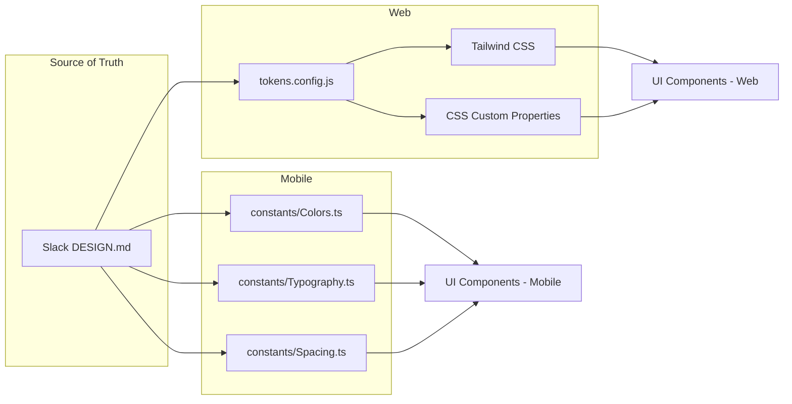

# Design Document: Slack-Inspired Visual Redesign

## Overview

The redesign applies Slack's design language to Chatter across web (Next.js) and mobile (Expo React Native). The approach centers on installing Slack's official DESIGN.md as the source of truth for design tokens, then mapping those tokens to platform-specific implementations in Tailwind CSS (web) and a React Native theme object (mobile). Component styling is updated layer by layer, starting with the token foundation, then auth screens, then the main chat interface, then navigation.

## Key Technologies

- **Design Token Source**: Slack DESIGN.md via `npx getdesign@latest add slack`
- **Web Implementation**: Tailwind CSS (already present in `frontend/`) with CSS custom properties
- **Mobile Implementation**: `constants/Colors.ts` + a new `constants/Typography.ts` + `constants/Spacing.ts`

## Design Principles

1. **Token-first, not component-first** — Define all colors, typography, and spacing as named tokens before touching any component. Components consume tokens; they do not define values.
2. **Single source of truth** — The DESIGN.md is the authoritative reference. Platform-specific files are generated/copied from it, not manually maintained independently.
3. **Platform-native, brand-consistent** — Web and mobile may use different layout mechanisms (flexbox vs. React Native `StyleSheet`) but the visual output (colors, type scale, radii) must be identical.
4. **Preserve functionality, change only appearance** — Every screen, API call, store, and navigation route stays exactly as-is. Only CSS/StyleSheet values change.

## Architecture

### Design Token Flow

### Platform Files and Their Tokens

| Token Category | Source (DESIGN.md) | Web File | Mobile File |
|---------------|-------------------|----------|-------------|
| Colors | `--slack-*` | `tailwind.config.js` → `colors` | `constants/Colors.ts` |
| Typography | `--font-*`, `--type-*` | `tailwind.config.js` → `fontFamily`, `fontSize` | `constants/Typography.ts` |
| Spacing | `--space-*` | `tailwind.config.js` → `spacing` | `constants/Spacing.ts` |
| Border Radius | `--radius-*` | `tailwind.config.js` → `borderRadius` | Inline `borderRadius` values |
| Shadows | `--shadow-*` | `tailwind.config.js` → `boxShadow` | `constants/Shadows.ts` |

## Slack Design Token Mapping

### Color Palette

| Token | Light Mode | Dark Mode | Usage |
|-------|-----------|-----------|-------|
| `--slack-primary` | `#4A154B` | `#611F69` | Primary CTAs, active nav, badges |
| `--slack-primary-light` | `#7C2382` | `#7C2382` | Hover states |
| `--slack-accent-green` | `#2EB67D` | `#2EB67D` | Success, online indicator, verified |
| `--slack-accent-blue` | `#36C5F0` | `#36C5F0` | Links, info banners |
| `--slack-accent-yellow` | `#ECB22E` | `#ECB22E` | Warnings, pending states |
| `--slack-accent-red` | `#E01E5A` | `#E01E5A` | Errors, destructive actions, offline |
| `--slack-surface-primary` | `#FFFFFF` | `#1A1D21` | Main background |
| `--slack-surface-secondary` | `#F4EDE4` | `#222529` | Sidebar, cards, secondary surfaces |
| `--slack-surface-tertiary` | `#E8E0D5` | `#2D2F33` | Input backgrounds, dividers |
| `--slack-text-primary` | `#1D1C1D` | `#D1D2D3` | Body text |
| `--slack-text-secondary` | `#616061` | `#9D9EA0` | Secondary text, placeholders |
| `--slack-text-inverse` | `#FFFFFF` | `#1D1C1D` | Text on primary backgrounds |
| `--slack-border` | `#DDD9D4` | `#424448` | Dividers, input borders |

### Typography Scale

| Token | Size | Weight | Line Height | Usage |
|-------|------|--------|-------------|-------|
| `--type-display-xl` | 32px | 700 | 1.2 | Page titles |
| `--type-display-lg` | 24px | 700 | 1.25 | Section headers |
| `--type-display-md` | 20px | 600 | 1.3 | Card titles |
| `--type-body-lg` | 16px | 400 | 1.5 | Message body |
| `--type-body-md` | 15px | 400 | 1.4667 | UI text, input labels |
| `--type-body-sm` | 13px | 400 | 1.3846 | Secondary text, timestamps |
| `--type-caption` | 11px | 400 | 1.2727 | Badges, small labels |

**Font Family:** `'Noto Sans Display', 'Noto Sans', -apple-system, BlinkMacSystemFont, sans-serif`

### Spacing Scale

| Token | Value | Usage |
|-------|-------|-------|
| `--space-xs` | 4px | Inner padding for tight elements |
| `--space-sm` | 8px | Between icons and text |
| `--space-md` | 12px | Between stacked form elements |
| `--space-lg` | 16px | Standard card padding, between messages |
| `--space-xl` | 20px | Between sections |
| `--space-2xl` | 24px | Page margins |
| `--space-3xl` | 32px | Between major layout blocks |

### Border Radius

| Token | Value | Usage |
|-------|-------|-------|
| `--radius-sm` | 4px | Avatars, small badges |
| `--radius-md` | 6px | Card corners, message bubbles |
| `--radius-lg` | 8px | Modals, bottom sheets |
| `--radius-pill` | 9999px | Primary CTAs, search inputs |

### Component Changes by Screen

#### Login Screen (`app/(auth)/login.tsx`)

| Current | Slack-Inspired Replacement |
|---------|---------------------------|
| Blue `#2f95dc` button | Aubergine (`#4A154B`) pill-shaped CTA |
| White background | Cream-lavender gradient background (`#F4EDE4` → `#FFFFFF`) |
| Default border inputs | Slack tertiary surface input with `--radius-md` |
| Default link color | Slack accent blue (`#36C5F0`) for links |
| Default spacing | Slack spacing scale throughout |

#### Chats List (`app/(tabs)/chats/index.tsx`)

| Current | Slack-Inspired Replacement |
|---------|---------------------------|
| Default container background | `--slack-surface-secondary` |
| Default search input | Pill-shaped search bar (`--radius-pill`, `--slack-surface-tertiary`) |
| Default list items | Slack-style with `--slack-surface-primary`, `--slack-border` dividers |
| Default activity indicator | Slack accent blue |
| Default text colors | `--slack-text-primary` / `--slack-text-secondary` |
| Pull-to-refresh color | Slack accent green |

#### Chat Room Detail (`app/(tabs)/chats/[roomId].tsx`)

| Current | Slack-Inspired Replacement |
|---------|---------------------------|
| Default message bubbles | Slack rounded messages with sender color coding |
| Default input area | Pill-shaped message input with `--radius-pill` and send icon |
| Default timestamp | `--type-caption`, `--slack-text-secondary` |
| System messages (JOIN/LEAVE) | Slack italic secondary style |
| Online presence indicator | Slack accent green dot (`#2EB67D`) |

#### Tab Bar (`app/(tabs)/_layout.tsx`)

| Current | Slack-Inspired Replacement |
|---------|---------------------------|
| Default tab colors | Active: `--slack-primary`, Inactive: `--slack-text-secondary` |
| Default badge style | Slack accent red pill badge |
| Default tab bar background | `--slack-surface-primary` with top border |

#### Navigation Bar (Auth layout)

| Current | Slack-Inspired Replacement |
|---------|---------------------------|
| Header shown | Hidden (`headerShown: false`) — replaced with custom Slack-style back button |

### New Screens/Features (If Required)

During the redesign, if any of the following are identified as necessary to achieve visual consistency with Slack's design:

| Potential Addition | Trigger Condition | Scope |
|-------------------|-------------------|-------|
| Workspace/instance switcher | If the app needs to support multiple servers/orgs | Add new screen + route |
| Sidebar navigation (web) | If web layout shifts from simple routing to sidebar-based layout | Add sidebar component |
| Settings/more tab | If profile screen expands to include app settings | Add settings screen + route |
| Message search screen | If search needs a dedicated full-screen view | Add search screen + route |

## Correctness Properties

### Property 1: Token Consistency

*For any* component on any screen, the rendered color values SHALL match the hex values defined in the Slack DESIGN.md for that token category.

**Validates: Requirements 1.2, 1.3, 1.4**

### Property 2: Typography Consistency

*For any* text element on any screen, the font-family, font-size, font-weight, and line-height SHALL match the Slack typography scale.

**Validates: Requirement 1.5**

### Property 3: CTA Uniqueness

*For any* screen, there SHALL be exactly one primary call-to-action styled with `--slack-primary` background and `--radius-pill`. All other interactive elements SHALL use secondary styling.

**Validates: Requirements 1.4, 2.1**

### Property 4: Dark Mode Parity

*For any* screen in dark mode, every design token SHALL have a corresponding dark-mode value, and no color SHALL be undefined or fall back to light mode unintentionally.

**Validates: Requirements 1.3, 5.1**

### Property 5: Cross-Platform Identity

*For any* component that exists on both web and mobile, the color, font, radius, and spacing values SHALL resolve to identical hex/pixel values on both platforms.

**Validates: Requirement 5.1, 5.2, 5.3, 5.4**

### Property 6: Preservation

*For any* screen before the redesign, after the redesign the screen SHALL contain the same interactive elements (buttons, inputs, links, navigation targets) and support the same user flows.

**Validates: All Requirements (regression prevention)**

## Error Handling

| Scenario | Visual Treatment |
|----------|-----------------|
| Form validation error | Red accent text (`#E01E5A`) below the input, `--type-body-sm` |
| API error banner | Red accent background, white text, `--radius-md` container |
| Success message | Green accent text (`#2EB67D`) |
| Warning/info banner | Yellow accent background or blue accent |
| Empty state | Slack's secondary text color, centered, with icon |
| Loading state | Slack accent blue spinner |

## Testing Strategy

### Unit Tests
- Verify dark mode tokens are all defined (no undefined colors)
- Verify every Slack token has a corresponding mapping in platform files

### Visual Regression (Manual)
- Compare each screen side-by-side with Slack's reference UI
- Verify light and dark mode on each screen
- Verify web and mobile parity

### Property-Based Testing Applicability

**Assessment**: NOT APPLICABLE for visual redesign

**Rationale**: PBT is designed for functional correctness (e.g., "for any input X, output Y always holds"). Visual design is inherently subjective and binary (a color is either `#4A154B` or it isn't). The correctness properties above are verified by static analysis (token audits) and manual visual comparison, not by generative testing.
