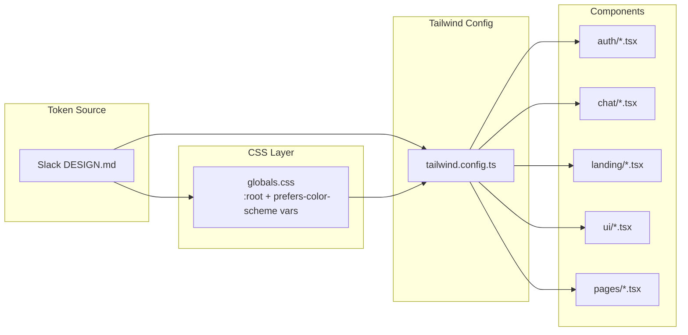

# Design Document: Cross-Platform Slack-Inspired Design Implementation

## Overview

Deliver Slack's design tokens to the web frontend by replacing the existing dark purple "Kiro" theme with a light/dark responsive Slack token system. The web will shift from a dark-only theme to full light/dark mode parity with the mobile app, using CSS custom properties driven by `prefers-color-scheme`.

### Key Technologies

- **Web**: Next.js 16, TypeScript, Tailwind CSS v4 (via `@tailwindcss/postcss`)
- **Token Delivery**: CSS custom properties on `:root` + `@media (prefers-color-scheme: dark)`, referenced in `tailwind.config.ts` via `var(--slack-*)`
- **Fonts**: Google Fonts via `next/font/google` — Noto Sans Display + Noto Sans (replacing Geist Sans)

### Design Principles

1. **CSS Custom Properties over hardcoded hex** — All colors resolve through `var(--slack-*)` so a single media query swaps the entire theme
2. **Same token, same value, both platforms** — Every `--slack-*` token resolves to identical hex on web and mobile, validated by audit
3. **Component-by-component, class-by-class** — Every `kiro-*`, `bg-[#...]`, and hardcoded color in every component file is replaced with `slack-*` equivalents
4. **Preserve structure, change only appearance** — No component logic, API calls, routes, or exports change

## Architecture

### High-Level Architecture



### Token Delivery Strategy

CSS Custom Properties in `globals.css`:

```css
@theme {
  --color-slack-primary: var(--slack-primary);
  --color-slack-primary-light: var(--slack-primary-light);
  --color-slack-accent-green: var(--slack-accent-green);
  --color-slack-accent-blue: var(--slack-accent-blue);
  --color-slack-accent-yellow: var(--slack-accent-yellow);
  --color-slack-accent-red: var(--slack-accent-red);
  --color-slack-surface-primary: var(--slack-surface-primary);
  --color-slack-surface-secondary: var(--slack-surface-secondary);
  --color-slack-surface-tertiary: var(--slack-surface-tertiary);
  --color-slack-text-primary: var(--slack-text-primary);
  --color-slack-text-secondary: var(--slack-text-secondary);
  --color-slack-text-inverse: var(--slack-text-inverse);
  --color-slack-border: var(--slack-border);
}

:root {
  --slack-primary: #4A154B;
  --slack-primary-light: #7C2382;
  --slack-accent-green: #2EB67D;
  --slack-accent-blue: #36C5F0;
  --slack-accent-yellow: #ECB22E;
  --slack-accent-red: #E01E5A;
  --slack-surface-primary: #FFFFFF;
  --slack-surface-secondary: #F4EDE4;
  --slack-surface-tertiary: #E8E0D5;
  --slack-text-primary: #1D1C1D;
  --slack-text-secondary: #616061;
  --slack-text-inverse: #FFFFFF;
  --slack-border: #DDD9D4;
}

@media (prefers-color-scheme: dark) {
  :root {
    --slack-primary: #611F69;
    --slack-primary-light: #7C2382;
    --slack-surface-primary: #1A1D21;
    --slack-surface-secondary: #222529;
    --slack-surface-tertiary: #2D2F33;
    --slack-text-primary: #D1D2D3;
    --slack-text-secondary: #9D9EA0;
    --slack-text-inverse: #1D1C1D;
    --slack-border: #424448;
  }
}
```

### Kiro → Slack Token Mapping

| Kiro Token | Current Value | Slack Token | Slack Light Value |
|---|---|---|---|
| `kiro-purple-400` | `#9b7cff` | `--slack-accent-blue` | `#36C5F0` |
| `kiro-purple-500/600/700` | `#6f42c1` / `#5b3fe6` / `#4329b3` | `--slack-primary` | `#4A154B` |
| `kiro-ink-900/950` | `#0b0b12` / `#06060a` | `--slack-surface-primary` (dark) | `#1A1D21` |
| `kiro-slate-100/200` | `#f1f1f8` / `#d9d9e6` | `--slack-text-primary` | `#1D1C1D` |
| `kiro-slate-400/500` | `#a1a1aa` / `#8b8b9e` | `--slack-text-secondary` | `#616061` |
| `bg-[#13131f]` (chat bg) | dark background | `--slack-surface-primary` | `#FFFFFF` |
| `bg-[#0e0e1a]` (sidebar) | dark sidebar | `--slack-surface-secondary` | `#F4EDE4` |
| `bg-[#1e1e30]` (other bubble) | dark bubble | `--slack-surface-tertiary` | `#E8E0D5` |
| `bg-[#07070d]` (landing) | dark landing | `--slack-surface-primary` | `#FFFFFF` |
| `bg-red-*` / `text-red-*` | standard red | `--slack-accent-red` | `#E01E5A` |
| `bg-green-*` | standard green | `--slack-accent-green` | `#2EB67D` |

### Component Changes by Group

#### UI Base Components

| Component | Change Summary |
|---|---|
| `Button.tsx` | Variant colors → Slack tokens. Primary CTA: `bg-slack-primary rounded-pill`. All variants get pill radius |
| `Input.tsx` | Focus ring → `ring-slack-accent-blue`. Border → `border-slack-border`. Background → `bg-slack-surface-tertiary` |
| `Card.tsx` | Background → `bg-slack-surface-primary`. Border → `border-slack-border` |
| `Modal.tsx` | Background → `bg-slack-surface-primary`. Overlay → Slack opacity convention |

#### Auth Components & Pages

| Component | Change Summary |
|---|---|
| `LoginForm.tsx` | Inputs → Slack tertiary surface + accent blue focus. Links → `text-slack-accent-blue`. Errors → `text-slack-accent-red` |
| `RegisterForm.tsx` | Same token replacement |
| `ForgotPasswordForm.tsx`, `ResetPasswordForm.tsx` | Same token replacement |
| `login/page.tsx` | Gradient bg: `from-[#F4EDE4] to-[#FFFFFF]` (light) / `from-slack-surface-primary to-slack-surface-primary` (dark). Purple radial glow removed |
| `register/page.tsx` | Same gradient bg and token replacement |
| `forgot-password/page.tsx`, `reset-password/page.tsx`, `verify-email/page.tsx` | Same gradient bg and token replacement |

#### Chat Components & Pages

| Component | Change Summary |
|---|---|
| `MessageList.tsx` | Own bubble: `bg-slack-primary text-slack-text-inverse`. Other bubble: `bg-slack-surface-tertiary text-slack-text-primary`. Timestamps: `text-slack-text-secondary text-caption` |
| `MessageInput.tsx` | Container: `bg-slack-surface-primary`. Input: `bg-slack-surface-tertiary rounded-pill`. Send button: `bg-slack-primary rounded-full` |
| `RoomSelector.tsx` | Room items: `border-b border-slack-border`. Avatars: `bg-slack-primary`. Names: `text-slack-text-primary`. Previews: `text-slack-text-secondary` |
| `UserList.tsx` | Status badges → accent green/accent yellow. Text → Slack text tokens |
| `FriendsPanel.tsx` | Same as UserList + Slack tokens for request buttons |
| `UserSearch.tsx` | Input/button tokens → Slack equivalents |
| `RoomCreateModal.tsx` | Form inputs → Slack tertiary surface. CTA → `bg-slack-primary rounded-pill` |
| `chat/layout.tsx` | Nav bar: `bg-slack-surface-secondary`. Active icon: `text-slack-primary`. Inactive icon: `text-slack-text-secondary`. Connection dot: Slack accent colors |

#### Landing Components

| Component | Change Summary |
|---|---|
| `NavigationHeader.tsx` | Background → `bg-slack-surface-primary`. CTA buttons → `bg-slack-primary rounded-pill`. Links → `text-slack-text-primary` |
| `HeroSection.tsx` | Purple gradient text removed → `text-slack-text-primary`. Stats cards → `bg-slack-surface-secondary`. CTAs → `bg-slack-primary rounded-pill` |
| `FeaturesSection.tsx` | Section backgrounds → `bg-slack-surface-secondary`. Cards → `bg-slack-surface-primary border border-slack-border` |
| `FooterSection.tsx` | Background → `bg-slack-surface-secondary`. Text → `text-slack-text-secondary` |

### Font Loading

```tsx
// In app/layout.tsx
import { Noto_Sans, Noto_Sans_Display } from 'next/font/google';

const notoSans = Noto_Sans({
  subsets: ['latin'],
  weight: ['400', '500', '600', '700'],
  variable: '--font-noto-sans',
});

const notoSansDisplay = Noto_Sans_Display({
  subsets: ['latin'],
  weight: ['400', '500', '600', '700'],
  variable: '--font-noto-sans-display',
});
```

### Dark Mode Strategy

- **Trigger**: `@media (prefers-color-scheme: dark)` — automatic, no class toggle needed
- **Implementation**: CSS custom properties swap all `--slack-*` values in one block
- **No light-mode fallbacks**: Every token used in any component MUST have both `:root` and `@media (prefers-color-scheme: dark)` definitions

### Correctness Properties

#### Property 1: Token Consistency

*For any* component on any web page, the rendered color values SHALL match the hex values defined in the Slack DESIGN.md for that token category.

**Validates: Requirements 1.1, 1.2, 1.3, 1.4, 1.5**

#### Property 2: Cross-Platform Identity

*For any* token in `globals.css` on web, the hex value in light mode SHALL match `constants/Colors.ts` on mobile, and the hex value in dark mode SHALL also match.

**Validates: Requirements 5.1, 5.2**

#### Property 3: No Hardcoded Colors

*For any* file under `components/` or `app/`, there SHALL be zero color values written as hex, rgba, or named colors — all colors SHALL use `slack-*` Tailwind classes.

**Validates: Requirements 5.3, 6.1, 6.2**

#### Property 4: CTA Uniqueness

*For any* screen, there SHALL be exactly one primary call-to-action styled with `--slack-primary` background and `rounded-pill`. All other interactive elements SHALL use secondary styling.

**Validates: Requirement 2.2**

#### Property 5: Preservation

*For any* screen on the web before the redesign, after the redesign the screen SHALL contain the same interactive elements (buttons, inputs, links, navigation targets) with the same exported interfaces.

**Validates: Requirement 6.1, 6.2, 6.3**

### Error Handling

| Scenario | Current Treatment | Slack Treatment |
|---|---|---|
| Form validation error | `text-red-400` | `text-slack-accent-red` |
| API error banner | `bg-red-950/40 text-red-300` | `bg-slack-accent-red/20 text-slack-accent-red` |
| Success message | `text-emerald-200 bg-emerald-950/40` | `text-slack-accent-green` |
| Connection offline | `bg-red-500` dot | `bg-slack-accent-red` dot |
| Connection reconnecting | `bg-yellow-500` dot | `bg-slack-accent-yellow` dot |
| Connection connected | `bg-green-500` dot | `bg-slack-accent-green` dot |

### Testing Strategy

#### Manual Visual Audit
- Walk through every page in light mode — compare colors against mobile app screenshots
- Walk through every page in dark mode — verify all tokens swap correctly
- Verify auth flow (register → verify → login → chat) end-to-end
- Verify no regressions in interactive elements (buttons click, forms submit, links navigate)

#### Static Analysis
- `grep` for any remaining `kiro-*`, `#[0-9a-f]{6}`, `rgba(`, or named colors in component files — zero tolerance
- Compare hex values between web `globals.css` and mobile `constants/Colors.ts` — must match exactly

#### Property-Based Testing Applicability

**Assessment**: NOT APPLICABLE

**Rationale**: Visual token values are static constants, not generated values. Correctness is verified by static analysis (token audit) and manual visual comparison.
